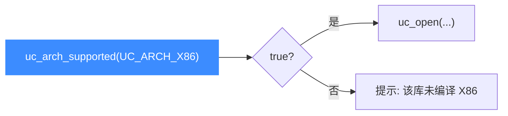

# uc_arch_supported — 架构可用性检查

本页讲 `uc_arch_supported`：在 `uc_open` 之前判断当前 Unicorn 库是否在**编译期**包含了某个架构。读完你能写出对不同发行版都健壮的初始化代码。

## 📌 概述

Unicorn 可以只编译进部分架构后端以减小体积。`uc_arch_supported` 让你**先探测再打开**，避免直接 [uc_open](/api/open) 得到 `UC_ERR_ARCH`。

## 函数原型

```c
bool uc_arch_supported(uc_arch arch);
```

> 📄 声明：[`unicorn.h`](https://github.com/android-security-engineer/unicorn-skills/blob/master/include/unicorn/unicorn.h#L722) · 实现：[`uc.c`](https://github.com/android-security-engineer/unicorn-skills/blob/master/uc.c#L198)

## 参数

| 参数 | 类型 | 说明 |
|------|------|------|
| `arch` | `uc_arch` | 待检测的架构，`UC_ARCH_*` |

## 返回值

返回 `bool`：`true` 表示本库支持该架构，`false` 表示未编译进来。

::: tip 与其他函数不同
`uc_arch_supported` **不返回 `uc_err`**，而是直接返回布尔值，这在整套 API 中是少数特例。
:::

## uc_arch 枚举一览

| 架构 | 枚举 |
|------|------|
| ARM | `UC_ARCH_ARM` |
| ARM64 | `UC_ARCH_ARM64` |
| MIPS | `UC_ARCH_MIPS` |
| X86 | `UC_ARCH_X86` |
| PowerPC | `UC_ARCH_PPC` |
| SPARC | `UC_ARCH_SPARC` |
| M68K | `UC_ARCH_M68K` |
| RISC-V | `UC_ARCH_RISCV` |
| S390X | `UC_ARCH_S390X` |
| TriCore | `UC_ARCH_TRICORE` |

## 预检流程



## 💻 用法示例

```c
#include <unicorn/unicorn.h>
#include <stdio.h>

int main(void) {
    if (!uc_arch_supported(UC_ARCH_RISCV)) {
        printf("此 Unicorn 未编译 RISC-V 支持\n");
        return 1;
    }

    uc_engine *uc;
    if (uc_open(UC_ARCH_RISCV, UC_MODE_RISCV64, &uc) != UC_ERR_OK)
        return 1;

    // ...
    uc_close(uc);
    return 0;
}
```

一次性列出全部可用架构：

```c
struct { uc_arch a; const char *name; } list[] = {
    {UC_ARCH_X86, "x86"}, {UC_ARCH_ARM, "arm"},
    {UC_ARCH_ARM64, "arm64"}, {UC_ARCH_RISCV, "riscv"},
};
for (size_t i = 0; i < sizeof(list)/sizeof(list[0]); i++)
    printf("%-6s: %s\n", list[i].name,
           uc_arch_supported(list[i].a) ? "可用" : "未编译");
```

::: warning 常见错误
- ❌ **跳过检查直接 open**：在只编译了部分架构的发行版上会拿到 `UC_ERR_ARCH`。库工具类代码尤其应先探测。
:::

## 📂 相关源码

| 文件 | 角色 |
|------|------|
| [`unicorn.h`](https://github.com/android-security-engineer/unicorn-skills/blob/master/include/unicorn/unicorn.h#L722) | `uc_arch_supported` 声明 |
| [`uc.c`](https://github.com/android-security-engineer/unicorn-skills/blob/master/uc.c#L198) | `uc_arch_supported` 实现 |

## 相关页面

- [uc_open — 创建引擎](/api/open)
- [uc_version — 版本号](/api/version)
- [多架构支持](/features/architectures)
- [UC_ERR_ARCH — 架构不支持](/errors/arch)
