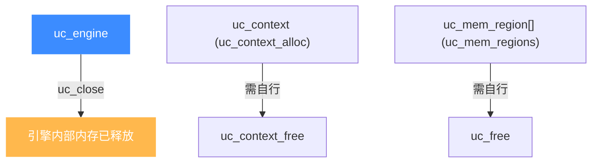

# uc_close — 释放引擎实例

本页讲 `uc_close`：与 [uc_open](/api/open) 成对出现的收尾函数。读完你能理解引擎句柄的生命周期终点、为何关闭后不可再用，以及与上下文、缓冲区等其他资源释放的关系。

## 📌 概述

`uc_close` 关闭一个引擎实例，释放它内部缓存的内存。**关闭后 `uc` 句柄立即失效**，此后任何用它调用 Unicorn API 的行为都可能使程序崩溃。

## 函数原型

```c
uc_err uc_close(uc_engine *uc);
```

> 📄 声明：[`unicorn.h`](https://github.com/android-security-engineer/unicorn-skills/blob/master/include/unicorn/unicorn.h#L751) · 实现：[`uc.c`](https://github.com/android-security-engineer/unicorn-skills/blob/master/uc.c#L497)

## 参数

| 参数 | 类型 | 说明 |
|------|------|------|
| `uc` | `uc_engine *` | 由 [uc_open](/api/open) 返回的句柄 |

## 返回值

返回 `uc_err`：`UC_ERR_OK` 表示成功；若传入无效句柄，可能返回 `UC_ERR_HANDLE`。

## 资源释放全景

`uc_close` 只负责引擎本身。它**不会**替你释放你另外分配的资源：



| 资源 | 由谁分配 | 用什么释放 |
|------|---------|-----------|
| 引擎 | [uc_open](/api/open) | `uc_close` |
| 上下文 | [uc_context_alloc](/api/context-alloc) | [uc_context_free](/api/context-free) |
| 区域数组 | [uc_mem_regions](/api/mem-regions) | [uc_free](/api/free) |

## 💻 用法示例

```c
uc_engine *uc;
if (uc_open(UC_ARCH_ARM, UC_MODE_ARM, &uc) != UC_ERR_OK)
    return 1;

// ... 使用引擎 ...

uc_err err = uc_close(uc);
if (err != UC_ERR_OK) {
    printf("uc_close 失败: %s\n", uc_strerror(err));
}
uc = NULL;  // 好习惯：置空防止误用
```

::: warning 常见错误
- ❌ **关闭后继续使用**：`uc_close(uc)` 之后再 `uc_reg_read(uc, ...)` 是未定义行为，通常直接崩溃。建议关闭后把句柄置 `NULL`。
- ❌ **重复关闭**：对同一句柄调用两次 `uc_close` 会导致 double-free。
- ❌ **先关引擎再释放上下文**：`uc_context` 与引擎相关联，应在 `uc_close` 前完成 [uc_context_free](/api/context-free)。
:::

## 📂 相关源码

| 文件 | 角色 |
|------|------|
| [`unicorn.h`](https://github.com/android-security-engineer/unicorn-skills/blob/master/include/unicorn/unicorn.h#L751) | `uc_close` 声明 |
| [`uc.c`](https://github.com/android-security-engineer/unicorn-skills/blob/master/uc.c#L497) | `uc_close` 实现 |

## 相关页面

- [uc_open — 创建引擎](/api/open)
- [uc_context_free — 释放上下文](/api/context-free)
- [uc_free — 释放缓冲](/api/free)
- [核心概念](/guide/concepts)
