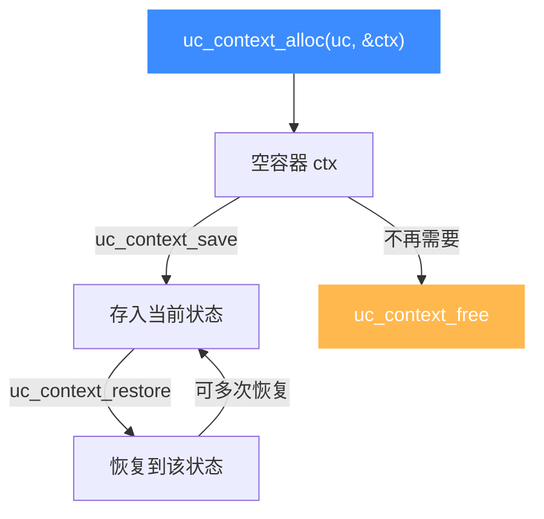

# uc_context_alloc — 分配上下文容器

本页讲 `uc_context_alloc`：为「保存/恢复完整 CPU 状态」分配一个不透明容器。读完你能开启快照能力，并理解容器的生命周期与跨引擎限制。

## 📌 概述

`uc_context` 是一块能存放引擎完整 CPU 状态（寄存器 + 部分内部元数据）的不透明缓冲。`uc_context_alloc` 负责分配它，之后配合 [uc_context_save](/api/context-save) / [uc_context_restore](/api/context-restore) 使用，用完由 [uc_context_free](/api/context-free) 释放。

## 函数原型

```c
uc_err uc_context_alloc(uc_engine *uc, uc_context **context);
```

> 📄 声明：[`unicorn.h`](https://github.com/android-security-engineer/unicorn-skills/blob/master/include/unicorn/unicorn.h#L1265) · 实现：[`uc.c`](https://github.com/android-security-engineer/unicorn-skills/blob/master/uc.c#L2234)

## 参数

| 参数 | 类型 | 说明 |
|------|------|------|
| `uc` | `uc_engine *` | 引擎句柄，用于确定上下文尺寸/布局 |
| `context` | `uc_context **` | 出参：成功时写入新分配的上下文指针 |

## 返回值

返回 `uc_err`：`UC_ERR_OK` 表示成功，`UC_ERR_NOMEM` 表示内存不足。

## 生命周期



## 💻 用法示例

```c
uc_context *ctx = NULL;
uc_err err = uc_context_alloc(uc, &ctx);
if (err != UC_ERR_OK) {
    printf("分配上下文失败: %s\n", uc_strerror(err));
    return 1;
}

uc_context_save(uc, ctx);       // 保存当前状态
// ... 继续仿真, 状态改变 ...
uc_context_restore(uc, ctx);    // 回滚

uc_context_free(ctx);           // 注意: 不要用 uc_free
```

::: danger 释放方式
`uc_context_alloc` 分配的内存**必须**用 [uc_context_free](/api/context-free) 释放。用 [uc_free](/api/free) 释放它的结果是未定义的。
:::

::: warning 跨引擎限制
上下文**不能**跨架构或模式不同的引擎共享。若启用了 `UC_CTL_CONTEXT_MEMORY`（保存内存内容），该上下文会持有指向内部分配内存的指针，因而也不能用于另一个 unicorn 对象。见 [上下文控制](/features/context)。
:::

## 📂 相关源码

| 文件 | 角色 |
|------|------|
| [`unicorn.h`](https://github.com/android-security-engineer/unicorn-skills/blob/master/include/unicorn/unicorn.h#L1265) | `uc_context_alloc` 声明 |
| [`uc.c`](https://github.com/android-security-engineer/unicorn-skills/blob/master/uc.c#L2234) | `uc_context_alloc` 实现 |

## 相关页面

- [uc_context_save — 保存状态](/api/context-save)
- [uc_context_restore — 恢复状态](/api/context-restore)
- [uc_context_free — 释放上下文](/api/context-free)
- [上下文控制](/features/context)
