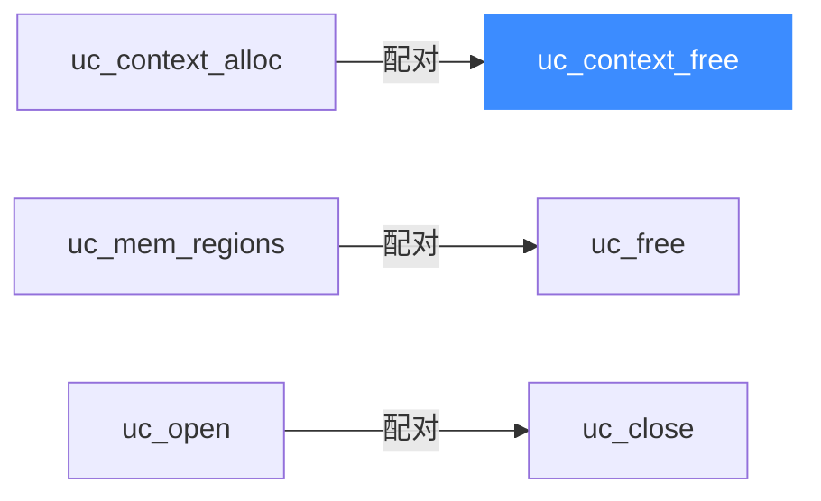

# uc_context_free — 释放上下文容器

本页讲 `uc_context_free`：释放 [uc_context_alloc](/api/context-alloc) 分配的上下文。读完你能正确收尾快照资源，避免与 `uc_free` 混用带来的未定义行为。

## 📌 概述

`uc_context_free` 是上下文的专用释放函数。自 Unicorn 1.0.1rc5 起，上下文**只能**用它释放，不要用旧的 [uc_free](/api/free)。

## 函数原型

```c
uc_err uc_context_free(uc_context *context);
```

> 📄 声明：[`unicorn.h`](https://github.com/android-security-engineer/unicorn-skills/blob/master/include/unicorn/unicorn.h#L1450) · 实现：[`uc.c`](https://github.com/android-security-engineer/unicorn-skills/blob/master/uc.c#L2598)

## 参数

| 参数 | 类型 | 说明 |
|------|------|------|
| `context` | `uc_context *` | 由 [uc_context_alloc](/api/context-alloc) 返回的句柄 |

## 返回值

返回 `uc_err`，`UC_ERR_OK` 表示成功。

## 释放归属



## 💻 用法示例

```c
uc_context *ctx;
uc_context_alloc(uc, &ctx);
uc_context_save(uc, ctx);

// ... 使用 ctx 做保存/恢复 ...

uc_err err = uc_context_free(ctx);
if (err != UC_ERR_OK)
    printf("释放上下文失败: %s\n", uc_strerror(err));
ctx = NULL;   // 好习惯: 置空
```

::: danger 不要用 uc_free
用 [uc_free](/api/free) 释放上下文的结果是**未定义的**（虽可能碰巧不崩，但不保证）。务必用 `uc_context_free`。
:::

::: warning 常见错误
- ❌ **释放顺序**：应在 [uc_close](/api/close) 之前释放上下文。引擎关闭后再操作相关上下文属未定义行为。
- ❌ **重复释放**：对同一上下文调用两次会造成 double-free。释放后置空指针。
:::

## 📂 相关源码

| 文件 | 角色 |
|------|------|
| [`unicorn.h`](https://github.com/android-security-engineer/unicorn-skills/blob/master/include/unicorn/unicorn.h#L1450) | `uc_context_free` 声明 |
| [`uc.c`](https://github.com/android-security-engineer/unicorn-skills/blob/master/uc.c#L2598) | `uc_context_free` 实现 |

## 相关页面

- [uc_context_alloc — 分配上下文](/api/context-alloc)
- [uc_context_save — 保存状态](/api/context-save)
- [uc_free — 释放缓冲](/api/free)
- [上下文控制](/features/context)
