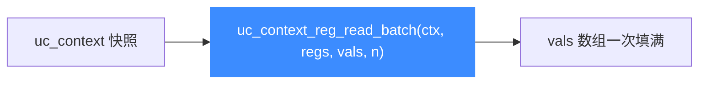

# uc_context_reg_read_batch — 批量读上下文寄存器

本页讲 `uc_context_reg_read_batch`：一次从上下文快照读取多个寄存器。读完你能高效地从历史快照中提取整组寄存器，用于差异对比或状态导出。

## 📌 概述

它是 [uc_reg_read_batch](/api/reg-read-batch) 的「上下文版」：数据源不是引擎当前状态，而是一个已保存的 [uc_context](/api/context-alloc) 快照。一趟读完多个寄存器，省去逐个调用开销。

## 函数原型

```c
uc_err uc_context_reg_read_batch(uc_context *ctx, int const *regs,
                                 void **vals, int count);
```

> 📄 声明：[`unicorn.h`](https://github.com/android-security-engineer/unicorn-skills/blob/master/include/unicorn/unicorn.h#L1376) · 实现：[`uc.c`](https://github.com/android-security-engineer/unicorn-skills/blob/master/uc.c#L2495)

## 参数

| 参数 | 类型 | 说明 |
|------|------|------|
| `ctx` | `uc_context *` | 已 save 的上下文 |
| `regs` | `int const *` | 待读取的寄存器 ID 数组 |
| `vals` | `void **` | 指针数组：每个元素指向对应结果的存放位置 |
| `count` | `int` | `regs` 与 `vals` 的长度 |

## 返回值

返回 `uc_err`：`UC_ERR_OK` 成功；`UC_ERR_ARG` 表示某寄存器号或值指针无效。

## 数据流



## 💻 用法示例

从快照导出一组寄存器：

```c
int regs[] = { UC_X86_REG_RAX, UC_X86_REG_RBX, UC_X86_REG_RSP };
uint64_t rax, rbx, rsp;
void *vals[] = { &rax, &rbx, &rsp };

uc_err err = uc_context_reg_read_batch(ctx, regs, vals, 3);
if (err == UC_ERR_OK)
    printf("快照: RAX=0x%" PRIx64 " RBX=0x%" PRIx64 " RSP=0x%" PRIx64 "\n",
           rax, rbx, rsp);
```

::: warning 常见错误
- ❌ **vals 元素未指向合法存储**：每个 `vals[i]` 都要指向足够宽的内存。
- ❌ **count 与数组不符**：越界。
- ❌ **上下文未 save**：读到未定义内容。
:::

## 📂 相关源码

| 文件 | 角色 |
|------|------|
| [`unicorn.h`](https://github.com/android-security-engineer/unicorn-skills/blob/master/include/unicorn/unicorn.h#L1376) | `uc_context_reg_read_batch` 声明 |
| [`uc.c`](https://github.com/android-security-engineer/unicorn-skills/blob/master/uc.c#L2495) | `uc_context_reg_read_batch` 实现 |

## 相关页面

- [uc_context_reg_write_batch — 批量写](/api/context-reg-write-batch)
- [uc_context_reg_read — 读上下文寄存器](/api/context-reg-read)
- [uc_reg_read_batch — 批量读](/api/reg-read-batch)
- [批量 API](/features/batch-api)
