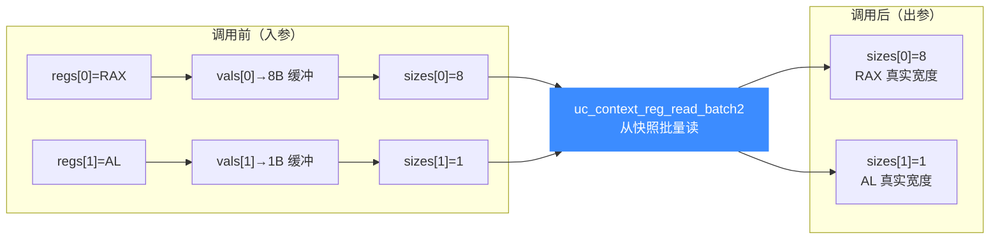

# uc_context_reg_read_batch2 — 批量带宽度读上下文寄存器

本页讲 `uc_context_reg_read_batch2`：与 [uc_context_reg_read_batch](/api/context-reg-read-batch) 一样一次从快照读多个寄存器，但每个值都带 `size`，能在同一批里混合不同宽度的寄存器并安全截断。

## 📌 概述

`uc_context_reg_read_batch2` 遍历 `regs[]`，把快照里每个寄存器读进 `vals[i]`，最多 `sizes[i]` 字节，返回时把 `sizes[i]` 更新为该寄存器真实宽度。它把 [uc_reg_read_batch2](/api/reg-read-batch2) 的批量带宽度特性搬到快照场景——一次快照采样即可拿到所有寄存器的值与宽度。

## 函数原型

```c
uc_err uc_context_reg_read_batch2(uc_context *ctx, int const *regs,
                                  void *const *vals, size_t *sizes, int count);
```

> 📄 声明：[`unicorn.h`](https://github.com/android-security-engineer/unicorn-skills/blob/master/include/unicorn/unicorn.h#L1412) · 实现：[`uc.c`](https://github.com/android-security-engineer/unicorn-skills/blob/master/uc.c#L2540)

每个 `sizes[i]` 独立地按「缓冲容量 → 实际读取字节数」流转，可混合不同宽度寄存器：



## 参数

| 参数 | 类型 | 方向 | 说明 |
|------|------|------|------|
| `ctx` | `uc_context *` | 入 | 已 save 的上下文 |
| `regs` | `int const *` | 入 | 寄存器 ID 数组 |
| `vals` | `void *const *` | 出 | 指向各结果缓冲的指针数组 |
| `sizes` | `size_t *` | 入/出 | 入：各缓冲容量；出：各实际读取字节数 |
| `count` | `int` | 入 | 数组长度 |

## 返回值

| 值 | 含义 |
|----|------|
| `UC_ERR_OK` | 全部成功 |
| `UC_ERR_ARG` | 某个寄存器号或指针无效 |
| `UC_ERR_OVERFLOW` | 某个缓冲放不下对应寄存器（仍截断写入并回传宽度） |

## 💻 用法示例

一次从快照读出 x86 三个不同宽度寄存器，做快照差异展示：

```c
int regs[] = { UC_X86_REG_RAX, UC_X86_REG_EAX, UC_X86_REG_AL };
uint64_t rax; uint32_t eax; uint8_t al;
void *vals[]   = { &rax, &eax, &al };
size_t sizes[] = { sizeof(rax), sizeof(eax), sizeof(al) };

uc_err err = uc_context_reg_read_batch2(ctx, regs, vals, sizes, 3);
if (err == UC_ERR_OK) {
    printf("快照 RAX=0x%llx EAX=0x%x AL=0x%02x\n",
           (unsigned long long)rax, eax, al);
}
```

::: tip 何时用 2 版本
- 做**快照 diff 工具**：两个快照各跑一次 batch2，按回传宽度逐字节比对。
- 快照里寄存器**宽度不一**又想一次取完。
:::

::: warning 常见错误
- ❌ **`sizes` 未逐个初始化**：每个元素都是入参，漏置会读到 0 字节。
- ❌ **上下文未 save**：读未保存快照得到未定义内容。
:::

## 📂 相关源码

| 文件 | 角色 |
|------|------|
| [`unicorn.h`](https://github.com/android-security-engineer/unicorn-skills/blob/master/include/unicorn/unicorn.h#L1412) | `uc_context_reg_read_batch2` 声明 |
| [`uc.c`](https://github.com/android-security-engineer/unicorn-skills/blob/master/uc.c#L2540) | `uc_context_reg_read_batch2` 实现 |

## 相关页面

- [uc_context_reg_read_batch — 普通批量读上下文寄存器](/api/context-reg-read-batch)
- [uc_context_reg_write_batch2 — 批量带宽度写上下文寄存器](/api/context-reg-write-batch2)
- [uc_reg_read_batch2 — 引擎侧批量带宽度读](/api/reg-read-batch2)
- [上下文控制](/features/context)
