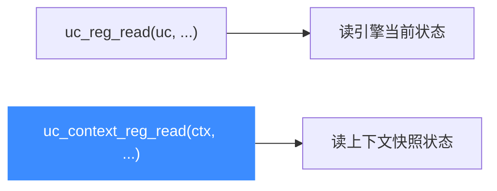

# uc_context_reg_read — 读上下文中的寄存器

本页讲 `uc_context_reg_read`：直接从一个已保存的上下文里读寄存器，无需先把上下文恢复到引擎。读完你能在不打扰当前仿真状态的前提下检视历史快照。

## 📌 概述

有了 [uc_context_save](/api/context-save) 保存的快照后，`uc_context_reg_read` 让你**直接**读取快照里某个寄存器的值——引擎的当前状态完全不受影响。这对「比较两个时刻的寄存器差异」尤其方便。

## 函数原型

```c
uc_err uc_context_reg_read(uc_context *ctx, int regid, void *value);
```

> 📄 声明：[`unicorn.h`](https://github.com/android-security-engineer/unicorn-skills/blob/master/include/unicorn/unicorn.h#L1317) · 实现：[`uc.c`](https://github.com/android-security-engineer/unicorn-skills/blob/master/uc.c#L2447)

## 参数

| 参数 | 类型 | 说明 |
|------|------|------|
| `ctx` | `uc_context *` | 由 [uc_context_alloc](/api/context-alloc) 返回、且已 save 的上下文 |
| `regid` | `int` | 寄存器 ID，取 `UC_<ARCH>_REG_*` |
| `value` | `void *` | 出参：存放结果的缓冲，宽度须匹配寄存器 |

## 返回值

| 值 | 含义 |
|----|------|
| `UC_ERR_OK` | 成功 |
| `UC_ERR_ARG` | 寄存器号或 value 指针无效 |

## 与 uc_reg_read 的区别



| 函数 | 数据源 | 是否影响引擎 |
|------|--------|-------------|
| [uc_reg_read](/api/reg-read) | 引擎当前 | 否 |
| `uc_context_reg_read` | 上下文快照 | 否 |

## 💻 用法示例

比较仿真前后的 RAX：

```c
uc_context *ctx;
uc_context_alloc(uc, &ctx);
uc_context_save(uc, ctx);            // 记录起始快照

uc_emu_start(uc, START, END, 0, 0);  // 引擎状态改变

uint64_t rax_before = 0, rax_now = 0;
uc_context_reg_read(ctx, UC_X86_REG_RAX, &rax_before);  // 快照里的旧值
uc_reg_read(uc, UC_X86_REG_RAX, &rax_now);              // 引擎里的新值
printf("RAX: 0x%" PRIx64 " -> 0x%" PRIx64 "\n", rax_before, rax_now);

uc_context_free(ctx);
```

::: warning 常见错误
- ❌ **上下文未 save**：读一个刚 alloc、还没 save 的上下文得到的是未定义内容。
- ❌ **宽度不符**：与 [uc_reg_read](/api/reg-read) 同理，缓冲宽度须匹配寄存器。
- ❌ **架构不符**：上下文属于某架构，用其它架构的 regid 会 `UC_ERR_ARG`。
:::

## 📂 相关源码

| 文件 | 角色 |
|------|------|
| [`unicorn.h`](https://github.com/android-security-engineer/unicorn-skills/blob/master/include/unicorn/unicorn.h#L1317) | `uc_context_reg_read` 声明 |
| [`uc.c`](https://github.com/android-security-engineer/unicorn-skills/blob/master/uc.c#L2447) | `uc_context_reg_read` 实现 |

## 相关页面

- [uc_context_reg_read2 — 带宽度读上下文寄存器](/api/context-reg-read2)
- [uc_context_reg_write — 写上下文寄存器](/api/context-reg-write)
- [uc_context_reg_read_batch — 批量读](/api/context-reg-read-batch)
- [uc_context_save — 保存状态](/api/context-save)
- [上下文控制](/features/context)
