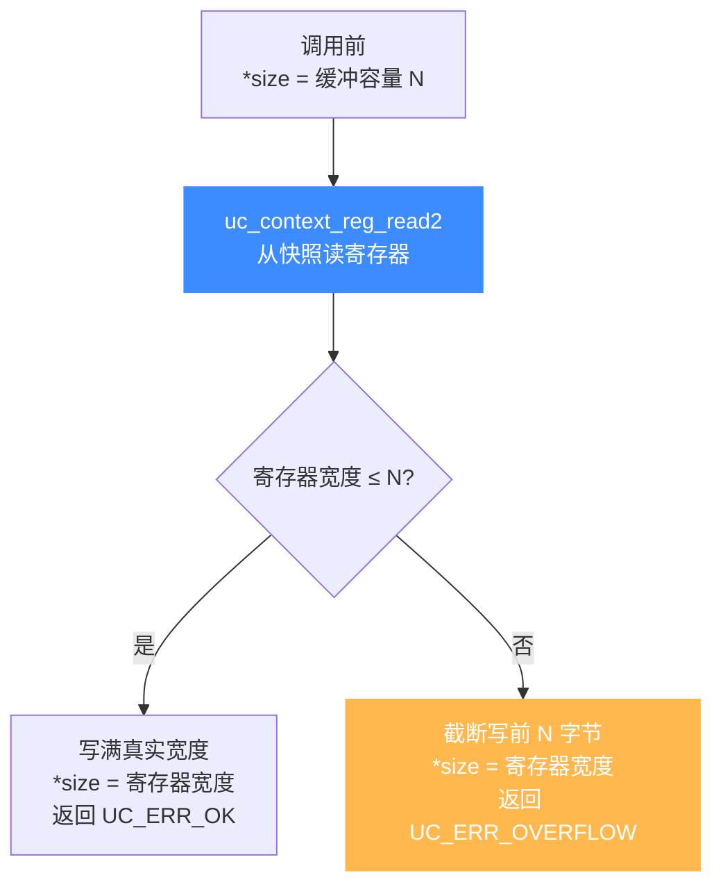

# uc_context_reg_read2 — 带宽度读上下文寄存器

本页讲 `uc_context_reg_read2`：与 [uc_context_reg_read](/api/context-reg-read) 一样直接从快照读寄存器，但多一个 `size` 参数，能在缓冲容量不足时安全截断并回传寄存器真实宽度。

## 📌 概述

`uc_context_reg_read2` 把快照 `ctx` 里 `regid` 的值拷进 `value`，最多 `*size` 字节，返回时把 `*size` 更新为该寄存器真实宽度。它把 [uc_reg_read2](/api/reg-read2) 的「带宽度 + 截断安全」特性搬到快照读取场景——读快照而不打扰引擎，同时安全处理变宽寄存器。

## 函数原型

```c
uc_err uc_context_reg_read2(uc_context *ctx, int regid,
                            void *value, size_t *size);
```

> 📄 声明：[`unicorn.h`](https://github.com/android-security-engineer/unicorn-skills/blob/master/include/unicorn/unicorn.h#L1346) · 实现：[`uc.c`](https://github.com/android-security-engineer/unicorn-skills/blob/master/uc.c#L2464)

`size` 既是入参（缓冲容量）也是出参（实际读取字节数），缓冲不够时安全截断：



## 参数

| 参数 | 类型 | 方向 | 说明 |
|------|------|------|------|
| `ctx` | `uc_context *` | 入 | 已 save 的上下文 |
| `regid` | `int` | 入 | 寄存器 ID，取 `UC_<ARCH>_REG_*` |
| `value` | `void *` | 出 | 存放结果的缓冲 |
| `size` | `size_t *` | 入/出 | 入：缓冲容量；出：实际读取字节数 |

## 返回值

| 值 | 含义 |
|----|------|
| `UC_ERR_OK` | 成功 |
| `UC_ERR_ARG` | 寄存器号或指针无效 |
| `UC_ERR_OVERFLOW` | 缓冲放不下整个寄存器（仍截断写入并回传宽度） |

## 💻 用法示例

用统一缓冲读快照里任意寄存器，事后看宽度：

```c
uint8_t buf[64] = {0};
size_t size = sizeof(buf);
uc_err err = uc_context_reg_read2(ctx, UC_X86_REG_RAX, buf, &size);
if (err == UC_ERR_OK) {
    printf("快照 RAX = %zu 字节\n", size);
} else if (err == UC_ERR_OVERFLOW) {
    printf("缓冲太小，快照里该寄存器 %zu 字节\n", size);
}
```

::: tip 何时用 2 版本
- 读快照中的**变宽 / 特殊寄存器**，事先不知宽度。
- 写**快照差异比较工具**：统一缓冲扫所有寄存器，再按回传宽度逐字节比对两个快照。
:::

::: warning 常见错误
- ❌ **`size` 未初始化**：入参也是出参，漏置会读到 0 字节。
- ❌ **上下文未 save**：读未保存的快照得到的是未定义内容。
:::

## 📂 相关源码

| 文件 | 角色 |
|------|------|
| [`unicorn.h`](https://github.com/android-security-engineer/unicorn-skills/blob/master/include/unicorn/unicorn.h#L1346) | `uc_context_reg_read2` 声明 |
| [`uc.c`](https://github.com/android-security-engineer/unicorn-skills/blob/master/uc.c#L2464) | `uc_context_reg_read2` 实现 |

## 相关页面

- [uc_context_reg_read — 普通读上下文寄存器](/api/context-reg-read)
- [uc_context_reg_write2 — 带宽度写上下文寄存器](/api/context-reg-write2)
- [uc_reg_read2 — 引擎侧带宽度读](/api/reg-read2)
- [上下文控制](/features/context)
