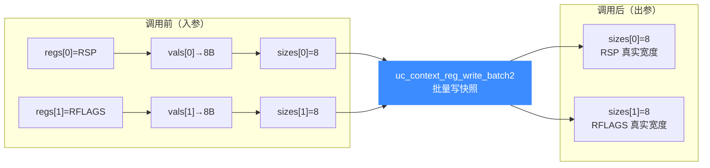

# uc_context_reg_write_batch2 — 批量带宽度写上下文寄存器

本页讲 `uc_context_reg_write_batch2`：与 [uc_context_reg_write_batch](/api/context-reg-write-batch) 一样一次改快照里多个寄存器，但每个值都带 `size`，能在同一批里给不同宽度寄存器写入精确字节数。

## 📌 概述

`uc_context_reg_write_batch2` 遍历 `regs[]`，从 `vals[i]` 取 `sizes[i]` 字节写入快照对应寄存器，返回时把 `sizes[i]` 更新为实际写入宽度。它把 [uc_reg_write_batch2](/api/reg-write-batch2) 的批量带宽度特性搬到快照场景——在快照上一次性布置多个不同宽度的输入寄存器，再 restore 重跑。

## 函数原型

```c
uc_err uc_context_reg_write_batch2(uc_context *ctx, int const *regs,
                                   const void *const *vals,
                                   size_t *sizes, int count);
```

> 📄 声明：[`unicorn.h`](https://github.com/android-security-engineer/unicorn-skills/blob/master/include/unicorn/unicorn.h#L1393) · 实现：[`uc.c`](https://github.com/android-security-engineer/unicorn-skills/blob/master/uc.c#L2517)

每个 `sizes[i]` 独立地按「要写字节数 → 实际写入字节数」流转，可在快照上一次性布置多个不同宽度的输入寄存器：



## 参数

| 参数 | 类型 | 方向 | 说明 |
|------|------|------|------|
| `ctx` | `uc_context *` | 入 | 已 save 的上下文 |
| `regs` | `int const *` | 入 | 寄存器 ID 数组 |
| `vals` | `const void *const *` | 入 | 指向各待写值的指针数组 |
| `sizes` | `size_t *` | 入/出 | 入：各要写字节数；出：各实际写入字节数 |
| `count` | `int` | 入 | 数组长度 |

## 返回值

| 值 | 含义 |
|----|------|
| `UC_ERR_OK` | 全部成功 |
| `UC_ERR_ARG` | 某个寄存器号或指针无效 |
| `UC_ERR_OVERFLOW` | 某个缓冲数据不足寄存器宽度（仍按缓冲写入并回传宽度） |

## 💻 用法示例

在快照上一次性布置 x86 栈指针、参数、标志位，循环重跑：

```c
int regs[] = { UC_X86_REG_RSP, UC_X86_REG_RDI, UC_X86_REG_RFLAGS };
uint64_t rsp = 0x7fff0000, rdi = 42, rflags = 0x202;
const void *vals[] = { &rsp, &rdi, &rflags };
size_t sizes[]     = { sizeof(rsp), sizeof(rdi), sizeof(rflags) };

uc_context_save(uc, ctx);                                   // 基线
uc_context_reg_write_batch2(ctx, regs, vals, sizes, 3);     // 改快照
uc_context_restore(uc, ctx);                                // 回灌
uc_emu_start(uc, START, END, 0, 0);
```

::: tip 何时用 2 版本
- 快照 fuzzing：每轮**一次性**改一组不同宽度的输入寄存器，比逐个调 `uc_context_reg_write2` 省往返。
- 从外部序列化数据恢复快照状态，每字段宽度已在数据里标注。
:::

::: warning 常见错误
- ❌ **`sizes` 未逐个初始化**：每个元素是入参，漏置会写成 0 字节。
- ❌ **`count` 与数组实际长度不符**：三者（regs/vals/sizes）必须同长。
:::

## 📂 相关源码

| 文件 | 角色 |
|------|------|
| [`unicorn.h`](https://github.com/android-security-engineer/unicorn-skills/blob/master/include/unicorn/unicorn.h#L1393) | `uc_context_reg_write_batch2` 声明 |
| [`uc.c`](https://github.com/android-security-engineer/unicorn-skills/blob/master/uc.c#L2517) | `uc_context_reg_write_batch2` 实现 |

## 相关页面

- [uc_context_reg_write_batch — 普通批量写上下文寄存器](/api/context-reg-write-batch)
- [uc_context_reg_read_batch2 — 批量带宽度读上下文寄存器](/api/context-reg-read-batch2)
- [uc_reg_write_batch2 — 引擎侧批量带宽度写](/api/reg-write-batch2)
- [上下文控制](/features/context)
