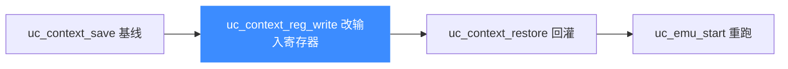

# uc_context_reg_write — 写上下文中的寄存器

本页讲 `uc_context_reg_write`：直接修改一个已保存上下文里的寄存器值，随后再 restore 就能把「篡改过的状态」灌回引擎。读完你能实现「基于快照微调后重跑」的高效试探。

## 📌 概述

`uc_context_reg_write` 在**不接触引擎当前状态**的前提下，改写上下文快照里的某个寄存器。典型用法是：保存一个基线快照 → 在快照上改一个输入寄存器 → [uc_context_restore](/api/context-restore) 回灌 → 重跑。

## 函数原型

```c
uc_err uc_context_reg_write(uc_context *ctx, int regid, const void *value);
```

> 📄 声明：[`unicorn.h`](https://github.com/android-security-engineer/unicorn-skills/blob/master/include/unicorn/unicorn.h#L1305) · 实现：[`uc.c`](https://github.com/android-security-engineer/unicorn-skills/blob/master/uc.c#L2438)

## 参数

| 参数 | 类型 | 说明 |
|------|------|------|
| `ctx` | `uc_context *` | 已 save 的上下文 |
| `regid` | `int` | 寄存器 ID，取 `UC_<ARCH>_REG_*` |
| `value` | `const void *` | 指向要写入值的缓冲，宽度须匹配寄存器 |

## 返回值

| 值 | 含义 |
|----|------|
| `UC_ERR_OK` | 成功 |
| `UC_ERR_ARG` | 寄存器号或 value 无效 |

## 工作流



## 💻 用法示例

在快照上批量试不同输入，无需每次都动引擎再存回：

```c
uc_context *ctx;
uc_context_alloc(uc, &ctx);
uc_context_save(uc, ctx);              // 基线

for (uint64_t input = 0; input < 4; input++) {
    uc_context_reg_write(ctx, UC_X86_REG_RDI, &input);  // 只改快照
    uc_context_restore(uc, ctx);                        // 灌回引擎
    uc_emu_start(uc, START, END, 0, 0);

    uint64_t ret;
    uc_reg_read(uc, UC_X86_REG_RAX, &ret);
    printf("input=%" PRIu64 " ret=0x%" PRIx64 "\n", input, ret);
}
uc_context_free(ctx);
```

::: tip 与直接改引擎的区别
你也可以 restore 后再用 [uc_reg_write](/api/reg-write) 改引擎。区别在于：`uc_context_reg_write` 改的是**快照本身**，之后每次 restore 都会带上这次修改，适合「让某个寄存器在所有后续恢复中都保持新值」。
:::

::: warning 常见错误
- ❌ **上下文未 save**：在未保存的容器上写寄存器，restore 出来的其它寄存器是未定义的。
- ❌ **宽度不符**：与 [uc_reg_write](/api/reg-write) 同理。
:::

## 📂 相关源码

| 文件 | 角色 |
|------|------|
| [`unicorn.h`](https://github.com/android-security-engineer/unicorn-skills/blob/master/include/unicorn/unicorn.h#L1305) | `uc_context_reg_write` 声明 |
| [`uc.c`](https://github.com/android-security-engineer/unicorn-skills/blob/master/uc.c#L2438) | `uc_context_reg_write` 实现 |

## 相关页面

- [uc_context_reg_write2 — 带宽度写上下文寄存器](/api/context-reg-write2)
- [uc_context_reg_read — 读上下文寄存器](/api/context-reg-read)
- [uc_context_reg_write_batch — 批量写](/api/context-reg-write-batch)
- [uc_context_restore — 恢复状态](/api/context-restore)
- [上下文控制](/features/context)
