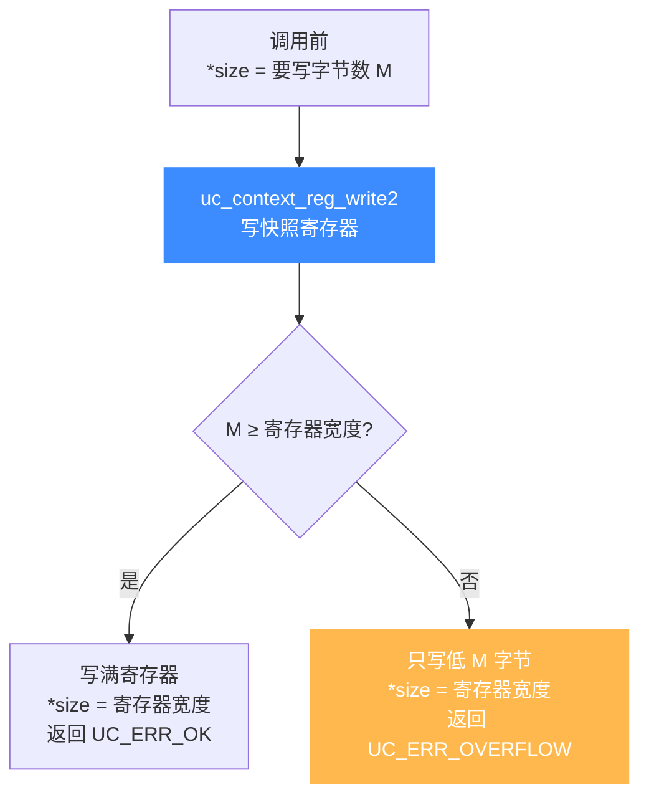

# uc_context_reg_write2 — 带宽度写上下文寄存器

本页讲 `uc_context_reg_write2`：与 [uc_context_reg_write](/api/context-reg-write) 一样直接改快照里的寄存器，但多一个 `size` 参数，能精确指定写入字节数并回传实际写入宽度。

## 📌 概述

`uc_context_reg_write2` 从 `value` 取 `*size` 字节写入快照 `ctx` 的 `regid`，返回时把 `*size` 更新为实际写入宽度。它把 [uc_reg_write2](/api/reg-write2) 的「按字节写 + 回传宽度」搬到快照场景——在快照上微调输入寄存器时，能只动低若干位。

## 函数原型

```c
uc_err uc_context_reg_write2(uc_context *ctx, int regid,
                             const void *value, size_t *size);
```

> 📄 声明：[`unicorn.h`](https://github.com/android-security-engineer/unicorn-skills/blob/master/include/unicorn/unicorn.h#L1331) · 实现：[`uc.c`](https://github.com/android-security-engineer/unicorn-skills/blob/master/uc.c#L2455)

`size` 既是入参（要写字节数）也是出参（实际写入字节数），数据不足寄存器宽度时仍按缓冲写入：



## 参数

| 参数 | 类型 | 方向 | 说明 |
|------|------|------|------|
| `ctx` | `uc_context *` | 入 | 已 save 的上下文 |
| `regid` | `int` | 入 | 寄存器 ID，取 `UC_<ARCH>_REG_*` |
| `value` | `const void *` | 入 | 指向要写入值的缓冲 |
| `size` | `size_t *` | 入/出 | 入：要写字节数；出：实际写入字节数 |

## 返回值

| 值 | 含义 |
|----|------|
| `UC_ERR_OK` | 成功 |
| `UC_ERR_ARG` | 寄存器号或指针无效 |
| `UC_ERR_OVERFLOW` | 缓冲数据不足寄存器宽度（仍按缓冲写入并回传宽度） |

## 💻 用法示例

在快照上只改 RAX 低 2 字节，再 restore 重跑：

```c
uint16_t lo = 0xbeef;
size_t size = sizeof(lo);
uc_err err = uc_context_reg_write2(ctx, UC_X86_REG_RAX, &lo, &size);
if (err == UC_ERR_OVERFLOW) {
    printf("RAX 真实宽度 %zu 字节，仅改了低 %zu 字节\n", size, sizeof(lo));
}
uc_context_restore(uc, ctx);
uc_emu_start(uc, START, END, 0, 0);
```

::: tip 何时用 2 版本
- 在快照上做**位级 fuzzing**：每次只改寄存器某几个字节，看哪个比特触发不同路径。
- 从外部序列化数据恢复快照状态，字段宽度已标注。
:::

::: warning 常见错误
- ❌ **`size` 未初始化**：入参也是出参，漏置会写成 0 字节。
- ❌ **误以为截断即失败**：`UC_ERR_OVERFLOW` 时低字节**仍已写入**快照。
:::

## 📂 相关源码

| 文件 | 角色 |
|------|------|
| [`unicorn.h`](https://github.com/android-security-engineer/unicorn-skills/blob/master/include/unicorn/unicorn.h#L1331) | `uc_context_reg_write2` 声明 |
| [`uc.c`](https://github.com/android-security-engineer/unicorn-skills/blob/master/uc.c#L2455) | `uc_context_reg_write2` 实现 |

## 相关页面

- [uc_context_reg_write — 普通写上下文寄存器](/api/context-reg-write)
- [uc_context_reg_read2 — 带宽度读上下文寄存器](/api/context-reg-read2)
- [uc_reg_write2 — 引擎侧带宽度写](/api/reg-write2)
- [上下文控制](/features/context)
