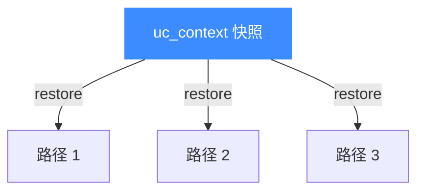

# uc_context_restore — 恢复 CPU 状态

本页讲 `uc_context_restore`：把之前 [uc_context_save](/api/context-save) 保存的状态回灌到引擎，实现「时间回退」。读完你能反复从同一还原点重跑，构建分叉与回滚逻辑。

## 📌 概述

`uc_context_restore` 用上下文中保存的状态覆盖引擎当前 CPU 状态。一个上下文可被**多次**恢复，每次都把引擎带回保存时的样子。

## 函数原型

```c
uc_err uc_context_restore(uc_engine *uc, uc_context *context);
```

> 📄 声明：[`unicorn.h`](https://github.com/android-security-engineer/unicorn-skills/blob/master/include/unicorn/unicorn.h#L1428) · 实现：[`uc.c`](https://github.com/android-security-engineer/unicorn-skills/blob/master/uc.c#L2561)

## 参数

| 参数 | 类型 | 说明 |
|------|------|------|
| `uc` | `uc_engine *` | 引擎句柄 |
| `context` | `uc_context *` | 曾用于 [uc_context_save](/api/context-save) 的上下文 |

## 返回值

返回 `uc_err`，`UC_ERR_OK` 表示成功。

## 多次恢复



## 💻 用法示例

对同一还原点尝试多组输入：

```c
uc_context *ctx;
uc_context_alloc(uc, &ctx);
uc_context_save(uc, ctx);        // 还原点

uint64_t inputs[] = { 1, 2, 3, 4 };
for (int i = 0; i < 4; i++) {
    uc_context_restore(uc, ctx);              // 每轮先回退
    uc_reg_write(uc, UC_X86_REG_RDI, &inputs[i]);
    uc_emu_start(uc, START, END, 0, 0);

    uint64_t ret;
    uc_reg_read(uc, UC_X86_REG_RAX, &ret);
    printf("输入 %" PRIu64 " -> 返回 0x%" PRIx64 "\n", inputs[i], ret);
}
uc_context_free(ctx);
```

::: warning 常见错误
- ❌ **恢复未曾 save 的上下文**：内容未定义。必须先 [uc_context_save](/api/context-save)。
- ❌ **只恢复了寄存器却期望内存也回退**：默认上下文不含内存。若仿真中修改了内存，恢复后内存仍是修改后的样子。需要内存回滚见 [快照与回滚](/features/snapshot) 与 [uc_ctl_context_mode](/ctl/context-mode)。
- ❌ **跨引擎/跨架构恢复**：只能恢复到与保存时同架构、同模式的引擎。
:::

## 📂 相关源码

| 文件 | 角色 |
|------|------|
| [`unicorn.h`](https://github.com/android-security-engineer/unicorn-skills/blob/master/include/unicorn/unicorn.h#L1428) | `uc_context_restore` 声明 |
| [`uc.c`](https://github.com/android-security-engineer/unicorn-skills/blob/master/uc.c#L2561) | `uc_context_restore` 实现 |

## 相关页面

- [uc_context_save — 保存状态](/api/context-save)
- [uc_context_alloc — 分配上下文](/api/context-alloc)
- [快照与回滚](/features/snapshot)
- [上下文控制](/features/context)
