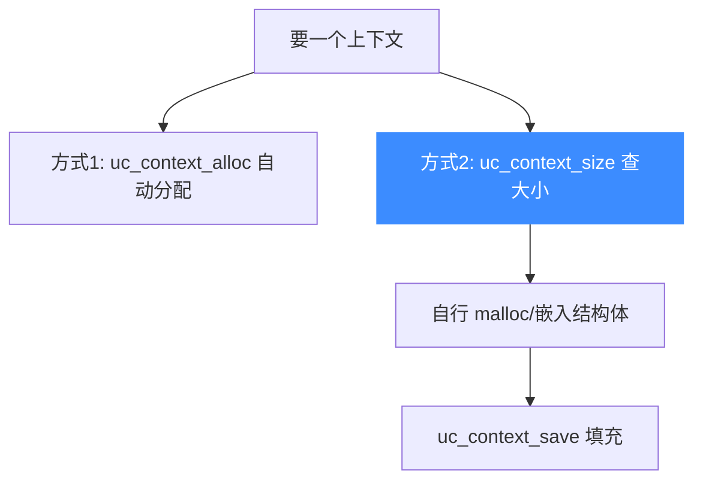

# uc_context_size — 上下文所需字节数

本页讲 `uc_context_size`：返回存储一个引擎上下文所需的字节数。读完你能自行分配缓冲、把上下文直接嵌入自己的数据结构，而不必依赖 `uc_context_alloc`。

## 📌 概述

`uc_context_size` 告诉你保存该引擎的完整上下文需要多大内存。它的用途是让你能用自己的分配器预留空间，再配合 [uc_context_save](/api/context-save) 直接填充。

## 函数原型

```c
size_t uc_context_size(uc_engine *uc);
```

> 📄 声明：[`unicorn.h`](https://github.com/android-security-engineer/unicorn-skills/blob/master/include/unicorn/unicorn.h#L1439) · 实现：[`uc.c`](https://github.com/android-security-engineer/unicorn-skills/blob/master/uc.c#L2263)

## 参数

| 参数 | 类型 | 说明 |
|------|------|------|
| `uc` | `uc_engine *` | 引擎句柄 |

## 返回值

返回 `size_t`——存储该引擎上下文所需的字节数。

::: tip 与其他函数不同
`uc_context_size` **直接返回大小值**，而非 `uc_err`。这在整套 API 中属少数特例（另一个是 [uc_version](/api/version)）。
:::

## 两条路线



## 💻 用法示例

用 `uc_context_size` 预估内存占用：

```c
size_t sz = uc_context_size(uc);
printf("每个上下文占用 %zu 字节\n", sz);

// 估算保存 100 个快照的内存
printf("100 个快照约需 %zu KB\n", (sz * 100) / 1024);
```

::: tip 何时关心它
做符号执行/模糊测试时，可能同时保留成百上千个上下文快照。用 `uc_context_size` 提前估算内存预算，或决定是否用 [uc_ctl_context_mode](/ctl/context-mode) 裁剪保存范围以省内存。
:::

::: warning 常见错误
- ❌ **把它当错误码判断**：返回的是大小，不是 `uc_err`。不要写 `if (uc_context_size(uc) != UC_ERR_OK)`。
- ❌ **在配置变化后不重新查询**：改变会影响上下文内容的设置（如 `UC_CTL_CONTEXT_MEMORY`）后，尺寸可能改变，应重新调用。
:::

## 📂 相关源码

| 文件 | 角色 |
|------|------|
| [`unicorn.h`](https://github.com/android-security-engineer/unicorn-skills/blob/master/include/unicorn/unicorn.h#L1439) | `uc_context_size` 声明 |
| [`uc.c`](https://github.com/android-security-engineer/unicorn-skills/blob/master/uc.c#L2263) | `uc_context_size` 实现 |

## 相关页面

- [uc_context_alloc — 分配上下文](/api/context-alloc)
- [uc_context_save — 保存状态](/api/context-save)
- [uc_ctl_context_mode — 上下文范围](/ctl/context-mode)
- [上下文控制](/features/context)
