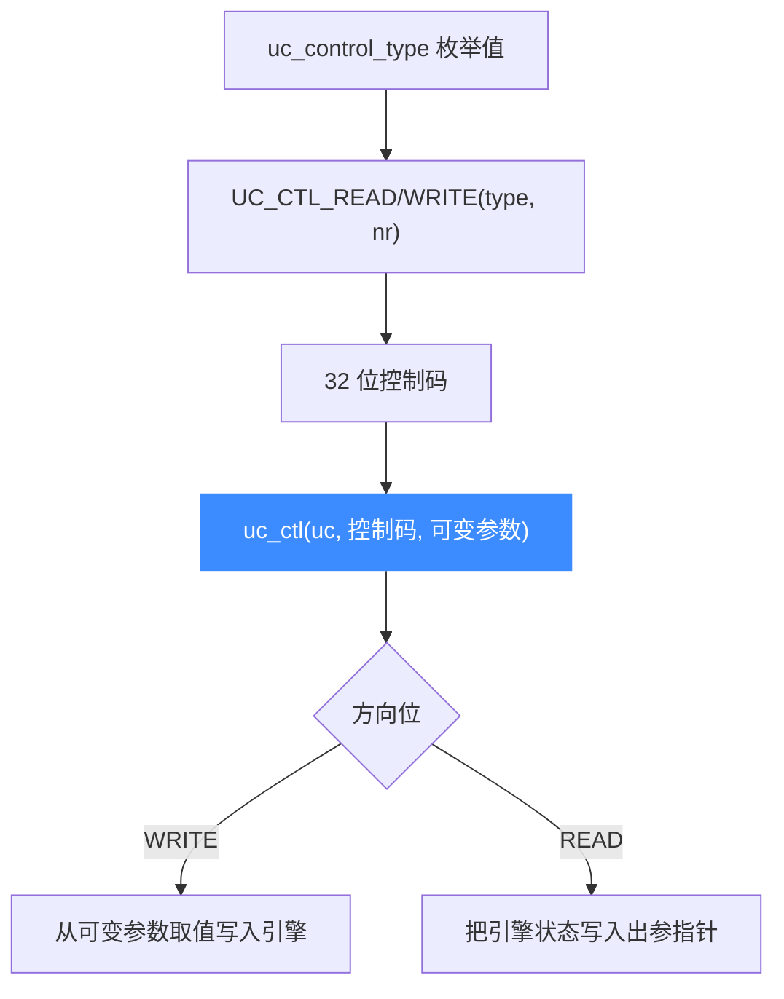

# uc_ctl — 动态控制总入口

本页讲 `uc_ctl` 的**机制**：它如何用一个可变参数函数统一承载几十种控制操作，以及控制码里「读写方向位 + 参数个数 + 类型」的编码协议。具体每个控制点的用法见 [uc_ctl 控制接口](/ctl/)。

## 📌 概述

`uc_ctl` 类似 Linux 的 `ioctl`：把「要控制什么」编码进一个 `uc_control_type` 值，再按该操作的约定传可变参数。日常使用**推荐用头文件提供的 `uc_ctl_*` 便捷宏**，无需手工拼控制码。

## 函数原型

```c
uc_err uc_ctl(uc_engine *uc, uc_control_type control, ...);
```

> 📄 声明：[`unicorn.h`](https://github.com/android-security-engineer/unicorn-skills/blob/master/include/unicorn/unicorn.h#L778) · 实现：[`uc.c`](https://github.com/android-security-engineer/unicorn-skills/blob/master/uc.c#L2623)

## 参数

| 参数 | 类型 | 说明 |
|------|------|------|
| `uc` | `uc_engine *` | 引擎句柄 |
| `control` | `uc_control_type` | 控制码，通常由 `UC_CTL_*(type, nr)` 宏构造 |
| `...` | 可变参数 | 依控制码而定：读操作传出参指针，写操作传值 |

## 🔧 控制码的位布局

一个控制码 32 位，被切成四段（来自 `unicorn.h`）：

```
   R/W       NR       Reserved     Type
 [      ] [      ]  [         ] [       ]
 31    30 29     26 25       16 15      0
```

| 字段 | 位 | 含义 |
|------|----|------|
| R/W | 31–30 | 读写方向：见下表 |
| NR | 29–26 | 参数个数 |
| Reserved | 25–16 | 保留，置 0 |
| Type | 15–0 | 取自 `uc_control_type` 枚举 |

### 读写方向位

| 宏 | 值 | 含义 |
|----|----|------|
| `UC_CTL_IO_NONE` | 0 | 无参数 |
| `UC_CTL_IO_WRITE` | 1 | 只写（传入值） |
| `UC_CTL_IO_READ` | 2 | 只读（传出指针） |
| `UC_CTL_IO_READ_WRITE` | 3 | 读写皆有 |

构造宏：

```c
#define UC_CTL(type, nr, rw)  ((type) | ((nr) << 26) | ((rw) << 30))
#define UC_CTL_READ(type, nr)        UC_CTL(type, nr, UC_CTL_IO_READ)
#define UC_CTL_WRITE(type, nr)       UC_CTL(type, nr, UC_CTL_IO_WRITE)
#define UC_CTL_READ_WRITE(type, nr)  UC_CTL(type, nr, UC_CTL_IO_READ_WRITE)
```



## 💻 用法示例

### 用便捷宏（推荐）

```c
// 读页大小
uint32_t page = 0;
uc_ctl_get_page_size(uc, &page);

// 设置 CPU 型号（写）
uc_ctl_set_cpu_model(uc, UC_CPU_ARM_CORTEX_R5);

// 刷新全部翻译块缓存（无参数）
uc_ctl_flush_tb(uc);
```

### 手工拼控制码（理解机制用）

```c
// 等价于 uc_ctl_get_page_size：读 1 个参数
uint32_t page = 0;
uc_ctl(uc, UC_CTL_READ(UC_CTL_UC_PAGE_SIZE, 1), &page);
```

::: warning 常见错误
- ❌ **方向位或参数个数写错**：`nr` 与实际传入的可变参数个数必须一致，否则读到垃圾或越界。优先用便捷宏避免手滑。
- ❌ **读操作传值而非指针**：读方向必须传出参地址（如 `&page`）。
- ❌ **可变参数类型不符**：如某控制点要求 `uint64_t*` 却传了 `int*`，在 64 位平台会出错。以 [/ctl/](/ctl/) 各页标注的类型为准。
- ❌ **时机不对**：如 `UC_CTL_CPU_MODEL` 只能在除 `uc_open` 外的任何 API 调用**之前**设置。
:::

## 📂 相关源码

| 文件 | 角色 |
|------|------|
| [`unicorn.h`](https://github.com/android-security-engineer/unicorn-skills/blob/master/include/unicorn/unicorn.h#L778) | `uc_ctl` 声明 |
| [`uc.c`](https://github.com/android-security-engineer/unicorn-skills/blob/master/uc.c#L2623) | `uc_ctl` 实现 |

## 相关页面

- [uc_ctl 控制接口总览](/ctl/) — 每个控制点的详解
- [uc_query — 查询属性](/api/query)
- [上下文控制](/features/context)
- [多出口机制](/features/exits)
