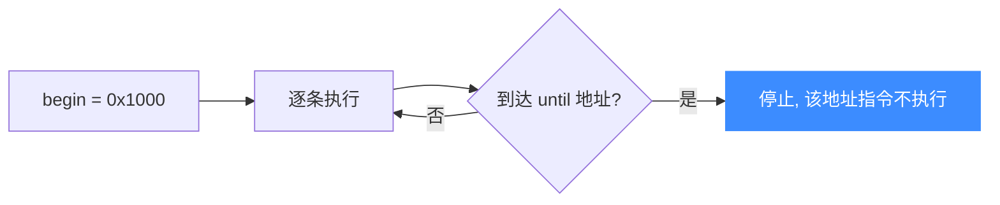
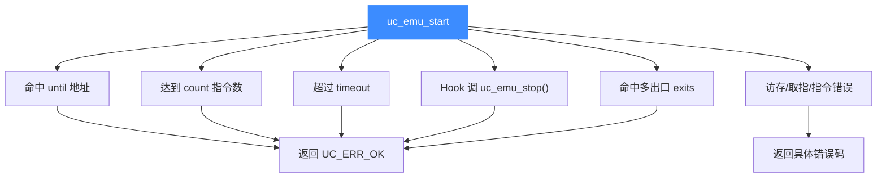

# uc_emu_start — 启动仿真

本页讲 `uc_emu_start`：Unicorn 的「运行」按钮。读完你能精确掌握 `begin`、`until`、`timeout`、`count` 四个参数的语义，理解为什么 `until` 常被误解，以及仿真停止的各种原因。

## 📌 概述

`uc_emu_start` 从 `begin` 地址开始翻译并执行机器码，直到命中退出地址、达到超时/指令上限、Hook 主动停止，或发生错误。它是**阻塞**调用——返回时仿真已停止。

## 函数原型

```c
uc_err uc_emu_start(uc_engine *uc, uint64_t begin, uint64_t until,
                    uint64_t timeout, size_t count);
```

> 📄 声明：[`unicorn.h`](https://github.com/android-security-engineer/unicorn-skills/blob/master/include/unicorn/unicorn.h#L1047) · 实现：[`uc.c`](https://github.com/android-security-engineer/unicorn-skills/blob/master/uc.c#L1076)

## 参数详解

| 参数 | 类型 | 语义 |
|------|------|------|
| `begin` | `uint64_t` | 开始执行的地址（一般设为你写入代码的起始地址） |
| `until` | `uint64_t` | **退出地址**：执行到该地址时停止（命中即停，该地址指令不再执行） |
| `timeout` | `uint64_t` | 超时（**微秒**）。为 `0` 表示不限时，跑到自然结束 |
| `count` | `size_t` | 最多执行的指令条数。为 `0` 表示不限条数 |

### 🎯 until 参数的正确理解

`until` 是「执行到此地址就停」的**边界**，不是「执行完这段范围」。



常见做法是把 `until` 设为「代码末尾之后」的地址，或某个已知返回点。想让它**永不因地址停止**，可传一个不可能命中的值（如 `0` 或 `-1`），只靠 `timeout`/`count`/Hook 控制。

### ⏱️ timeout 的单位

`timeout` 以**微秒**计。头文件提供了换算常量：

| 常量 | 值 | 含义 |
|------|----|------|
| `UC_SECOND_SCALE` | 1000000 | 1 秒 = 1,000,000 微秒 |
| `UC_MILISECOND_SCALE` | 1000 | 用于毫秒换算 |

例如跑 2 秒：`timeout = 2 * UC_SECOND_SCALE`。

## 返回值

返回 `uc_err`。`UC_ERR_OK` 表示**正常**结束（命中 until / 达到 count / Hook 停止 / 超时）。若因访存等问题异常停止，返回对应错误码，例如：

| 错误码 | 含义 |
|--------|------|
| `UC_ERR_READ_UNMAPPED` | 读了未映射内存 |
| `UC_ERR_WRITE_UNMAPPED` | 写了未映射内存 |
| `UC_ERR_FETCH_UNMAPPED` | 从未映射内存取指（常因忘记映射代码段） |
| `UC_ERR_INSN_INVALID` | 非法指令 |
| `UC_ERR_EXCEPTION` | 未处理的 CPU 异常 |

::: tip 判断是否超时
返回 `UC_ERR_OK` 时若想知道是不是因超时停止，用 `uc_query(uc, UC_QUERY_TIMEOUT, &r)`，见 [uc_query](/api/query)。
:::

## 停止原因全景



## 💻 用法示例

```c
// x86-64: 把代码写到 0x1000, 从头跑到写完为止
uint8_t code[] = { 0x48, 0xC7, 0xC0, 0x01, 0, 0, 0 };  // mov rax, 1
uint64_t addr = 0x1000;

uc_mem_map(uc, addr, 0x1000, UC_PROT_ALL);
uc_mem_write(uc, addr, code, sizeof(code));

// begin=0x1000, until=代码末尾, 不限时不限条数
uc_err err = uc_emu_start(uc, addr, addr + sizeof(code), 0, 0);
if (err != UC_ERR_OK)
    printf("仿真出错: %s\n", uc_strerror(err));

uint64_t rax;
uc_reg_read(uc, UC_X86_REG_RAX, &rax);   // 应为 1
```

只跑固定条数（单步调试常用）：

```c
uc_emu_start(uc, addr, 0, 0, 1);   // 只执行 1 条指令
```

::: warning 常见错误
- ❌ **忘记映射代码段**：最常见的坑，得到 `UC_ERR_FETCH_UNMAPPED`。执行前必须 [uc_mem_map](/api/mem-map) 覆盖 `begin` 所在页并写入代码。
- ❌ **误把 until 当范围长度**：`until` 是**绝对地址**，不是字节数。
- ❌ **Thumb 模式忘了置位**：ARM Thumb 代码需把 `begin` 的最低位或按 `UC_MODE_THUMB` 打开，否则解码错乱。
- ❌ **启用多出口后仍指望 until**：调用 `uc_ctl_exits_enable` 后 `until` 会被忽略，见 [多出口机制](/features/exits)。
:::

## 📂 相关源码

| 文件 | 角色 |
|------|------|
| [`unicorn.h`](https://github.com/android-security-engineer/unicorn-skills/blob/master/include/unicorn/unicorn.h#L1047) | `uc_emu_start` 声明 |
| [`uc.c`](https://github.com/android-security-engineer/unicorn-skills/blob/master/uc.c#L1076) | `uc_emu_start` 实现 |

## 相关页面

- [uc_emu_stop — 停止仿真](/api/emu-stop)
- [uc_mem_map — 映射内存](/api/mem-map)
- [超时与指令计数](/features/timeout)
- [多出口机制](/features/exits)
