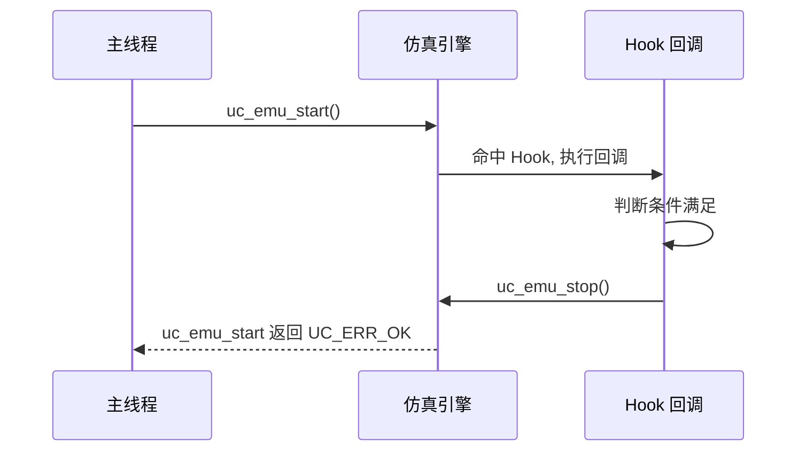

# uc_emu_stop — 停止仿真

本页讲 `uc_emu_stop`：从 Hook 回调内部主动叫停正在运行的仿真。读完你能实现「命中某条件就停」的逻辑，理解它与 `uc_emu_start` 返回的配合关系。

## 📌 概述

`uc_emu_stop` 请求停止由 [uc_emu_start](/api/emu-start) 启动的仿真。它**几乎总是在 Hook 回调里调用**——因为主线程此时正阻塞在 `uc_emu_start` 中，只有回调有机会执行你的逻辑。

## 函数原型

```c
uc_err uc_emu_stop(uc_engine *uc);
```

> 📄 声明：[`unicorn.h`](https://github.com/android-security-engineer/unicorn-skills/blob/master/include/unicorn/unicorn.h#L1060) · 实现：[`uc.c`](https://github.com/android-security-engineer/unicorn-skills/blob/master/uc.c#L1257)

## 参数

| 参数 | 类型 | 说明 |
|------|------|------|
| `uc` | `uc_engine *` | 引擎句柄 |

## 返回值

返回 `uc_err`，`UC_ERR_OK` 表示停止请求已受理。调用后，正在阻塞的 `uc_emu_start` 会随即返回 `UC_ERR_OK`。

## 工作时序



## 💻 用法示例

在 `UC_HOOK_CODE` 里，执行到某地址就停：

```c
static uint64_t stop_at = 0x1010;

static void hook_code(uc_engine *uc, uint64_t address,
                      uint32_t size, void *user_data) {
    printf("执行 @ 0x%" PRIx64 "\n", address);
    if (address == stop_at) {
        printf("命中目标, 停止仿真\n");
        uc_emu_stop(uc);
    }
}

int main(void) {
    uc_engine *uc;
    uc_open(UC_ARCH_X86, UC_MODE_64, &uc);
    uc_mem_map(uc, 0x1000, 0x1000, UC_PROT_ALL);
    // ... 写入代码 ...

    uc_hook h;
    uc_hook_add(uc, &h, UC_HOOK_CODE, hook_code, NULL, 0x1000, 0x2000);

    uc_emu_start(uc, 0x1000, 0, 0, 0);   // 会被 hook 内的 stop 打断
    uc_close(uc);
    return 0;
}
```

::: tip 计数达标即停
若只是想「执行 N 条后停」，用 [uc_emu_start](/api/emu-start) 的 `count` 参数更直接，无需自己在 Hook 里计数调用 `uc_emu_stop`。
:::

::: warning 常见错误
- ❌ **在仿真外调用**：`uc_emu_start` 是阻塞的，主线程在其外部无法调用 `uc_emu_stop`（除非在另一线程，需自行保证线程安全，见 [线程安全](/features/thread-safety)）。正常用法是在回调内调用。
- ❌ **以为立即停在当前指令**：停止在实现上有粒度（基本块边界），当前指令通常会执行完。若需精确停在某地址，配合 [uc_reg_read](/api/reg-read) 检查 PC。
- ❌ **停止后不检查状态**：停止后应读寄存器/内存确认结果。
:::

## 📂 相关源码

| 文件 | 角色 |
|------|------|
| [`unicorn.h`](https://github.com/android-security-engineer/unicorn-skills/blob/master/include/unicorn/unicorn.h#L1060) | `uc_emu_stop` 声明 |
| [`uc.c`](https://github.com/android-security-engineer/unicorn-skills/blob/master/uc.c#L1257) | `uc_emu_stop` 实现 |

## 相关页面

- [uc_emu_start — 启动仿真](/api/emu-start)
- [uc_hook_add — 注册 Hook](/api/hook-add)
- [Hook 插桩体系](/features/hooks)
- [多出口机制](/features/exits)
