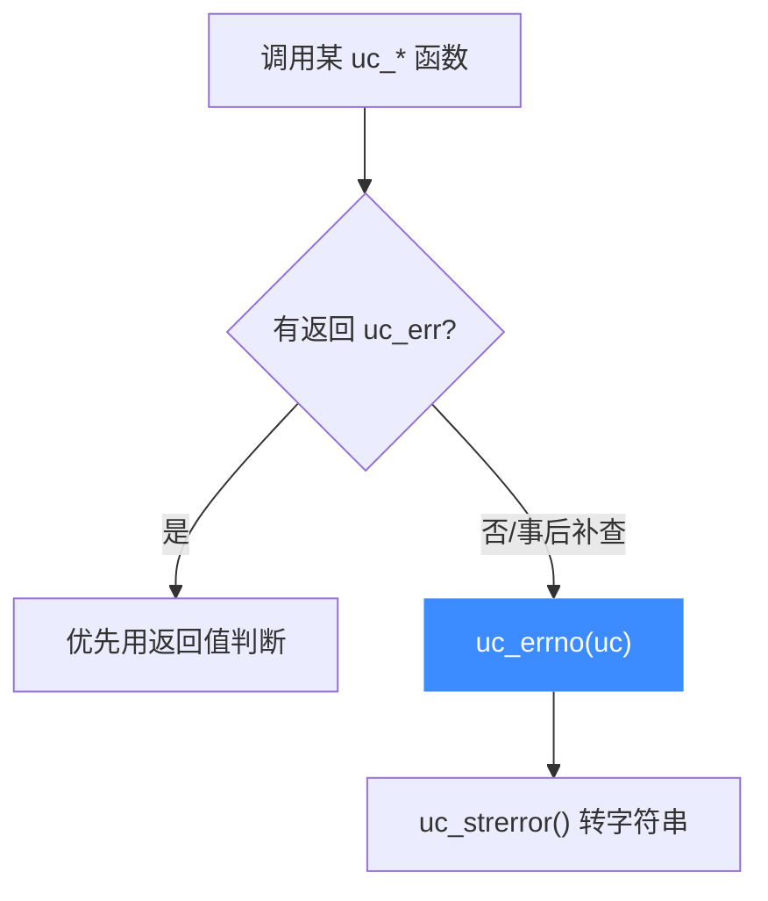

# uc_errno — 取最近错误码

本页讲 `uc_errno`：取引擎最近一次 API 失败的错误码，类似 glibc 的 `errno`。读完你能理解它的取值时机与「一经读取可能不再保留旧值」的语义。

## 📌 概述

大多数 Unicorn 函数已经**直接返回** `uc_err`，通常不需要额外调用 `uc_errno`。它主要用于那些不返回错误码、或想在事后补查的场景。

## 函数原型

```c
uc_err uc_errno(uc_engine *uc);
```

> 📄 声明：[`unicorn.h`](https://github.com/android-security-engineer/unicorn-skills/blob/master/include/unicorn/unicorn.h#L789) · 实现：[`uc.c`](https://github.com/android-security-engineer/unicorn-skills/blob/master/uc.c#L139)

## 参数

| 参数 | 类型 | 说明 |
|------|------|------|
| `uc` | `uc_engine *` | 引擎句柄 |

## 返回值

返回 `uc_err`——最近一次错误的代码。含义详见 [错误码参考](/errors/)，可用 [uc_strerror](/api/strerror) 转成字符串。

::: warning 值可能不保留
头文件明确指出：**像 glibc 的 errno 一样，`uc_errno` 一旦被访问，其旧值可能不再保留**。因此要用就尽早读，不要假设它长期有效。
:::

## 与直接返回值的关系



## 💻 用法示例

```c
uc_err err = uc_mem_write(uc, 0x1000, code, sizeof(code));
if (err != UC_ERR_OK) {
    // 二者应当一致
    printf("返回码: %s\n", uc_strerror(err));
    printf("uc_errno: %s\n", uc_strerror(uc_errno(uc)));
}
```

更常见的是仿真出错后查最近状态：

```c
if (uc_emu_start(uc, 0x1000, 0, 0, 0) != UC_ERR_OK) {
    uc_err e = uc_errno(uc);
    printf("仿真失败: %s\n", uc_strerror(e));   // 如 UC_ERR_READ_UNMAPPED
}
```

::: tip 优先用返回值
既然绝大多数函数已返回 `uc_err`，最稳妥的写法是**直接检查每次调用的返回值**，而非事后依赖 `uc_errno`。后者作为辅助手段更合适。
:::

## 📂 相关源码

| 文件 | 角色 |
|------|------|
| [`unicorn.h`](https://github.com/android-security-engineer/unicorn-skills/blob/master/include/unicorn/unicorn.h#L789) | `uc_errno` 声明 |
| [`uc.c`](https://github.com/android-security-engineer/unicorn-skills/blob/master/uc.c#L139) | `uc_errno` 实现 |

## 相关页面

- [uc_strerror — 错误字符串](/api/strerror)
- [错误码参考总览](/errors/)
- [调试仿真问题](/guide/debugging)
