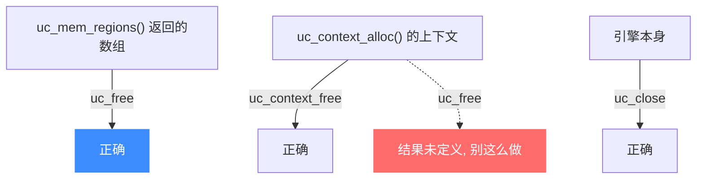

# uc_free — 释放 Unicorn 分配的缓冲

本页讲 `uc_free`：释放由 Unicorn（主要是 [uc_mem_regions](/api/mem-regions)）替你分配的内存。读完你能分清 `uc_free`、`uc_context_free`、`uc_close` 各自的职责，避免内存泄漏与误用。

## 📌 概述

某些 API 会在内部分配内存并通过出参交给你，最典型的是 [uc_mem_regions](/api/mem-regions) 返回的区域数组。这类缓冲需要你用 `uc_free` 释放。

## 函数原型

```c
uc_err uc_free(void *mem);
```

> 📄 声明：[`unicorn.h`](https://github.com/android-security-engineer/unicorn-skills/blob/master/include/unicorn/unicorn.h#L1279) · 实现：[`uc.c`](https://github.com/android-security-engineer/unicorn-skills/blob/master/uc.c#L2256)

## 参数

| 参数 | 类型 | 说明 |
|------|------|------|
| `mem` | `void *` | 由 Unicorn 分配的缓冲，如 `uc_mem_regions` 返回的 `*regions` |

## 返回值

返回 `uc_err`，`UC_ERR_OK` 表示成功。

## 三种「释放」别搞混



| 资源 | 分配者 | 正确释放方式 |
|------|--------|-------------|
| 区域数组 | [uc_mem_regions](/api/mem-regions) | `uc_free` |
| 上下文 | [uc_context_alloc](/api/context-alloc) | [uc_context_free](/api/context-free) |
| 引擎 | [uc_open](/api/open) | [uc_close](/api/close) |

::: danger 不要用 uc_free 释放上下文
头文件警告：自 Unicorn 1.0.1rc5 起，`uc_context_alloc` 分配的内存应由 [uc_context_free](/api/context-free) 释放。用 `uc_free` 释放上下文的结果是**未定义的**。
:::

## 💻 用法示例

```c
uc_mem_region *regions = NULL;
uint32_t count = 0;

if (uc_mem_regions(uc, &regions, &count) == UC_ERR_OK) {
    for (uint32_t i = 0; i < count; i++) {
        printf("区域 %u: 0x%" PRIx64 " - 0x%" PRIx64 " perms=%u\n",
               i, regions[i].begin, regions[i].end, regions[i].perms);
    }
    uc_free(regions);   // 必须释放, 否则泄漏
}
```

::: warning 常见错误
- ❌ **忘记释放**：`uc_mem_regions` 每次调用都分配新数组，不 `uc_free` 就会持续泄漏。
- ❌ **对非 Unicorn 分配的指针调用**：只对 Unicorn 交给你的缓冲用 `uc_free`，不要拿它释放你自己 `malloc` 的内存。
- ❌ **误用于上下文**：见上方 danger 提示。
:::

## 📂 相关源码

| 文件 | 角色 |
|------|------|
| [`unicorn.h`](https://github.com/android-security-engineer/unicorn-skills/blob/master/include/unicorn/unicorn.h#L1279) | `uc_free` 声明 |
| [`uc.c`](https://github.com/android-security-engineer/unicorn-skills/blob/master/uc.c#L2256) | `uc_free` 实现 |

## 相关页面

- [uc_mem_regions — 枚举映射](/api/mem-regions)
- [uc_context_free — 释放上下文](/api/context-free)
- [uc_close — 释放引擎](/api/close)
