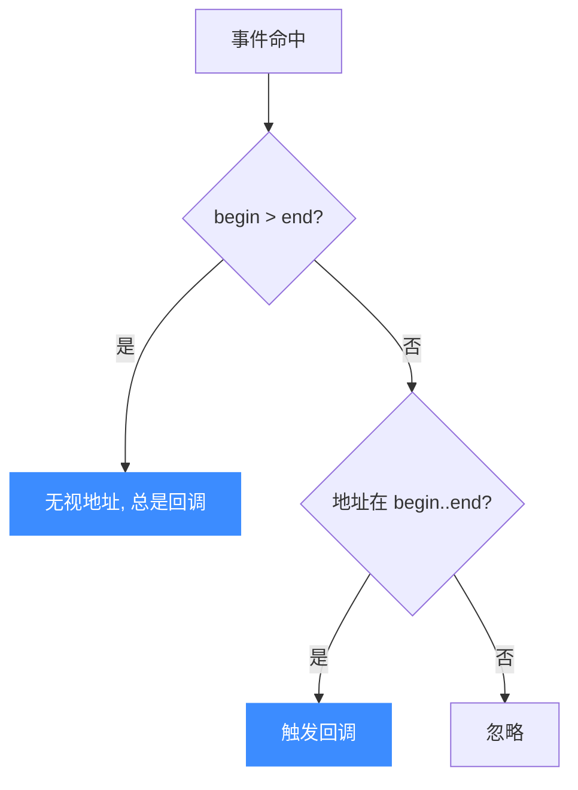

# uc_hook_add — 注册 Hook 回调

Unicorn 插桩的总入口：一个函数注册所有类型的 Hook。读完本页你能掌握位掩码 `type`、`begin`/`end` 地址范围、`UC_HOOK_INSN` 的可变参数，以及如何用返回的 `uc_hook` 句柄事后注销。

## 🪝 原型

```c
uc_err uc_hook_add(uc_engine *uc, uc_hook *hh, int type, void *callback,
                   void *user_data, uint64_t begin, uint64_t end, ...);
```

> 📄 声明：[`unicorn.h`](https://github.com/android-security-engineer/unicorn-skills/blob/master/include/unicorn/unicorn.h#L1088) · 实现：[`uc.c`](https://github.com/android-security-engineer/unicorn-skills/blob/master/uc.c#L1908)

为某类事件登记一个回调，事件命中时执行。**所有** Hook（代码、块、内存、中断、指令……）都经由这一个 API 注册。

## 🧩 参数

| 参数 | 类型 | 说明 |
|------|------|------|
| `uc` | `uc_engine *` | 引擎句柄 |
| `hh` | `uc_hook *` | 出参：注册成功后写回句柄，用于 [uc_hook_del](/api/hook-del) |
| `type` | `int` | `UC_HOOK_*` 的**按位或**，可一次注册多种事件 |
| `callback` | `void *` | 回调函数指针，**签名随 `type` 而定**（见下） |
| `user_data` | `void *` | 透传给回调的用户数据 |
| `begin` | `uint64_t` | 生效地址范围起点（含） |
| `end` | `uint64_t` | 生效地址范围终点（含） |
| `...` | 可变参数 | 仅特定 `type` 需要（见下） |

### begin / end 地址范围

- 回调**仅当**相关地址落在 `[begin, end]`（闭区间）时才触发。
- 若 `begin > end`，则**忽略范围**，该类型事件每次都触发。常用 `begin=1, end=0` 表示"全程生效"。



### type 是位掩码

`type` 可按位或多个 `UC_HOOK_*`。例如同时挂读写：

```c
UC_HOOK_MEM_READ | UC_HOOK_MEM_WRITE
```

前提是这些类型共用同一种回调签名（内存类共用 `uc_cb_hookmem_t`）。常见回调签名：

| type | 回调签名 |
|------|----------|
| `UC_HOOK_CODE` / `UC_HOOK_BLOCK` | `uc_cb_hookcode_t(uc, address, size, user_data)` |
| `UC_HOOK_MEM_READ/WRITE/FETCH` | `uc_cb_hookmem_t(uc, type, address, size, value, user_data)` |
| `UC_HOOK_MEM_*_UNMAPPED/PROT` | `uc_cb_eventmem_t(...)` → 返回 `bool` 决定是否继续 |
| `UC_HOOK_INTR` | `uc_cb_hookintr_t(uc, intno, user_data)` |
| `UC_HOOK_INSN` | 因指令而异（如 x86 IN 用 `uc_cb_insn_in_t`） |

### 可变参数：UC_HOOK_INSN 与 UC_HOOK_TCG_OPCODE

- **`UC_HOOK_INSN`**：第 8 个参数是**指令 ID**。目前仅 x86 的 `in`、`out`、`syscall`、`sysenter`、`cpuid` 受支持。
- **`UC_HOOK_TCG_OPCODE`**：额外传 `opcode` 与 `flags`（见 `uc_tcg_op_code` / `uc_tcg_op_flag`）。

## 📤 返回值

| 返回值 | 含义 |
|--------|------|
| `UC_ERR_OK` | 注册成功，`*hh` 有效 |
| `UC_ERR_HOOK` | Hook 类型无效 |
| `UC_ERR_NOMEM` | 分配失败 |

## 🔧 注册流程

```mermaid
sequenceDiagram
    participant App as 你的代码
    participant UC as Unicorn
    participant CB as 回调
    App->>UC: uc_hook_add(&hh, type, cb, ud, begin, end, ...)
    UC-->>App: 写回句柄 hh (UC_ERR_OK)
    App->>UC: uc_emu_start(...)
    UC->>CB: 事件命中且在范围内 → 调用 cb
    App->>UC: uc_hook_del(hh) 注销
    style UC fill:#3c8cff,color:#fff,stroke:none
```

## 💻 完整示例

```c
#include <unicorn/unicorn.h>
#include <stdio.h>

// 每条指令执行前回调
static void on_code(uc_engine *uc, uint64_t addr, uint32_t size, void *ud) {
    printf("exec @0x%" PRIx64 " size=%u\n", addr, size);
}

// 内存写回调（UC_HOOK_MEM_WRITE 用 uc_cb_hookmem_t）
static void on_write(uc_engine *uc, uc_mem_type t, uint64_t addr, int size,
                     int64_t value, void *ud) {
    printf("write @0x%" PRIx64 " = 0x%" PRIx64 "\n", addr, (uint64_t)value);
}

int main(void) {
    uc_engine *uc;
    uc_open(UC_ARCH_X86, UC_MODE_64, &uc);
    uc_mem_map(uc, 0x1000, 0x1000, UC_PROT_ALL);

    // mov [0x1000], eax ; nop
    uint8_t code[] = {0x89, 0x04, 0x25, 0x00, 0x10, 0x00, 0x00, 0x90};
    uc_mem_write(uc, 0x1000, code, sizeof(code));

    uc_hook h_code, h_write;
    // begin=1,end=0 → 全程生效
    uc_hook_add(uc, &h_code, UC_HOOK_CODE, on_code, NULL, 1, 0);
    uc_hook_add(uc, &h_write, UC_HOOK_MEM_WRITE, on_write, NULL, 1, 0);

    uc_emu_start(uc, 0x1000, 0x1000 + sizeof(code), 0, 0);

    uc_hook_del(uc, h_code);
    uc_hook_del(uc, h_write);
    uc_close(uc);
    return 0;
}
```

::: warning 常见坑
- **回调签名必须与 `type` 匹配**：`callback` 是 `void *`，编译器不查类型，签名写错就是未定义行为/崩溃。
- **想全程生效用 `begin=1, end=0`**（`begin > end`）；写成 `0, 0` 只会命中地址 0。
- **位或多个类型时**它们必须共用同一回调签名，否则应分多次注册。
- `UC_HOOK_INSN` 忘传指令 ID，或用在不支持的架构/指令上会失败。
- 句柄 `hh` 要留着给 [uc_hook_del](/api/hook-del)，否则无法单独注销。
:::

## 📂 相关源码

| 文件 | 角色 |
|------|------|
| [`unicorn.h`](https://github.com/android-security-engineer/unicorn-skills/blob/master/include/unicorn/unicorn.h#L1088) | `uc_hook_add` 声明 |
| [`uc.c`](https://github.com/android-security-engineer/unicorn-skills/blob/master/uc.c#L1908) | `uc_hook_add` 实现 |
| [`list.c`](https://github.com/android-security-engineer/unicorn-skills/blob/master/list.c) | Hook 链表工具 |

## 相关页面

- [Hook 类型参考](/hooks/) — 每种 `UC_HOOK_*` 详解
- [Hook 插桩体系](/features/hooks) — 位掩码、粒度与设计
- [uc_hook_del](/api/hook-del) — 注销 Hook
- [uc_emu_start](/api/emu-start) — 触发 Hook 的执行入口
