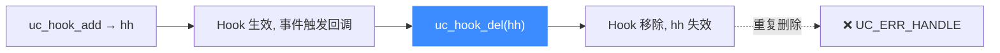

# uc_hook_del — 注销 Hook 回调

移除一个之前用 `uc_hook_add` 注册的 Hook，让它不再被触发。读完本页你能掌握它的用法、句柄失效语义，以及何时该主动注销。

## 🧹 原型

```c
uc_err uc_hook_del(uc_engine *uc, uc_hook hh);
```

> 📄 声明：[`unicorn.h`](https://github.com/android-security-engineer/unicorn-skills/blob/master/include/unicorn/unicorn.h#L1104) · 实现：[`uc.c`](https://github.com/android-security-engineer/unicorn-skills/blob/master/uc.c#L2036)

删除句柄 `hh` 对应的 Hook。调用后 `hh` **立即失效**，不可再使用（包括不能重复删除）。

## 🧩 参数

| 参数 | 类型 | 说明 |
|------|------|------|
| `uc` | `uc_engine *` | 引擎句柄 |
| `hh` | `uc_hook` | [uc_hook_add](/api/hook-add) 写回的句柄 |

::: tip uc_hook 是什么
`uc_hook` 就是 `typedef size_t uc_hook;`——一个不透明的整数句柄，仅用于标识已注册的 Hook。别去解读它的数值。
:::

## 📤 返回值

| 返回值 | 含义 |
|--------|------|
| `UC_ERR_OK` | 注销成功 |
| `UC_ERR_HANDLE` | 句柄无效（如已删除、从未注册） |

## 🔧 生命周期



## 💻 完整示例：只在前若干指令插桩

```c
#include <unicorn/unicorn.h>
#include <stdio.h>

static int count = 0;
static uc_hook g_hook;
static uc_engine *g_uc;

static void on_code(uc_engine *uc, uint64_t addr, uint32_t size, void *ud) {
    printf("insn #%d @0x%" PRIx64 "\n", ++count, addr);
    if (count >= 2) {
        // 达到阈值后动态注销自己，后续指令不再插桩
        uc_hook_del(g_uc, g_hook);
        printf("hook removed\n");
    }
}

int main(void) {
    uc_open(UC_ARCH_X86, UC_MODE_64, &g_uc);
    uc_mem_map(g_uc, 0x1000, 0x1000, UC_PROT_ALL);
    uint8_t code[] = {0x90, 0x90, 0x90, 0x90}; // 4 个 nop
    uc_mem_write(g_uc, 0x1000, code, sizeof(code));

    uc_hook_add(g_uc, &g_hook, UC_HOOK_CODE, on_code, NULL, 1, 0);
    uc_emu_start(g_uc, 0x1000, 0x1000 + sizeof(code), 0, 0);

    uc_close(g_uc);
    return 0;
}
```

::: warning 常见坑
- **不要重复删除**同一句柄，第二次返回 `UC_ERR_HANDLE`（且句柄可能已被复用）。
- 删除后**不要再使用** `hh` 做任何事。
- `uc_close` 会自动清理所有 Hook，正常关闭时无需逐个 `uc_hook_del`；主动注销主要用于"运行期动态开关插桩"。
- 在回调**内部**注销自己是允许的（如上例），但注销别的正在触发的 Hook 需谨慎。
:::

## 📂 相关源码

| 文件 | 角色 |
|------|------|
| [`unicorn.h`](https://github.com/android-security-engineer/unicorn-skills/blob/master/include/unicorn/unicorn.h#L1104) | `uc_hook_del` 声明 |
| [`uc.c`](https://github.com/android-security-engineer/unicorn-skills/blob/master/uc.c#L2036) | `uc_hook_del` 实现 |
| [`list.c`](https://github.com/android-security-engineer/unicorn-skills/blob/master/list.c) | Hook 链表工具 |

## 相关页面

- [uc_hook_add](/api/hook-add) — 注册 Hook 并取得句柄
- [Hook 类型参考](/hooks/) — 每种 `UC_HOOK_*` 详解
- [Hook 插桩体系](/features/hooks) — 插桩设计全貌
