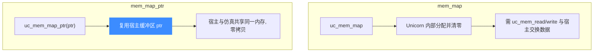

# uc_mem_map_ptr — 零拷贝映射宿主内存

把一段模拟地址直接指向宿主进程已分配的缓冲区，双方共享同一份物理内存。读完本页你能掌握它与 `uc_mem_map` 的区别、零拷贝的收益，以及最危险的生命周期陷阱。

## 🚀 原型

```c
uc_err uc_mem_map_ptr(uc_engine *uc, uint64_t address, uint64_t size,
                      uint32_t perms, void *ptr);
```

> 📄 声明：[`unicorn.h`](https://github.com/android-security-engineer/unicorn-skills/blob/master/include/unicorn/unicorn.h#L1166) · 实现：[`uc.c`](https://github.com/android-security-engineer/unicorn-skills/blob/master/uc.c#L1409)

与 [uc_mem_map](/api/mem-map) 几乎相同，唯一区别是：底层内存不由 Unicorn 分配，而是**直接使用你传入的宿主指针 `ptr`**。被仿真代码对这块区域的读写，会实时反映到 `ptr` 指向的宿主缓冲区，反之亦然。

## 🧩 参数

| 参数 | 类型 | 说明 |
|------|------|------|
| `uc` | `uc_engine *` | 引擎句柄 |
| `address` | `uint64_t` | 起始物理地址，必须 **4KB 对齐** |
| `size` | `uint64_t` | 区域大小，必须是 **4KB 的倍数** |
| `perms` | `uint32_t` | `UC_PROT_*` 权限组合（约束的是被仿真代码，不是 `ptr`） |
| `ptr` | `void *` | 宿主缓冲区指针，**大小 ≥ `size`**，且宿主侧应至少 `PROT_READ｜PROT_WRITE` |

## 📤 返回值

| 返回值 | 含义 |
|--------|------|
| `UC_ERR_OK` | 映射成功 |
| `UC_ERR_ARG` | 未对齐或参数非法 |
| `UC_ERR_MAP` | 区域重叠或映射无效 |

## 🔧 mem_map vs mem_map_ptr



| 维度 | `uc_mem_map` | `uc_mem_map_ptr` |
|------|--------------|------------------|
| 底层内存 | Unicorn 分配 | 你提供的 `ptr` |
| 数据交换 | 需 `uc_mem_read/write` 拷贝 | 直接共享，无需拷贝 |
| 生命周期 | Unicorn 负责 | **你负责**，必须活得比映射久 |
| 适用场景 | 通用 | 大块数据/固件镜像、与宿主频繁交互 |

## 💻 完整示例

```c
#include <unicorn/unicorn.h>
#include <stdio.h>
#include <stdlib.h>

int main(void) {
    uc_engine *uc;
    uc_open(UC_ARCH_X86, UC_MODE_64, &uc);

    // 宿主分配一页并预填数据
    uint8_t *host = calloc(1, 0x1000);
    host[0] = 0xAB;

    // 零拷贝映射到模拟地址 0x4000
    uc_err err = uc_mem_map_ptr(uc, 0x4000, 0x1000, UC_PROT_ALL, host);
    printf("map_ptr: %s\n", uc_strerror(err));

    // 被仿真侧看到宿主写入的值
    uint8_t v;
    uc_mem_read(uc, 0x4000, &v, 1);
    printf("emu sees host[0] = %02x\n", v); // AB

    // 反过来：改宿主缓冲区，仿真侧立即可见（共享内存）
    host[0] = 0xCD;
    uc_mem_read(uc, 0x4000, &v, 1);
    printf("after host update = %02x\n", v); // CD

    uc_mem_unmap(uc, 0x4000, 0x1000); // 先解除映射
    free(host);                       // 再释放宿主内存
    uc_close(uc);
    return 0;
}
```

::: danger 生命周期陷阱
`ptr` 的所有权仍在你手里。**必须保证 `ptr` 在整个映射存续期间有效**：
- 别传栈上的局部数组——函数返回后指针悬空，仿真访问即野指针。
- 别在 `uc_mem_unmap` / `uc_close` 之前 `free(ptr)`——之后仿真访问会读写已释放内存。
- 缓冲区实际大小必须 ≥ `size`，否则越界为**未定义行为**。
正确顺序：`uc_mem_unmap`（或 `uc_close`）→ 再 `free(ptr)`。
:::

## 📂 相关源码

| 文件 | 角色 |
|------|------|
| [`unicorn.h`](https://github.com/android-security-engineer/unicorn-skills/blob/master/include/unicorn/unicorn.h#L1166) | `uc_mem_map_ptr` 声明 |
| [`uc.c`](https://github.com/android-security-engineer/unicorn-skills/blob/master/uc.c#L1409) | `uc_mem_map_ptr` 实现 |

## 相关页面

- [uc_mem_map](/api/mem-map) — 由 Unicorn 分配的普通映射
- [零拷贝映射 mem_map_ptr](/memory/map-ptr) — 概念详解
- [uc_mem_unmap](/api/mem-unmap) — 解除映射
- [内存映射与管理](/features/memory) — 内存模型全貌
