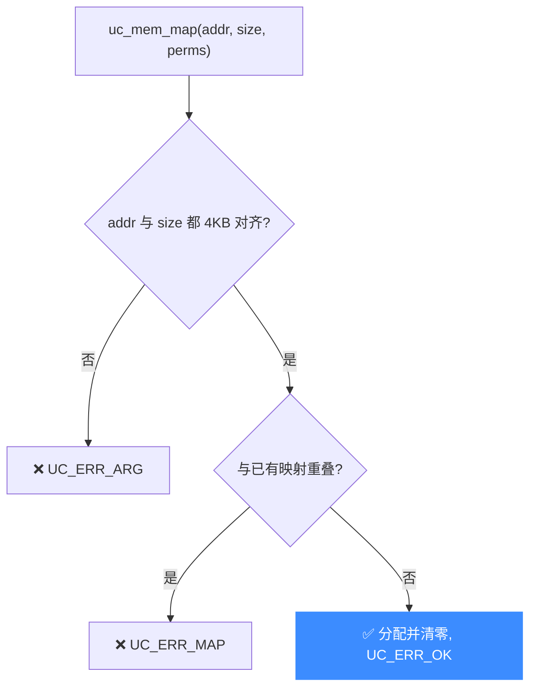

# uc_mem_map — 映射一块模拟内存

在模拟地址空间"焊"上一块可用内存，并设定读/写/执行权限。读完本页你能掌握它的对齐要求、`UC_PROT_*` 权限组合，以及为什么不映射就无法运行任何代码。

## 🧠 原型

```c
uc_err uc_mem_map(uc_engine *uc, uint64_t address, uint64_t size,
                  uint32_t perms);
```

> 📄 声明：[`unicorn.h`](https://github.com/android-security-engineer/unicorn-skills/blob/master/include/unicorn/unicorn.h#L1140) · 实现：[`uc.c`](https://github.com/android-security-engineer/unicorn-skills/blob/master/uc.c#L1390)

新增一块由 Unicorn 分配、清零的内存区域。**任何**被仿真代码的取指、读、写都必须落在已映射区域上，否则触发相应的未映射事件。

## 🧩 参数

| 参数 | 类型 | 说明 |
|------|------|------|
| `uc` | `uc_engine *` | [uc_open](/api/open) 返回的引擎句柄 |
| `address` | `uint64_t` | 起始**物理地址**，必须 **4KB 对齐**（`0x1000` 的倍数） |
| `size` | `uint64_t` | 区域大小，必须是 **4KB 的倍数** |
| `perms` | `uint32_t` | `UC_PROT_*` 的按位或 |

### 权限位 UC_PROT_*

| 常量 | 值 | 含义 |
|------|----|------|
| `UC_PROT_NONE` | 0 | 无任何权限 |
| `UC_PROT_READ` | 1 | 可读 |
| `UC_PROT_WRITE` | 2 | 可写 |
| `UC_PROT_EXEC` | 4 | 可执行 |
| `UC_PROT_ALL` | 7 | 读|写|执行 |

## 📤 返回值

| 返回值 | 含义 |
|--------|------|
| `UC_ERR_OK` | 映射成功 |
| `UC_ERR_ARG` | `address`/`size` 未 4KB 对齐，或 `perms` 非法 |
| `UC_ERR_MAP` | 与已有映射重叠，或映射无效 |
| `UC_ERR_NOMEM` | 宿主内存不足 |

## 🔧 对齐校验



## 💻 完整示例

```c
#include <unicorn/unicorn.h>
#include <stdio.h>

int main(void) {
    uc_engine *uc;
    uc_open(UC_ARCH_ARM64, UC_MODE_ARM, &uc);

    // 代码段：可读可执行
    uc_err err = uc_mem_map(uc, 0x10000, 0x1000, UC_PROT_READ | UC_PROT_EXEC);
    printf("code seg: %s\n", uc_strerror(err));

    // 数据段：可读可写
    uc_mem_map(uc, 0x20000, 0x2000, UC_PROT_READ | UC_PROT_WRITE);

    // 未对齐地址 → UC_ERR_ARG
    err = uc_mem_map(uc, 0x10001, 0x1000, UC_PROT_ALL);
    printf("misaligned: %s\n", uc_strerror(err));

    uc_close(uc);
    return 0;
}
```

::: warning 常见坑
- **未 4KB 对齐** 是最常见错误：`address` 或 `size` 只要不是 `0x1000` 的倍数就直接 `UC_ERR_ARG`。页大小可用 [uc_ctl_get_page_size](/ctl/get-page-size) 查询（某些架构非 4KB）。
- **漏了 `UC_PROT_EXEC`**：代码段只给了读写，取指时会触发 `UC_HOOK_MEM_FETCH_PROT`。
- **区域重叠**：两次 `uc_mem_map` 的范围不能相交，否则 `UC_ERR_MAP`。要改权限用 [uc_mem_protect](/api/mem-protect)，不要重复 map。
- MMU 启用后这里映射的是**物理地址**，别把虚拟地址传进来。
:::

## 📂 相关源码

| 文件 | 角色 |
|------|------|
| [`unicorn.h`](https://github.com/android-security-engineer/unicorn-skills/blob/master/include/unicorn/unicorn.h#L1140) | `uc_mem_map` 声明 |
| [`uc.c`](https://github.com/android-security-engineer/unicorn-skills/blob/master/uc.c#L1390) | `uc_mem_map` 实现 |

## 相关页面

- [映射内存 mem_map](/memory/map) — 概念详解
- [uc_mem_protect](/api/mem-protect) — 事后修改保护位
- [uc_mem_map_ptr](/api/mem-map-ptr) — 映射到宿主已有缓冲区
- [uc_mem_unmap](/api/mem-unmap) — 解除映射
- [内存映射与管理](/features/memory) — 内存模型全貌
