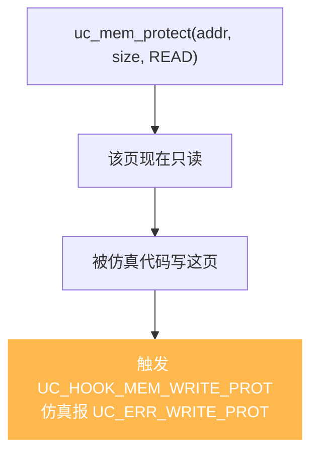

# uc_mem_protect — 修改已映射内存的保护位

在不重新映射的前提下，改变一段已映射内存的读/写/执行权限。读完本页你能掌握它的对齐要求、如何用它实现 W^X 与自修改代码检测。

## 🛡️ 原型

```c
uc_err uc_mem_protect(uc_engine *uc, uint64_t address, uint64_t size,
                      uint32_t perms);
```

> 📄 声明：[`unicorn.h`](https://github.com/android-security-engineer/unicorn-skills/blob/master/include/unicorn/unicorn.h#L1230) · 实现：[`uc.c`](https://github.com/android-security-engineer/unicorn-skills/blob/master/uc.c#L1713)

把 `[address, address + size)` 这段**已映射**内存的权限改为 `perms`。数据内容不变，只改保护位——相当于真实 CPU 的 `mprotect`。

## 🧩 参数

| 参数 | 类型 | 说明 |
|------|------|------|
| `uc` | `uc_engine *` | 引擎句柄 |
| `address` | `uint64_t` | 起始地址，必须 **4KB 对齐** |
| `size` | `uint64_t` | 大小，必须是 **4KB 的倍数** |
| `perms` | `uint32_t` | 新权限，`UC_PROT_*` 的按位或 |

`UC_PROT_*` 取值见 [uc_mem_map](/api/mem-map)：`NONE=0`、`READ=1`、`WRITE=2`、`EXEC=4`、`ALL=7`。

## 📤 返回值

| 返回值 | 含义 |
|--------|------|
| `UC_ERR_OK` | 修改成功 |
| `UC_ERR_ARG` | 未 4KB 对齐或 `perms` 非法 |
| `UC_ERR_NOMEM` | 覆盖的范围内有未映射页 |

## 🔧 权限违例如何触发 Hook



## 💻 完整示例：实现 W^X

```c
#include <unicorn/unicorn.h>
#include <stdio.h>

int main(void) {
    uc_engine *uc;
    uc_open(UC_ARCH_X86, UC_MODE_64, &uc);

    // 先以可写方式映射，装载机器码
    uc_mem_map(uc, 0x1000, 0x1000, UC_PROT_READ | UC_PROT_WRITE);
    uint8_t code[] = {0x90, 0x90, 0xC3}; // nop; nop; ret
    uc_mem_write(uc, 0x1000, code, sizeof(code));

    // 装载完毕，收紧为只读+可执行（去掉写权限 = W^X）
    uc_err err = uc_mem_protect(uc, 0x1000, 0x1000,
                                UC_PROT_READ | UC_PROT_EXEC);
    printf("protect: %s\n", uc_strerror(err));

    // 此后被仿真代码若试图写 0x1000，会触发 UC_HOOK_MEM_WRITE_PROT

    // 未对齐 → UC_ERR_ARG
    err = uc_mem_protect(uc, 0x1000, 0x800, UC_PROT_ALL);
    printf("bad size: %s\n", uc_strerror(err));

    uc_close(uc);
    return 0;
}
```

::: warning 常见坑
- **必须 4KB 对齐**，`address` 与 `size` 皆然。
- 范围必须**完全落在已映射内存**上，覆盖到未映射页会返回 `UC_ERR_NOMEM`。
- `uc_mem_protect` 只约束**被仿真代码**；宿主侧的 [uc_mem_write](/api/mem-write) 依然能写只读页。
- 想在写只读页时得到通知，需要额外挂 [UC_HOOK_MEM_WRITE_PROT](/hooks/mem-write-prot)。
:::

## 📂 相关源码

| 文件 | 角色 |
|------|------|
| [`unicorn.h`](https://github.com/android-security-engineer/unicorn-skills/blob/master/include/unicorn/unicorn.h#L1230) | `uc_mem_protect` 声明 |
| [`uc.c`](https://github.com/android-security-engineer/unicorn-skills/blob/master/uc.c#L1713) | `uc_mem_protect` 实现 |

## 相关页面

- [uc_mem_map](/api/mem-map) — 建立映射与初始权限
- [修改保护位](/memory/protect) — 概念详解
- [保护位 UC_PROT_*](/memory/permissions) — 权限位语义
- [内存映射与管理](/features/memory) — 内存模型全貌
