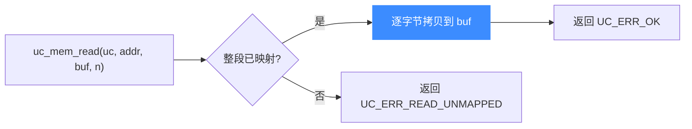

# uc_mem_read — 读取模拟内存

从模拟地址空间的某段读取原始字节到宿主缓冲区。读完本页你能掌握它的签名、越界/未映射时的报错，以及它与被仿真代码访存的本质区别。

## 📥 原型

```c
uc_err uc_mem_read(uc_engine *uc, uint64_t address, void *bytes, uint64_t size);
```

> 📄 声明：[`unicorn.h`](https://github.com/android-security-engineer/unicorn-skills/blob/master/include/unicorn/unicorn.h#L950) · 实现：[`uc.c`](https://github.com/android-security-engineer/unicorn-skills/blob/master/uc.c#L913)

把 `[address, address + size)` 区间的内容复制到宿主指针 `bytes` 指向的缓冲区。这是**宿主侧**的直接读取，不经过任何 CPU 指令，也**不会**触发 `UC_HOOK_MEM_READ` 之类的内存 Hook。

## 🧩 参数

| 参数 | 类型 | 说明 |
|------|------|------|
| `uc` | `uc_engine *` | [uc_open](/api/open) 返回的引擎句柄 |
| `address` | `uint64_t` | 起始**物理地址**（未启用 MMU 时物理==虚拟）。无需页对齐 |
| `bytes` | `void *` | 宿主缓冲区，必须至少能容纳 `size` 字节 |
| `size` | `uint64_t` | 要读取的字节数 |

::: tip 无需对齐
与 `uc_mem_map` 不同，`uc_mem_read` 的 `address`/`size` **不要求页对齐**，可以从任意地址读任意长度——只要整段落在已映射区域内。
:::

## 📤 返回值

| 返回值 | 含义 |
|--------|------|
| `UC_ERR_OK` | 读取成功 |
| `UC_ERR_READ_UNMAPPED` | 区间内存在未映射地址 |
| `UC_ERR_ARG` | 参数非法（如 `bytes` 为空） |

失败时可用 [uc_strerror](/api/strerror) 把错误码转成可读字符串。

## 🔧 读取流程



## 💻 完整示例

```c
#include <unicorn/unicorn.h>
#include <stdio.h>

int main(void) {
    uc_engine *uc;
    uc_open(UC_ARCH_X86, UC_MODE_64, &uc);

    // 映射一页并写入数据
    uc_mem_map(uc, 0x1000, 0x1000, UC_PROT_ALL);
    uint8_t code[] = {0x48, 0x31, 0xC0}; // xor rax, rax
    uc_mem_write(uc, 0x1000, code, sizeof(code));

    // 读回来校验
    uint8_t buf[3] = {0};
    uc_err err = uc_mem_read(uc, 0x1000, buf, sizeof(buf));
    if (err != UC_ERR_OK) {
        printf("read failed: %s\n", uc_strerror(err));
        return 1;
    }
    printf("bytes: %02x %02x %02x\n", buf[0], buf[1], buf[2]);

    // 读未映射地址 → UC_ERR_READ_UNMAPPED
    uint8_t tmp;
    err = uc_mem_read(uc, 0xDEAD0000, &tmp, 1);
    printf("unmapped read: %s\n", uc_strerror(err));

    uc_close(uc);
    return 0;
}
```

::: warning 常见坑
- 缓冲区太小：`bytes` 必须能容纳 `size` 字节，否则宿主进程缓冲区溢出（Unicorn 不会替你检查宿主侧大小）。
- 跨越未映射空洞：若区间中间有一段没 `uc_mem_map`，整次读取失败并返回 `UC_ERR_READ_UNMAPPED`，`bytes` 内容不可信。
- 想观察被仿真代码的读操作？`uc_mem_read` 帮不了你——它是宿主侧旁路读取。请挂 [UC_HOOK_MEM_READ](/hooks/mem-read)。
:::

## 📂 相关源码

| 文件 | 角色 |
|------|------|
| [`unicorn.h`](https://github.com/android-security-engineer/unicorn-skills/blob/master/include/unicorn/unicorn.h#L950) | `uc_mem_read` 声明 |
| [`uc.c`](https://github.com/android-security-engineer/unicorn-skills/blob/master/uc.c#L913) | `uc_mem_read` 实现 |

## 相关页面

- [uc_mem_write](/api/mem-write) — 反向操作：写入模拟内存
- [uc_mem_map](/api/mem-map) — 先映射才能读
- [内存映射与管理](/features/memory) — 内存模型全貌
- [内存模型总览](/memory/overview) — 物理/虚拟地址区分
