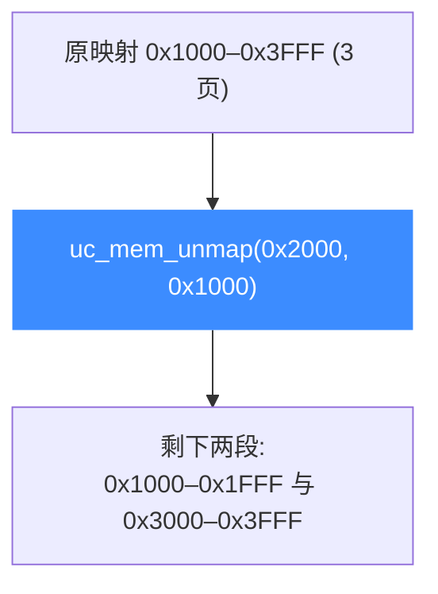

# uc_mem_unmap — 解除内存映射

从模拟地址空间删除一段之前映射的内存。读完本页你能掌握它的对齐要求、部分解除映射（会切割区域）的行为，以及与 `uc_mem_map_ptr` 配合时的释放顺序。

## 🧹 原型

```c
uc_err uc_mem_unmap(uc_engine *uc, uint64_t address, uint64_t size);
```

> 📄 声明：[`unicorn.h`](https://github.com/android-security-engineer/unicorn-skills/blob/master/include/unicorn/unicorn.h#L1209) · 实现：[`uc.c`](https://github.com/android-security-engineer/unicorn-skills/blob/master/uc.c#L1836)

删除 `[address, address + size)` 这段映射。之后该范围变回"未映射"，任何被仿真代码的访问都会触发 `UC_HOOK_MEM_*_UNMAPPED`。

## 🧩 参数

| 参数 | 类型 | 说明 |
|------|------|------|
| `uc` | `uc_engine *` | 引擎句柄 |
| `address` | `uint64_t` | 起始地址，必须 **4KB 对齐** |
| `size` | `uint64_t` | 要解除的大小，必须是 **4KB 的倍数** |

## 📤 返回值

| 返回值 | 含义 |
|--------|------|
| `UC_ERR_OK` | 解除成功 |
| `UC_ERR_ARG` | 未 4KB 对齐 |
| `UC_ERR_NOMEM` | 内部记账失败（如切割区域时分配失败） |

## 🔧 部分解除会切割区域

解除的范围可以只是某个已映射区域的**一部分**——Unicorn 会把原区域切成剩余的若干段：



这也是为什么 [uc_mem_regions](/api/mem-regions) 可能返回比你 map 次数更多的区域。

## 💻 完整示例

```c
#include <unicorn/unicorn.h>
#include <stdio.h>

int main(void) {
    uc_engine *uc;
    uc_open(UC_ARCH_X86, UC_MODE_64, &uc);

    uc_mem_map(uc, 0x1000, 0x3000, UC_PROT_ALL); // 3 页

    // 解除中间一页 → 原区域被切成两段
    uc_err err = uc_mem_unmap(uc, 0x2000, 0x1000);
    printf("unmap: %s\n", uc_strerror(err));

    // 现在访问 0x2000 已是未映射
    uint8_t v;
    err = uc_mem_read(uc, 0x2000, &v, 1);
    printf("read hole: %s\n", uc_strerror(err)); // UC_ERR_READ_UNMAPPED

    // 未对齐解除 → UC_ERR_ARG
    err = uc_mem_unmap(uc, 0x1001, 0x1000);
    printf("misaligned: %s\n", uc_strerror(err));

    uc_close(uc);
    return 0;
}
```

::: warning 常见坑
- **必须 4KB 对齐**：`address`/`size` 不对齐返回 `UC_ERR_ARG`。
- 解除**未映射**范围通常也会失败——先用 `uc_mem_regions` 确认边界。
- 对 [uc_mem_map_ptr](/api/mem-map-ptr) 映射的区域：先 `uc_mem_unmap` 断开 Unicorn 的引用，**再** `free` 宿主缓冲区，顺序反了就是释放后访问。
- `uc_close` 会自动清理所有映射，正常退出时无需逐一 unmap。
:::

## 📂 相关源码

| 文件 | 角色 |
|------|------|
| [`unicorn.h`](https://github.com/android-security-engineer/unicorn-skills/blob/master/include/unicorn/unicorn.h#L1209) | `uc_mem_unmap` 声明 |
| [`uc.c`](https://github.com/android-security-engineer/unicorn-skills/blob/master/uc.c#L1836) | `uc_mem_unmap` 实现 |

## 相关页面

- [uc_mem_map](/api/mem-map) — 建立映射
- [uc_mem_regions](/api/mem-regions) — 查看切割后的区域列表
- [解除映射](/memory/unmap) — 概念详解
- [内存映射与管理](/features/memory) — 内存模型全貌
