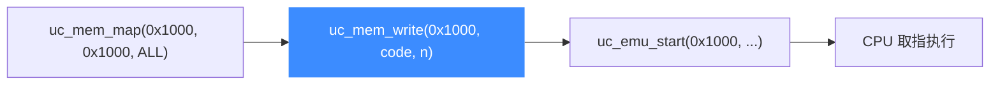

# uc_mem_write — 写入模拟内存

把宿主缓冲区的字节写进模拟地址空间。读完本页你能掌握它的签名、写只读页/未映射页的报错，以及为什么它常用来"装载机器码"。

## 📤 原型

```c
uc_err uc_mem_write(uc_engine *uc, uint64_t address, const void *bytes,
                    uint64_t size);
```

> 📄 声明：[`unicorn.h`](https://github.com/android-security-engineer/unicorn-skills/blob/master/include/unicorn/unicorn.h#L933) · 实现：[`uc.c`](https://github.com/android-security-engineer/unicorn-skills/blob/master/uc.c#L952)

把宿主指针 `bytes` 指向的 `size` 字节复制到模拟内存 `[address, address + size)`。这是**宿主侧**的直接写入，不经过 CPU 指令，也**不会**触发 `UC_HOOK_MEM_WRITE`。

## 🧩 参数

| 参数 | 类型 | 说明 |
|------|------|------|
| `uc` | `uc_engine *` | [uc_open](/api/open) 返回的引擎句柄 |
| `address` | `uint64_t` | 起始**物理地址**，无需页对齐 |
| `bytes` | `const void *` | 源数据缓冲区，至少 `size` 字节 |
| `size` | `uint64_t` | 要写入的字节数 |

::: tip 绕过保护位
`uc_mem_write` 是宿主侧操作，即使目标页只映射了 `UC_PROT_READ`，它**照样能写进去**——权限位只约束被仿真代码的访存，不约束宿主 API。
:::

## 📥 返回值

| 返回值 | 含义 |
|--------|------|
| `UC_ERR_OK` | 写入成功 |
| `UC_ERR_WRITE_UNMAPPED` | 区间内存在未映射地址 |
| `UC_ERR_ARG` | 参数非法 |

## 🔧 装载机器码的典型流程



## 💻 完整示例

```c
#include <unicorn/unicorn.h>
#include <stdio.h>

int main(void) {
    uc_engine *uc;
    uc_open(UC_ARCH_X86, UC_MODE_64, &uc);

    uc_mem_map(uc, 0x1000, 0x1000, UC_PROT_ALL);

    // inc ecx; inc edx
    uint8_t code[] = {0xFF, 0xC1, 0xFF, 0xC2};
    uc_err err = uc_mem_write(uc, 0x1000, code, sizeof(code));
    if (err != UC_ERR_OK) {
        printf("write failed: %s\n", uc_strerror(err));
        return 1;
    }

    // 运行这两条指令
    uc_emu_start(uc, 0x1000, 0x1000 + sizeof(code), 0, 0);

    // 写未映射地址 → UC_ERR_WRITE_UNMAPPED
    uint32_t v = 0x1234;
    err = uc_mem_write(uc, 0xDEAD0000, &v, sizeof(v));
    printf("unmapped write: %s\n", uc_strerror(err));

    uc_close(uc);
    return 0;
}
```

::: warning 常见坑
- 忘记先 `uc_mem_map`：写未映射地址返回 `UC_ERR_WRITE_UNMAPPED`。
- 跨越空洞：区间中途遇到未映射页会整体失败，已写入部分不保证被回滚。
- 想拦截被仿真代码的写操作请用 [UC_HOOK_MEM_WRITE](/hooks/mem-write)，`uc_mem_write` 不会触发它。
- MMU 启用后 `address` 是**物理地址**，别用虚拟地址（那是 [uc_vmem_write](/api/vmem-write) 的活）。
:::

## 📂 相关源码

| 文件 | 角色 |
|------|------|
| [`unicorn.h`](https://github.com/android-security-engineer/unicorn-skills/blob/master/include/unicorn/unicorn.h#L933) | `uc_mem_write` 声明 |
| [`uc.c`](https://github.com/android-security-engineer/unicorn-skills/blob/master/uc.c#L952) | `uc_mem_write` 实现 |

## 相关页面

- [uc_mem_read](/api/mem-read) — 反向操作：读取模拟内存
- [uc_mem_map](/api/mem-map) — 写之前必须先映射
- [uc_mem_protect](/api/mem-protect) — 调整页保护位
- [内存映射与管理](/features/memory) — 内存模型全貌
