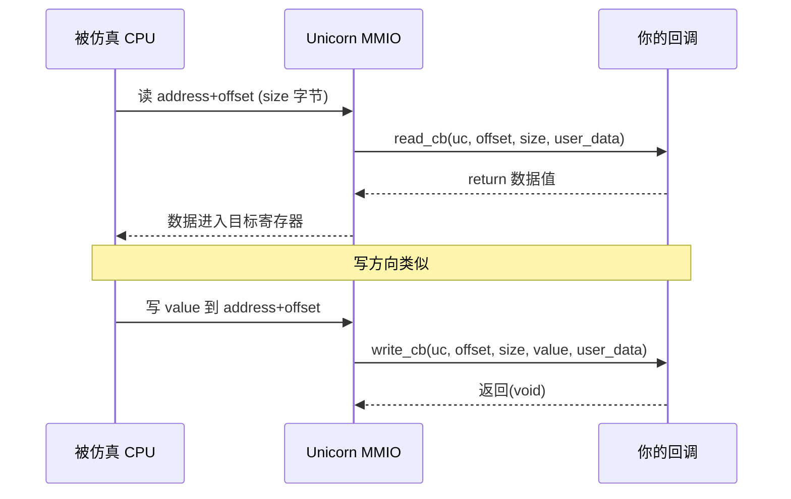

# uc_mmio_map — 映射内存映射 IO（MMIO）

把一段地址变成"设备寄存器"：被仿真代码对它的读写不落到真实内存，而是回调你的宿主函数。读完本页你能掌握 MMIO 回调签名、读写触发流程，以及如何用它模拟外设。

## 🔌 原型

```c
uc_err uc_mmio_map(uc_engine *uc, uint64_t address, uint64_t size,
                   uc_cb_mmio_read_t read_cb, void *user_data_read,
                   uc_cb_mmio_write_t write_cb, void *user_data_write);
```

> 📄 声明：[`unicorn.h`](https://github.com/android-security-engineer/unicorn-skills/blob/master/include/unicorn/unicorn.h#L1189) · 实现：[`uc.c`](https://github.com/android-security-engineer/unicorn-skills/blob/master/uc.c#L1433)

映射一块 MMIO 区域。CPU 对 `[address, address+size)` 的每次读取都会调用 `read_cb`（其返回值作为读到的数据），每次写入都会调用 `write_cb`。这正是模拟 UART、定时器、GPIO 等外设寄存器的手段。

## 🧩 参数

| 参数 | 类型 | 说明 |
|------|------|------|
| `uc` | `uc_engine *` | 引擎句柄 |
| `address` | `uint64_t` | 起始地址，必须 **4KB 对齐** |
| `size` | `uint64_t` | 区域大小，必须是 **4KB 的倍数** |
| `read_cb` | `uc_cb_mmio_read_t` | 读回调，可为 `NULL`（表示只写区域） |
| `user_data_read` | `void *` | 传给 `read_cb` 的用户数据 |
| `write_cb` | `uc_cb_mmio_write_t` | 写回调，可为 `NULL`（表示只读区域） |
| `user_data_write` | `void *` | 传给 `write_cb` 的用户数据 |

### 回调签名

```c
// 读回调：返回值即 CPU 读到的数据
typedef uint64_t (*uc_cb_mmio_read_t)(uc_engine *uc, uint64_t offset,
                                      unsigned size, void *user_data);

// 写回调：value 是 CPU 要写入的数据
typedef void (*uc_cb_mmio_write_t)(uc_engine *uc, uint64_t offset,
                                   unsigned size, uint64_t value,
                                   void *user_data);
```

| 回调参数 | 含义 |
|----------|------|
| `offset` | 相对区域基址 `address` 的**偏移**，不是绝对地址 |
| `size` | 本次访问的数据宽度（1/2/4/8 字节） |
| `value` | （仅写）CPU 要写入的值 |
| `user_data` | `uc_mmio_map` 时登记的读/写用户数据 |

## 📤 返回值

| 返回值 | 含义 |
|--------|------|
| `UC_ERR_OK` | 映射成功 |
| `UC_ERR_ARG` | 未 4KB 对齐 |
| `UC_ERR_MAP` | 区域重叠或映射无效 |

## 🔧 一次 MMIO 访问的时序



## 💻 完整示例：模拟一个只读计数器 + 日志寄存器

```c
#include <unicorn/unicorn.h>
#include <stdio.h>

static uint64_t counter = 0;

static uint64_t read_cb(uc_engine *uc, uint64_t offset, unsigned size,
                        void *user_data) {
    printf("[MMIO read] offset=0x%" PRIx64 " size=%u\n", offset, size);
    return counter++; // 每次读返回自增值
}

static void write_cb(uc_engine *uc, uint64_t offset, unsigned size,
                     uint64_t value, void *user_data) {
    printf("[MMIO write] offset=0x%" PRIx64 " size=%u value=0x%" PRIx64 "\n",
           offset, size, value);
}

int main(void) {
    uc_engine *uc;
    uc_open(UC_ARCH_X86, UC_MODE_64, &uc);

    // 把 0x20000 一页变成 MMIO 设备
    uc_err err = uc_mmio_map(uc, 0x20000, 0x1000,
                             read_cb, NULL, write_cb, NULL);
    printf("mmio_map: %s\n", uc_strerror(err));

    // 映射代码段并写入：读 [0x20000] 到 eax，再写回 [0x20004]
    uc_mem_map(uc, 0x1000, 0x1000, UC_PROT_ALL);
    // mov eax, [0x20000] ; mov [0x20004], eax
    uint8_t code[] = {0x8B, 0x04, 0x25, 0x00, 0x00, 0x02, 0x00,
                      0x89, 0x04, 0x25, 0x04, 0x00, 0x02, 0x00};
    uc_mem_write(uc, 0x1000, code, sizeof(code));
    uc_emu_start(uc, 0x1000, 0x1000 + sizeof(code), 0, 0);

    uc_close(uc);
    return 0;
}
```

::: warning 常见坑
- **`offset` 是相对偏移**，不是绝对地址：区域基址 `0x20000`、访问 `0x20004` 时 `offset==0x4`。
- **必须 4KB 对齐**，否则 `UC_ERR_ARG`。
- MMIO 区域不能与普通 `uc_mem_map` 区域重叠。
- `read_cb`/`write_cb` 可有一个为 `NULL`，实现纯只写/只读设备；但对 `NULL` 方向的访问会被视为非法访问。
- 回调里别做重活或递归进 `uc_emu_start`，会拖慢仿真甚至重入出错。
:::

## 📂 相关源码

| 文件 | 角色 |
|------|------|
| [`unicorn.h`](https://github.com/android-security-engineer/unicorn-skills/blob/master/include/unicorn/unicorn.h#L1189) | `uc_mmio_map` 声明 |
| [`uc.c`](https://github.com/android-security-engineer/unicorn-skills/blob/master/uc.c#L1433) | `uc_mmio_map` 实现 |

## 相关页面

- [MMIO 内存映射 IO](/memory/mmio) — 概念与外设建模
- [Hook 插桩体系](/features/hooks) — 另一种拦截访存的方式
- [uc_mem_map](/api/mem-map) — 普通内存映射
- [内存映射与管理](/features/memory) — 内存模型全貌
