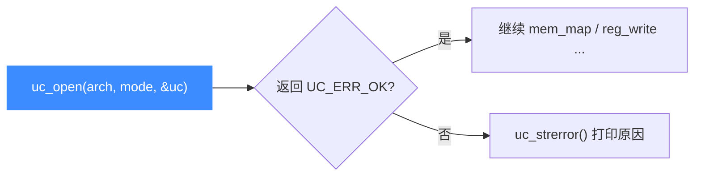

# uc_open — 创建引擎实例

本页讲 `uc_open`：Unicorn 一切操作的起点。读完你能正确地按「架构 + 模式」创建引擎句柄，理解 `arch` 与 `mode` 的组合规则，并知道常见的失败原因。

## 📌 概述

`uc_open` 分配并初始化一个 `uc_engine` 实例。之后所有 API 都要把这个句柄作为第一个参数传入；用完必须用 [uc_close](/api/close) 释放。

## 函数原型

```c
uc_err uc_open(uc_arch arch, uc_mode mode, uc_engine **uc);
```

> 📄 声明：[`unicorn.h`](https://github.com/android-security-engineer/unicorn-skills/blob/master/include/unicorn/unicorn.h#L735) · 实现：[`uc.c`](https://github.com/android-security-engineer/unicorn-skills/blob/master/uc.c#L310)

## 参数

| 参数 | 类型 | 说明 |
|------|------|------|
| `arch` | `uc_arch` | 架构类型，取 `UC_ARCH_*`（如 `UC_ARCH_X86`、`UC_ARCH_ARM64`） |
| `mode` | `uc_mode` | 硬件模式，由 `UC_MODE_*` 按位或组合而成 |
| `uc` | `uc_engine **` | 出参：成功时写入新建的引擎句柄 |

### 常用 arch / mode 组合

| 目标 | arch | mode |
|------|------|------|
| x86 32 位 | `UC_ARCH_X86` | `UC_MODE_32` |
| x86-64 | `UC_ARCH_X86` | `UC_MODE_64` |
| ARM (A32) | `UC_ARCH_ARM` | `UC_MODE_ARM` |
| ARM Thumb | `UC_ARCH_ARM` | `UC_MODE_THUMB` |
| ARM64 | `UC_ARCH_ARM64` | `UC_MODE_ARM` |
| MIPS32 大端 | `UC_ARCH_MIPS` | `UC_MODE_MIPS32 \| UC_MODE_BIG_ENDIAN` |
| RISC-V 64 | `UC_ARCH_RISCV` | `UC_MODE_RISCV64` |

## 返回值

返回 `uc_err`：

| 值 | 含义 |
|----|------|
| `UC_ERR_OK` | 成功，`*uc` 已就绪 |
| `UC_ERR_ARCH` | 该架构未在编译期启用（用 [uc_arch_supported](/api/arch-supported) 预检） |
| `UC_ERR_MODE` | 架构与模式组合非法 |
| `UC_ERR_NOMEM` | 内存不足 |

## 调用位置



## 💻 用法示例

```c
#include <unicorn/unicorn.h>
#include <stdio.h>

int main(void) {
    uc_engine *uc;
    uc_err err = uc_open(UC_ARCH_X86, UC_MODE_64, &uc);
    if (err != UC_ERR_OK) {
        printf("uc_open 失败: %s\n", uc_strerror(err));
        return 1;
    }

    // ... 在此映射内存、写代码、启动仿真 ...

    uc_close(uc);   // 与 uc_open 成对出现
    return 0;
}
```

::: warning 常见错误
- ❌ **忘记检查返回值**：`uc_open` 失败时 `*uc` 未定义，直接使用会崩溃。
- ❌ **arch/mode 不匹配**：如 `UC_ARCH_ARM64` 配 `UC_MODE_THUMB` 会得到 `UC_ERR_MODE`。ARM64 只用 `UC_MODE_ARM`（外加可选大端位）。
- ❌ **架构未编译进库**：得到 `UC_ERR_ARCH`。发行版可能只编了部分架构，先用 [uc_arch_supported](/api/arch-supported) 判断。
- ❌ **未配对 `uc_close`**：造成内存泄漏。
:::

::: tip 大端字节序
需要大端时，把 `UC_MODE_BIG_ENDIAN` 或进 `mode`，例如 `UC_MODE_MIPS32 | UC_MODE_BIG_ENDIAN`。详见 [字节序处理](/features/endianness)。
:::

## 📂 相关源码

| 文件 | 角色 |
|------|------|
| [`unicorn.h`](https://github.com/android-security-engineer/unicorn-skills/blob/master/include/unicorn/unicorn.h#L735) | `uc_open` 声明 |
| [`uc.c`](https://github.com/android-security-engineer/unicorn-skills/blob/master/uc.c#L310) | `uc_open` 实现 |

## 相关页面

- [uc_close — 释放引擎](/api/close)
- [uc_arch_supported — 架构可用性](/api/arch-supported)
- [多架构支持](/features/architectures)
- [快速开始](/guide/quickstart)
