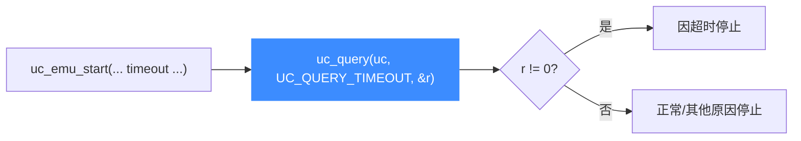

# uc_query — 查询引擎内部状态

本页讲 `uc_query`：以只读方式查询引擎的当前属性（页大小、架构、模式、是否超时）。读完你能用它在运行时探知引擎配置，尤其是判断 ARM 是否处于 Thumb 模式、仿真是否因超时而停止。

## 📌 概述

`uc_query` 把查询结果写入一个 `size_t` 出参。它是轻量只读操作，不改变引擎状态。更强大的读写控制请看 [uc_ctl](/api/ctl)。

## 函数原型

```c
uc_err uc_query(uc_engine *uc, uc_query_type type, size_t *result);
```

> 📄 声明：[`unicorn.h`](https://github.com/android-security-engineer/unicorn-skills/blob/master/include/unicorn/unicorn.h#L764) · 实现：[`uc.c`](https://github.com/android-security-engineer/unicorn-skills/blob/master/uc.c#L2199)

## 参数

| 参数 | 类型 | 说明 |
|------|------|------|
| `uc` | `uc_engine *` | 引擎句柄 |
| `type` | `uc_query_type` | 查询类型，见下表 |
| `result` | `size_t *` | 出参：查询结果 |

### uc_query_type 取值

| 枚举 | 含义 | result 语义 |
|------|------|-------------|
| `UC_QUERY_MODE` | 当前硬件模式 | 动态模式（ARM 可据此判断 Thumb） |
| `UC_QUERY_PAGE_SIZE` | 引擎页大小 | 字节数，通常 4096 |
| `UC_QUERY_ARCH` | 引擎架构 | `UC_ARCH_*` 数值 |
| `UC_QUERY_TIMEOUT` | 是否因超时停止 | 非 0 表示上次 `uc_emu_start` 因超时结束 |

## 返回值

返回 `uc_err`，`UC_ERR_OK` 表示成功。

## 典型流程



## 💻 用法示例

```c
size_t page_size = 0, arch = 0, mode = 0, timed_out = 0;

uc_query(uc, UC_QUERY_PAGE_SIZE, &page_size);
printf("页大小 = %zu 字节\n", page_size);      // 常见 4096

uc_query(uc, UC_QUERY_ARCH, &arch);
if (arch == UC_ARCH_ARM)
    printf("这是 ARM 引擎\n");

// 判断上次仿真是否超时结束
uc_emu_start(uc, 0x1000, 0, 1000 /*us*/, 0);
uc_query(uc, UC_QUERY_TIMEOUT, &timed_out);
if (timed_out)
    printf("仿真因超时而停止\n");
```

::: tip UC_QUERY_MODE 与 Thumb
对 ARM 引擎，指令流可能在 ARM 与 Thumb 间切换。用 `UC_QUERY_MODE` 可在运行时得到**当前**模式，而非 `uc_open` 时传入的初始模式。
:::

::: warning 常见错误
- ❌ **result 用错类型**：`result` 必须是 `size_t*`，传 `int*` 在 64 位平台会读到错误的高位。
- ❌ **把 PAGE_SIZE 当可设项**：`uc_query` 只读；要**设置**页大小需用 [uc_ctl_set_page_size](/ctl/set-page-size)。
:::

## 📂 相关源码

| 文件 | 角色 |
|------|------|
| [`unicorn.h`](https://github.com/android-security-engineer/unicorn-skills/blob/master/include/unicorn/unicorn.h#L764) | `uc_query` 声明 |
| [`uc.c`](https://github.com/android-security-engineer/unicorn-skills/blob/master/uc.c#L2199) | `uc_query` 实现 |

## 相关页面

- [uc_ctl — 动态控制](/api/ctl)
- [uc_ctl_get_page_size](/ctl/get-page-size)
- [超时与指令计数](/features/timeout)
- [uc_emu_start — 启动仿真](/api/emu-start)
