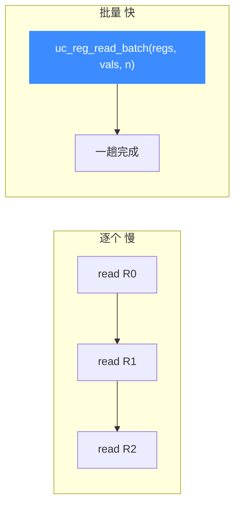

# uc_reg_read_batch — 批量读寄存器

本页讲 `uc_reg_read_batch`：一次调用读取多个寄存器，省去逐个 `uc_reg_read` 的函数调用开销。读完你能用它高效制作寄存器快照。

## 📌 概述

逐个读寄存器时每次都有一次跨库调用开销。批量 API 把「寄存器 ID 数组」和「结果指针数组」一起传入，一趟读完，适合快照/恢复完整状态的高频场景。

## 函数原型

```c
uc_err uc_reg_read_batch(uc_engine *uc, int const *regs, void **vals,
                         int count);
```

> 📄 声明：[`unicorn.h`](https://github.com/android-security-engineer/unicorn-skills/blob/master/include/unicorn/unicorn.h#L881) · 实现：[`uc.c`](https://github.com/android-security-engineer/unicorn-skills/blob/master/uc.c#L578)

## 参数

| 参数 | 类型 | 说明 |
|------|------|------|
| `uc` | `uc_engine *` | 引擎句柄 |
| `regs` | `int const *` | 待读取的寄存器 ID 数组 |
| `vals` | `void **` | 指针数组：每个元素指向对应寄存器结果的存放位置 |
| `count` | `int` | `regs` 与 `vals` 的长度 |

## 返回值

| 值 | 含义 |
|----|------|
| `UC_ERR_OK` | 成功 |
| `UC_ERR_ARG` | 某个寄存器号或值指针无效 |

## 逐个 vs 批量



## 💻 用法示例

关键在于 `vals` 的每个元素要**指向**真实的存储变量：

```c
int regs[] = { UC_X86_REG_RAX, UC_X86_REG_RBX, UC_X86_REG_RCX };
uint64_t rax, rbx, rcx;
void *vals[] = { &rax, &rbx, &rcx };

uc_err err = uc_reg_read_batch(uc, regs, vals, 3);
if (err == UC_ERR_OK)
    printf("RAX=0x%" PRIx64 " RBX=0x%" PRIx64 " RCX=0x%" PRIx64 "\n",
           rax, rbx, rcx);
```

::: warning 常见错误
- ❌ **vals 元素没指向合法存储**：每个 `vals[i]` 必须指向一块足够宽的内存，且宽度匹配对应寄存器。
- ❌ **count 与数组长度不符**：越界读写。确保 `regs`、`vals` 至少有 `count` 个元素。
- ❌ **忽略宽度差异**：若一次读入不同宽度的寄存器（如同时读 `AL` 和 `RAX`），需为每个准备正确宽度的存储；必要时改用 `uc_reg_read_batch2` 传 `sizes`。
:::

## 📂 相关源码

| 文件 | 角色 |
|------|------|
| [`unicorn.h`](https://github.com/android-security-engineer/unicorn-skills/blob/master/include/unicorn/unicorn.h#L881) | `uc_reg_read_batch` 声明 |
| [`uc.c`](https://github.com/android-security-engineer/unicorn-skills/blob/master/uc.c#L578) | `uc_reg_read_batch` 实现 |

## 相关页面

- [uc_reg_write_batch — 批量写](/api/reg-write-batch)
- [uc_reg_read — 读寄存器](/api/reg-read)
- [批量 API](/features/batch-api)
- [寄存器读写](/features/registers)
