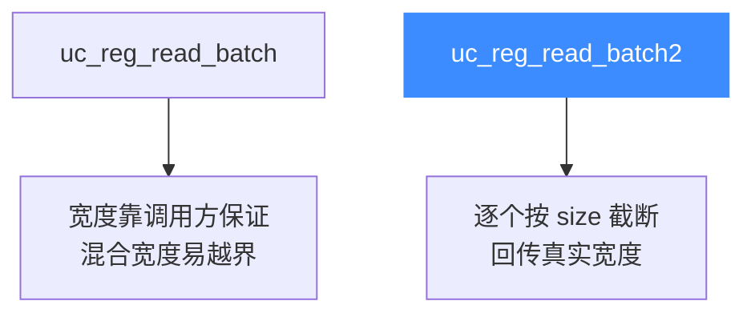

# uc_reg_read_batch2 — 批量带宽度读寄存器

本页讲 `uc_reg_read_batch2`：与 [uc_reg_read_batch](/api/reg-read-batch) 一样一次读多个寄存器，但每个值都带一个 `size`，能在同一批调用里混合不同宽度的寄存器并安全处理截断。

## 📌 概述

`uc_reg_read_batch2` 遍历 `regs[]` 数组，把每个寄存器读进 `vals[i]` 指向的缓冲，最多写 `sizes[i]` 字节，返回时把 `sizes[i]` 更新为该寄存器的真实宽度。它把 [uc_reg_read2](/api/reg-read2) 的「带宽度 + 截断安全」特性扩展到批量场景。

## 函数原型

```c
uc_err uc_reg_read_batch2(uc_engine *uc, int const *regs,
                          void *const *vals, size_t *sizes, int count);
```

> 📄 声明：[`unicorn.h`](https://github.com/android-security-engineer/unicorn-skills/blob/master/include/unicorn/unicorn.h#L916) · 实现：[`uc.c`](https://github.com/android-security-engineer/unicorn-skills/blob/master/uc.c#L633)

## 参数

| 参数 | 类型 | 方向 | 说明 |
|------|------|------|------|
| `uc` | `uc_engine *` | 入 | 引擎句柄 |
| `regs` | `int const *` | 入 | 寄存器 ID 数组 |
| `vals` | `void *const *` | 出 | 指向各结果缓冲的指针数组 |
| `sizes` | `size_t *` | 入/出 | 入：各缓冲容量；出：各实际读取字节数 |
| `count` | `int` | 入 | 数组长度（三者相同） |

## 返回值

| 值 | 含义 |
|----|------|
| `UC_ERR_OK` | 全部成功 |
| `UC_ERR_ARG` | 某个寄存器号或指针无效 |
| `UC_ERR_OVERFLOW` | 某个缓冲放不下对应寄存器（仍截断写入并回传宽度） |

## 🆚 与 uc_reg_read_batch 的区别



## 💻 用法示例

一次读出 x86 的 RAX(8B)、EAX(4B)、AL(1B) 三个不同宽度寄存器：

```c
int regs[]      = { UC_X86_REG_RAX, UC_X86_REG_EAX, UC_X86_REG_AL };
uint64_t rax; uint32_t eax; uint8_t al;
void *vals[]    = { &rax, &eax, &al };
size_t sizes[]  = { sizeof(rax), sizeof(eax), sizeof(al) };

uc_err err = uc_reg_read_batch2(uc, regs, vals, sizes, 3);
if (err == UC_ERR_OK) {
    printf("RAX=0x%llx EAX=0x%x AL=0x%02x\n",
           (unsigned long long)rax, eax, al);
}
```

::: tip 何时用 2 版本
- 同一批里寄存器**宽度不一**（如通用寄存器 + 标志位 + 段寄存器混读）。
- 写**调试器/trace 工具**，要为每个寄存器单独记录实际宽度。
- 想用统一缓冲（如 `uint8_t buf[N][64]`）批量探测所有寄存器。
:::

::: warning 常见错误
- ❌ **`sizes` 数组未逐个初始化**：每个元素都是独立的入参，漏初始化会导致该寄存器读到 0 字节。
- ❌ **`count` 与数组实际长度不符**：三者（regs/vals/sizes）必须同长，越界访问是未定义行为。
:::

## 📂 相关源码

| 文件 | 角色 |
|------|------|
| [`unicorn.h`](https://github.com/android-security-engineer/unicorn-skills/blob/master/include/unicorn/unicorn.h#L916) | `uc_reg_read_batch2` 声明 |
| [`uc.c`](https://github.com/android-security-engineer/unicorn-skills/blob/master/uc.c#L633) | `uc_reg_read_batch2` 实现 |

## 相关页面

- [uc_reg_read_batch — 普通批量读](/api/reg-read-batch)
- [uc_reg_write_batch2 — 批量带宽度写](/api/reg-write-batch2)
- [uc_reg_read2 — 单个带宽度读](/api/reg-read2)
- [寄存器读写](/features/registers)
