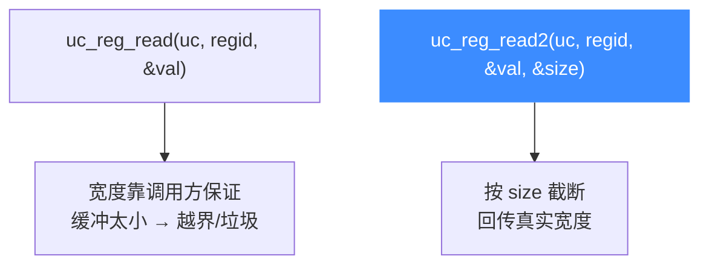

# uc_reg_read2 — 带宽度的读寄存器

本页讲 `uc_reg_read2`：与 [uc_reg_read](/api/reg-read) 一样读单个寄存器，但多一个 `size` 参数，能在读取变宽寄存器或不确定宽度时既「按缓冲容量读」又「回告诉你实际读了多少字节」。

## 📌 概述

`uc_reg_read2` 把 `regid` 指定的寄存器值拷进 `value` 缓冲，**最多拷 `*size` 字节**；返回时把 `*size` 更新为该寄存器的真实宽度。它解决了两个问题：缓冲不够时安全截断而非越界、以及调用方事先不知道寄存器有多宽。

## 函数原型

```c
uc_err uc_reg_read2(uc_engine *uc, int regid, void *value, size_t *size);
```

> 📄 声明：[`unicorn.h`](https://github.com/android-security-engineer/unicorn-skills/blob/master/include/unicorn/unicorn.h#L852) · 实现：[`uc.c`](https://github.com/android-security-engineer/unicorn-skills/blob/master/uc.c#L720)

## 参数

| 参数 | 类型 | 方向 | 说明 |
|------|------|------|------|
| `uc` | `uc_engine *` | 入 | 引擎句柄 |
| `regid` | `int` | 入 | 寄存器 ID，取 `UC_<ARCH>_REG_*` |
| `value` | `void *` | 出 | 存放结果的缓冲，须至少 `*size` 字节 |
| `size` | `size_t *` | 入/出 | 入：缓冲容量；出：实际读取字节数 |

## 返回值

| 值 | 含义 |
|----|------|
| `UC_ERR_OK` | 成功 |
| `UC_ERR_ARG` | 寄存器号或指针无效 |
| `UC_ERR_OVERFLOW` | 缓冲放不下整个寄存器（仍会写入 `*size` 字节并截断） |

## 🆚 与 uc_reg_read 的区别



| 函数 | 是否传宽度 | 缓冲不足 | 知道真实宽度 |
|------|-----------|---------|-------------|
| [uc_reg_read](/api/reg-read) | 否 | 行为未定义 | 否 |
| `uc_reg_read2` | 是 | 安全截断 + `UC_ERR_OVERFLOW` | 是（`*size`） |

## 💻 用法示例

用一个统一缓冲读取任意架构寄存器，事后看实际宽度：

```c
uint8_t buf[64] = {0};
size_t size = sizeof(buf);
uc_err err = uc_reg_read2(uc, UC_X86_REG_RAX, buf, &size);
if (err == UC_ERR_OK) {
    printf("RAX = %zu 字节: ", size);
    for (size_t i = 0; i < size; i++) printf("%02x ", buf[i]);
    printf("\n");
} else if (err == UC_ERR_OVERFLOW) {
    printf("缓冲太小，寄存器真实宽度 %zu 字节\n", size);
}
```

::: tip 何时用 2 版本
- 处理**变宽 / 特殊寄存器**（如某些 SIMD、浮点、架构相关控制寄存器）。
- 写**架构无关的通用工具**（如调试器后端），不预先知道目标寄存器宽度。
- 想在读取时**同时拿到宽度**，省去查表。
:::

::: warning 常见错误
- ❌ **忘记初始化 `*size`**：`size` 是入参也是出参，调用前必须置为缓冲容量，否则可能读到 0 字节。
- ❌ **缓冲太小却当成功**：截断时返回的是 `UC_ERR_OVERFLOW` 而非 `UC_ERR_OK`，要单独判断。
:::

## 📂 相关源码

| 文件 | 角色 |
|------|------|
| [`unicorn.h`](https://github.com/android-security-engineer/unicorn-skills/blob/master/include/unicorn/unicorn.h#L852) | `uc_reg_read2` 声明 |
| [`uc.c`](https://github.com/android-security-engineer/unicorn-skills/blob/master/uc.c#L720) | `uc_reg_read2` 实现 |

## 相关页面

- [uc_reg_read — 普通读寄存器](/api/reg-read)
- [uc_reg_write2 — 带宽度写寄存器](/api/reg-write2)
- [uc_reg_read_batch2 — 批量带宽度读](/api/reg-read-batch2)
- [寄存器读写](/features/registers)
