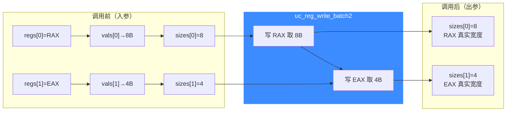

# uc_reg_write_batch2 — 批量带宽度写寄存器

本页讲 `uc_reg_write_batch2`：与 [uc_reg_write_batch](/api/reg-write-batch) 一样一次写多个寄存器，但每个值都带一个 `size`，能在同一批里给不同宽度的寄存器写入精确字节数。

## 📌 概述

`uc_reg_write_batch2` 遍历 `regs[]`，从 `vals[i]` 取 `sizes[i]` 字节写入对应寄存器，返回时把 `sizes[i]` 更新为实际写入宽度。它把 [uc_reg_write2](/api/reg-write2) 的「按字节写 + 回传宽度」特性扩展到批量场景，是仿真前批量布置初始状态的进阶接口。

## 函数原型

```c
uc_err uc_reg_write_batch2(uc_engine *uc, int const *regs,
                           const void *const *vals, size_t *sizes, int count);
```

> 📄 声明：[`unicorn.h`](https://github.com/android-security-engineer/unicorn-skills/blob/master/include/unicorn/unicorn.h#L898) · 实现：[`uc.c`](https://github.com/android-security-engineer/unicorn-skills/blob/master/uc.c#L657)

`sizes` 数组既是入参也是出参，每个元素独立地按「要写字节数 → 实际写入字节数」流转：



## 参数

| 参数 | 类型 | 方向 | 说明 |
|------|------|------|------|
| `uc` | `uc_engine *` | 入 | 引擎句柄 |
| `regs` | `int const *` | 入 | 寄存器 ID 数组 |
| `vals` | `const void *const *` | 入 | 指向各待写值的指针数组 |
| `sizes` | `size_t *` | 入/出 | 入：各要写字节数；出：各实际写入字节数 |
| `count` | `int` | 入 | 数组长度 |

## 返回值

| 值 | 含义 |
|----|------|
| `UC_ERR_OK` | 全部成功 |
| `UC_ERR_ARG` | 某个寄存器号或指针无效 |
| `UC_ERR_OVERFLOW` | 某个缓冲数据不足寄存器宽度（仍按缓冲写入并回传宽度） |

## 💻 用法示例

仿真前一次性布置 x86 栈指针、参数、标志位：

```c
int regs[] = { UC_X86_REG_RSP, UC_X86_REG_RDI, UC_X86_REG_RFLAGS };
uint64_t rsp = 0x7fff0000, rdi = 42, rflags = 0x202;
const void *vals[] = { &rsp, &rdi, &rflags };
size_t sizes[]     = { sizeof(rsp), sizeof(rdi), sizeof(rflags) };

uc_err err = uc_reg_write_batch2(uc, regs, vals, sizes, 3);
if (err != UC_ERR_OK) { /* 处理 */ }
```

::: tip 何时用 2 版本
- 同一批里寄存器**宽度不一**，又不方便为每个单独调用 `uc_reg_write2`。
- 从外部序列化数据恢复状态，每个字段宽度已在数据里标注。
- 想在写入后**校验每个寄存器实际接受了多少字节**。
:::

::: warning 常见错误
- ❌ **`sizes` 未逐个初始化**：每个元素是入参，漏置会写成 0 字节。
- ❌ **误用 `void **` 代替 `const void *const *`**：类型不匹配会触发编译警告甚至错误。
:::

## 📂 相关源码

| 文件 | 角色 |
|------|------|
| [`unicorn.h`](https://github.com/android-security-engineer/unicorn-skills/blob/master/include/unicorn/unicorn.h#L898) | `uc_reg_write_batch2` 声明 |
| [`uc.c`](https://github.com/android-security-engineer/unicorn-skills/blob/master/uc.c#L657) | `uc_reg_write_batch2` 实现 |

## 相关页面

- [uc_reg_write_batch — 普通批量写](/api/reg-write-batch)
- [uc_reg_read_batch2 — 批量带宽度读](/api/reg-read-batch2)
- [uc_reg_write2 — 单个带宽度写](/api/reg-write2)
- [寄存器读写](/features/registers)
