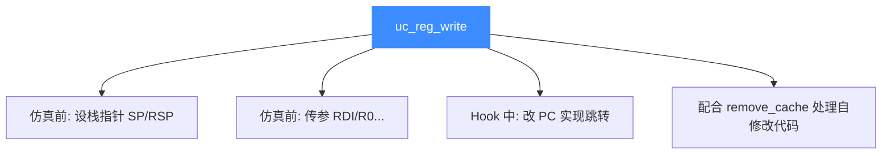

# uc_reg_write — 写寄存器

本页讲 `uc_reg_write`：设置单个寄存器的值。读完你能在仿真前初始化寄存器、在 Hook 中改写 PC 实现跳转，并避开宽度不匹配的坑。

## 📌 概述

`uc_reg_write` 把你缓冲中的值写入 `regid` 指定的寄存器。它是仿真前布置初始状态（如栈指针、参数寄存器）以及运行中干预 CPU 状态的核心手段。

## 函数原型

```c
uc_err uc_reg_write(uc_engine *uc, int regid, const void *value);
```

> 📄 声明：[`unicorn.h`](https://github.com/android-security-engineer/unicorn-skills/blob/master/include/unicorn/unicorn.h#L812) · 实现：[`uc.c`](https://github.com/android-security-engineer/unicorn-skills/blob/master/uc.c#L697)

## 参数

| 参数 | 类型 | 说明 |
|------|------|------|
| `uc` | `uc_engine *` | 引擎句柄 |
| `regid` | `int` | 寄存器 ID，取 `UC_<ARCH>_REG_*` |
| `value` | `const void *` | 指向要写入值的缓冲，宽度须匹配寄存器 |

## 返回值

| 值 | 含义 |
|----|------|
| `UC_ERR_OK` | 成功 |
| `UC_ERR_ARG` | 寄存器号或 value 指针无效 |

## 典型用途



## 💻 用法示例

仿真前初始化寄存器：

```c
uint64_t rsp = 0x200000;
uint64_t rdi = 42;
uc_reg_write(uc, UC_X86_REG_RSP, &rsp);   // 栈指针
uc_reg_write(uc, UC_X86_REG_RDI, &rdi);   // 第一个整型参数
```

在 Hook 里改写 PC 实现自定义跳转：

```c
static void hook_code(uc_engine *uc, uint64_t addr,
                      uint32_t size, void *ud) {
    if (addr == 0x1005) {
        uint64_t target = 0x2000;
        uc_reg_write(uc, UC_X86_REG_RIP, &target);  // 跳到 0x2000
    }
}
```

::: tip 写 PC 的副作用
写 PC 会改变下一条要执行的指令地址，可用于实现跳转或重启当前块翻译（配合 [uc_ctl_remove_cache](/ctl/remove-cache) 处理自修改代码）。详见 [寄存器读写](/features/registers)。
:::

::: warning 常见错误
- ❌ **传值而非指针**：`value` 是指针。写 `uc_reg_write(uc, UC_X86_REG_RAX, 42)` 是错的，应传 `&val`。
- ❌ **宽度不符**：给 64 位寄存器传 32 位缓冲，高位可能被读成栈上垃圾。用等宽类型或 `uc_reg_write2` 显式指定 `size`。
- ❌ **仿真中改了已缓存代码却没清缓存**：仅改内存不够，见 [上下文控制](/features/context)。
:::

## 📂 相关源码

| 文件 | 角色 |
|------|------|
| [`unicorn.h`](https://github.com/android-security-engineer/unicorn-skills/blob/master/include/unicorn/unicorn.h#L812) | `uc_reg_write` 声明 |
| [`uc.c`](https://github.com/android-security-engineer/unicorn-skills/blob/master/uc.c#L697) | `uc_reg_write` 实现 |

## 相关页面

- [uc_reg_write2 — 带宽度写寄存器](/api/reg-write2)
- [uc_reg_read — 读寄存器](/api/reg-read)
- [uc_reg_write_batch — 批量写](/api/reg-write-batch)
- [寄存器读写](/features/registers)
- [ARM 寄存器参考](/arch/arm/registers)
