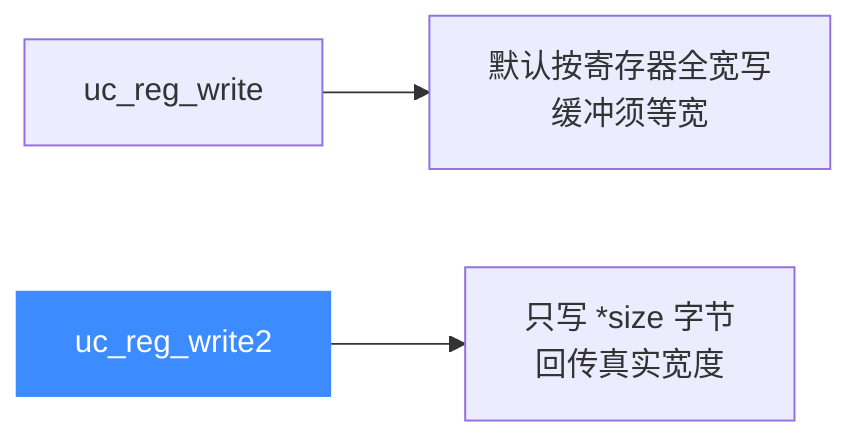

# uc_reg_write2 — 带宽度的写寄存器

本页讲 `uc_reg_write2`：与 [uc_reg_write](/api/reg-write) 一样写单个寄存器，但多一个 `size` 参数，能精确指定要写入多少字节，并在返回时告诉你实际写入的字节数。

## 📌 概述

`uc_reg_write2` 从 `value` 缓冲取 `*size` 字节写入 `regid` 寄存器；返回时把 `*size` 更新为实际写入宽度。它适合缓冲宽度与寄存器宽度不一致的场景——只写低 N 位，或先探测能写多少。

## 函数原型

```c
uc_err uc_reg_write2(uc_engine *uc, int regid, const void *value, size_t *size);
```

> 📄 声明：[`unicorn.h`](https://github.com/android-security-engineer/unicorn-skills/blob/master/include/unicorn/unicorn.h#L838) · 实现：[`uc.c`](https://github.com/android-security-engineer/unicorn-skills/blob/master/uc.c#L729)

## 参数

| 参数 | 类型 | 方向 | 说明 |
|------|------|------|------|
| `uc` | `uc_engine *` | 入 | 引擎句柄 |
| `regid` | `int` | 入 | 寄存器 ID，取 `UC_<ARCH>_REG_*` |
| `value` | `const void *` | 入 | 指向要写入值的缓冲 |
| `size` | `size_t *` | 入/出 | 入：要写入字节数；出：实际写入字节数 |

## 返回值

| 值 | 含义 |
|----|------|
| `UC_ERR_OK` | 成功 |
| `UC_ERR_ARG` | 寄存器号或指针无效 |
| `UC_ERR_OVERFLOW` | 缓冲提供的数据不足寄存器宽度（仍按缓冲写入并回传宽度） |

## 🆚 与 uc_reg_write 的区别



## 💻 用法示例

只把低 2 字节写进 64 位寄存器，并得知寄存器真实宽度：

```c
uint16_t lo = 0x1234;
size_t size = sizeof(lo);              // 只写 2 字节
uc_err err = uc_reg_write2(uc, UC_X86_REG_RAX, &lo, &size);
if (err == UC_ERR_OVERFLOW) {
    // 寄存器是 8 字节宽，但我们只提供了 2 字节：高位保持/未定义
    printf("RAX 实际宽度 %zu 字节，仅写了低 %zu 字节\n", size, sizeof(lo));
}
```

::: tip 何时用 2 版本
- 用窄类型给宽寄存器赋值，想**只动低若干位**而非整寄存器。
- 写**通用工具**，缓冲宽度由外部决定、与目标寄存器解耦。
- 写完后想**顺便确认**寄存器宽度，省去查表。
:::

::: warning 常见错误
- ❌ **把 `size` 当纯出参**：它是入参也是出参，调用前必须置为要写入的字节数。
- ❌ **误以为截断即失败**：`UC_ERR_OVERFLOW` 表示「数据不够宽」，但低字节**仍已写入**；若想整寄存器赋值，应保证 `*size >= 寄存器宽度`。
:::

## 📂 相关源码

| 文件 | 角色 |
|------|------|
| [`unicorn.h`](https://github.com/android-security-engineer/unicorn-skills/blob/master/include/unicorn/unicorn.h#L838) | `uc_reg_write2` 声明 |
| [`uc.c`](https://github.com/android-security-engineer/unicorn-skills/blob/master/uc.c#L729) | `uc_reg_write2` 实现 |

## 相关页面

- [uc_reg_write — 普通写寄存器](/api/reg-write)
- [uc_reg_read2 — 带宽度读寄存器](/api/reg-read2)
- [uc_reg_write_batch2 — 批量带宽度写](/api/reg-write-batch2)
- [寄存器读写](/features/registers)
