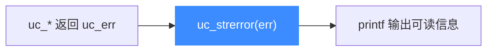

# uc_strerror — 错误码转字符串

本页讲 `uc_strerror`：把 `uc_err` 数值翻译成人类可读的英文描述。读完你能在日志与报错里输出清晰的错误信息，而不是一串数字。

## 📌 概述

`uc_strerror` 接收一个错误码，返回描述该错误的字符串指针。它是排查 Unicorn 问题时最常配合出现的辅助函数。

## 函数原型

```c
const char *uc_strerror(uc_err code);
```

> 📄 声明：[`unicorn.h`](https://github.com/android-security-engineer/unicorn-skills/blob/master/include/unicorn/unicorn.h#L800) · 实现：[`uc.c`](https://github.com/android-security-engineer/unicorn-skills/blob/master/uc.c#L145)

## 参数

| 参数 | 类型 | 说明 |
|------|------|------|
| `code` | `uc_err` | 错误码，来自函数返回值或 [uc_errno](/api/errno) |

## 返回值

返回一个指向常量字符串的指针，描述传入的错误码。

::: tip 无需释放
返回的字符串由 Unicorn 内部管理，**不要** `free` 它，也不要长期缓存指针。
:::

## 常见错误码对照

| 错误码 | 典型描述场景 |
|--------|-------------|
| `UC_ERR_OK` | 一切正常 |
| `UC_ERR_READ_UNMAPPED` | 读了未映射内存 |
| `UC_ERR_WRITE_UNMAPPED` | 写了未映射内存 |
| `UC_ERR_FETCH_UNMAPPED` | 从未映射内存取指 |
| `UC_ERR_INSN_INVALID` | 遇到非法指令 |
| `UC_ERR_ARG` | 传给某函数的参数无效 |

完整清单见 [错误码参考](/errors/)。

## 用法流程



## 💻 用法示例

```c
#include <unicorn/unicorn.h>
#include <stdio.h>

// 统一的错误检查小工具
#define CHECK(call) do {                                  \
    uc_err _e = (call);                                   \
    if (_e != UC_ERR_OK) {                                \
        printf(#call " 失败: %s\n", uc_strerror(_e));     \
        return 1;                                         \
    }                                                     \
} while (0)

int main(void) {
    uc_engine *uc;
    CHECK(uc_open(UC_ARCH_X86, UC_MODE_64, &uc));
    CHECK(uc_mem_map(uc, 0x1000, 0x1000, UC_PROT_ALL));
    // ...
    uc_close(uc);
    return 0;
}
```

::: warning 常见错误
- ❌ **把返回指针 free 掉**：会导致崩溃。它不是你分配的内存。
- ❌ **仅打印数字错误码**：难以定位问题。始终用 `uc_strerror` 转成可读文本。
:::

## 📂 相关源码

| 文件 | 角色 |
|------|------|
| [`unicorn.h`](https://github.com/android-security-engineer/unicorn-skills/blob/master/include/unicorn/unicorn.h#L800) | `uc_strerror` 声明 |
| [`uc.c`](https://github.com/android-security-engineer/unicorn-skills/blob/master/uc.c#L145) | `uc_strerror` 实现 |

## 相关页面

- [uc_errno — 最近错误](/api/errno)
- [错误码参考总览](/errors/)
- [调试仿真问题](/guide/debugging)
