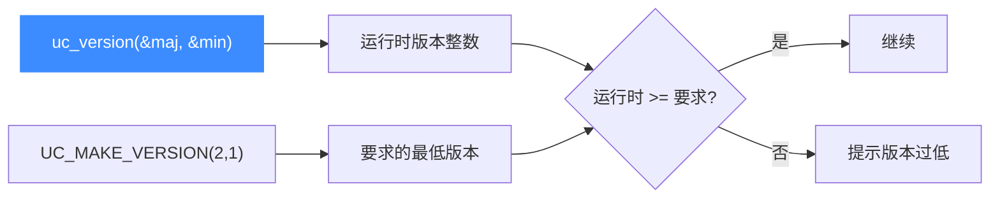

# uc_version — 获取库版本号

本页讲 `uc_version` 以及配套的 `UC_VERSION_*` 宏与 `UC_MAKE_VERSION`。读完你能在运行时取得动态库版本，并与编译期版本对比，做兼容性检查。

## 📌 概述

`uc_version` 返回一个把主/次/补丁/附加号打包在一起的整数，同时可选地把主、次版本号写入出参。它常用于**运行时校验**：确认实际链接的 `.so`/`.dll` 版本是否满足代码要求。

## 函数原型

```c
unsigned int uc_version(unsigned int *major, unsigned int *minor);
```

> 📄 声明：[`unicorn.h`](https://github.com/android-security-engineer/unicorn-skills/blob/master/include/unicorn/unicorn.h#L712) · 实现：[`uc.c`](https://github.com/android-security-engineer/unicorn-skills/blob/master/uc.c#L115)

## 参数

| 参数 | 类型 | 说明 |
|------|------|------|
| `major` | `unsigned int *` | 出参：主版本号，可传 `NULL` |
| `minor` | `unsigned int *` | 出参：次版本号，可传 `NULL` |

若只关心返回值，`major` 与 `minor` 都可传 `NULL`。

## 返回值

返回一个十六进制打包整数，布局为：

```
(major << 24) | (minor << 16) | (patch << 8) | extra
```

例如 Unicorn 2.0.1 正式版返回 `0x020001ff`（`extra = 255` 表示正式发行，非 RC）。

## 相关宏（来自 unicorn.h）

| 宏 | 当前值 | 说明 |
|----|--------|------|
| `UC_API_MAJOR` / `UC_VERSION_MAJOR` | 2 | 主版本 |
| `UC_API_MINOR` / `UC_VERSION_MINOR` | 1 | 次版本 |
| `UC_API_PATCH` / `UC_VERSION_PATCH` | 4 | 补丁号 |
| `UC_API_EXTRA` / `UC_VERSION_EXTRA` | 255 | 255 表示正式发行 |

```c
// 把 major/minor 打包成可与 uc_version() 比较的值
#define UC_MAKE_VERSION(major, minor) (((major) << 24) + ((minor) << 16))
```

## 版本比较流程



## 💻 用法示例

```c
#include <unicorn/unicorn.h>
#include <stdio.h>

int main(void) {
    unsigned int major, minor;
    unsigned int v = uc_version(&major, &minor);
    printf("Unicorn 运行时版本: %u.%u (打包值 0x%08x)\n", major, minor, v);

    // 要求至少 2.1
    if (v < UC_MAKE_VERSION(2, 1)) {
        printf("警告: 版本过低, 部分功能可能不可用\n");
        return 1;
    }
    return 0;
}
```

::: tip 编译期 vs 运行时
`UC_VERSION_*` 宏是**编译时**头文件里的常量；`uc_version()` 返回的是**运行时**实际链接的库版本。二者不一致往往意味着头文件与动态库版本不匹配，是排查诡异行为的第一站。
:::

::: warning 常见错误
- ❌ **注意 `UC_MAKE_VERSION` 不含 patch/extra**：它只左移打包了 major、minor，比较时低 16 位为 0，适合做「主次版本下限」判断，不要指望它精确到补丁号。
:::

## 📂 相关源码

| 文件 | 角色 |
|------|------|
| [`unicorn.h`](https://github.com/android-security-engineer/unicorn-skills/blob/master/include/unicorn/unicorn.h#L712) | `uc_version` 声明 |
| [`uc.c`](https://github.com/android-security-engineer/unicorn-skills/blob/master/uc.c#L115) | `uc_version` 实现 |

## 相关页面

- [uc_arch_supported — 架构可用性](/api/arch-supported)
- [编译与安装](/guide/compile)
- [API 参考总览](/api/)
