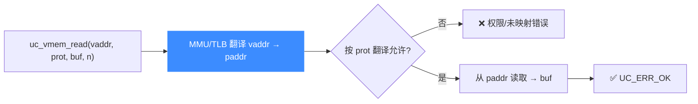

# uc_vmem_read — 经 MMU 翻译后按虚拟地址读

像 CPU 一样，先把虚拟地址走 MMU 翻译成物理地址再读取。读完本页你能掌握它与 `uc_mem_read` 的区别、`prot` 参数的作用，以及为何页表配置不对就会失败。

## 🧭 原型

```c
uc_err uc_vmem_read(uc_engine *uc, uint64_t address, uc_prot prot,
                    void *bytes, size_t size);
```

> 📄 声明：[`unicorn.h`](https://github.com/android-security-engineer/unicorn-skills/blob/master/include/unicorn/unicorn.h#L977) · 实现：[`uc.c`](https://github.com/android-security-engineer/unicorn-skills/blob/master/uc.c#L816)

与 [uc_mem_read](/api/mem-read) 的关键区别：`address` 是**虚拟地址**。Unicorn 会用当前 MMU/页表把它翻译成物理地址后再读。翻译需要相关页已按合适权限映射，否则失败。

## 🧩 参数

| 参数 | 类型 | 说明 |
|------|------|------|
| `uc` | `uc_engine *` | 引擎句柄 |
| `address` | `uint64_t` | 起始**虚拟地址** |
| `prot` | `uc_prot` | TLB 查找使用的访问类型（见下方说明） |
| `bytes` | `void *` | 宿主缓冲区，≥ `size` 字节 |
| `size` | `size_t` | 读取字节数 |

::: tip prot 与物理页权限是两回事
`prot` 是**这次翻译**要求的访问类型，独立于物理内存的实际权限。例如某段物理内存以只写映射，则只有 `prot == UC_PROT_WRITE` 的调用才能读到它的内容——MMU 按 `prot` 决定翻译是否放行。
:::

## 📤 返回值

| 返回值 | 含义 |
|--------|------|
| `UC_ERR_OK` | 翻译并读取成功 |
| `UC_ERR_READ_UNMAPPED` | 翻译后的物理地址未映射 |
| `UC_ERR_READ_PROT` | 页表/权限不允许该 `prot` 的翻译 |
| `UC_ERR_ARG` | 参数非法 |

## 🔧 翻译再读取



## 💻 完整示例

```c
#include <unicorn/unicorn.h>
#include <stdio.h>

int main(void) {
    uc_engine *uc;
    uc_open(UC_ARCH_ARM64, UC_MODE_ARM, &uc);

    // 映射物理内存并写入数据（uc_mem_* 走物理地址）
    uc_mem_map(uc, 0x1000, 0x1000, UC_PROT_ALL);
    uint32_t data = 0xCAFEBABE;
    uc_mem_write(uc, 0x1000, &data, sizeof(data));

    // 假设已通过页表让虚拟地址 0x4000 → 物理 0x1000
    // （此处省略架构相关的 TTBR/页表配置）
    uint32_t out = 0;
    uc_err err = uc_vmem_read(uc, 0x4000, UC_PROT_READ, &out, sizeof(out));
    if (err != UC_ERR_OK) {
        printf("vmem_read: %s\n", uc_strerror(err));
        return 1;
    }
    printf("read via MMU: 0x%08x\n", out);

    uc_close(uc);
    return 0;
}
```

::: warning 常见坑
- **必须先配置好 MMU/页表**：TTBR/CR3/SATP 等系统寄存器要正确，页要按 `prot` 要求的权限映射，否则 `UC_ERR_READ_UNMAPPED` / `UC_ERR_READ_PROT`。
- 别把它当 `uc_mem_read` 用：`uc_mem_read` 走物理地址、不翻译；`uc_vmem_read` 走虚拟地址、要翻译。
- 只想按物理地址旁路读取时用 [uc_mem_read](/api/mem-read) 更简单。
:::

## 📂 相关源码

| 文件 | 角色 |
|------|------|
| [`unicorn.h`](https://github.com/android-security-engineer/unicorn-skills/blob/master/include/unicorn/unicorn.h#L977) | `uc_vmem_read` 声明 |
| [`uc.c`](https://github.com/android-security-engineer/unicorn-skills/blob/master/uc.c#L816) | `uc_vmem_read` 实现 |

## 相关页面

- [uc_vmem_write](/api/vmem-write) — 反向：按虚拟地址写
- [uc_vmem_translate](/api/vmem-translate) — 只翻译不读写
- [MMU 与虚拟内存](/features/mmu) — 翻译机制全貌
- [uc_mem_read](/api/mem-read) — 按物理地址读取
