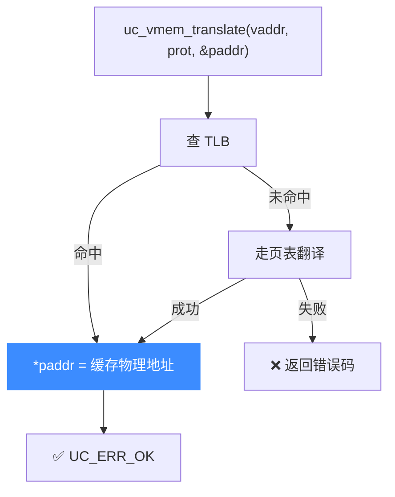

# uc_vmem_translate — 虚拟地址到物理地址翻译

只做一次 MMU 翻译，把虚拟地址换算成物理地址，不读也不写。读完本页你能掌握它的用途（调试页表、复现 CPU 的地址转换）、`prot` 的作用与失败原因。

## 🗺️ 原型

```c
uc_err uc_vmem_translate(uc_engine *uc, uint64_t address, uc_prot prot,
                         uint64_t *paddress);
```

> 📄 声明：[`unicorn.h`](https://github.com/android-security-engineer/unicorn-skills/blob/master/include/unicorn/unicorn.h#L1025) · 实现：[`uc.c`](https://github.com/android-security-engineer/unicorn-skills/blob/master/uc.c#L780)

用当前 MMU/页表把虚拟地址 `address` 翻译成物理地址，结果写入 `*paddress`。这与 [uc_vmem_read](/api/vmem-read)/[uc_vmem_write](/api/vmem-write) 走的是同一套翻译逻辑，只是**到翻译为止**，不做实际访存。

## 🧩 参数

| 参数 | 类型 | 说明 |
|------|------|------|
| `uc` | `uc_engine *` | 引擎句柄 |
| `address` | `uint64_t` | 待翻译的**虚拟地址** |
| `prot` | `uc_prot` | TLB 查找使用的访问类型（`UC_PROT_READ`/`WRITE`/`EXEC`） |
| `paddress` | `uint64_t *` | 出参：翻译得到的**物理地址** |

## 📤 返回值

| 返回值 | 含义 |
|--------|------|
| `UC_ERR_OK` | 翻译成功，`*paddress` 有效 |
| `UC_ERR_READ_UNMAPPED` 等 | 该虚拟地址没有对应的有效映射 |
| `UC_ERR_ARG` | 参数非法（如 `paddress` 为空） |

::: tip 为什么需要传 prot
同一虚拟地址在不同访问类型下可能有不同的翻译结果或权限判定。例如仅可执行的页，用 `UC_PROT_EXEC` 翻译成功，而用 `UC_PROT_WRITE` 翻译可能被拒。翻译前先想清楚"我要模拟哪种访问"。
:::

## 🔧 翻译流程



## 💻 完整示例

```c
#include <unicorn/unicorn.h>
#include <stdio.h>

int main(void) {
    uc_engine *uc;
    uc_open(UC_ARCH_ARM64, UC_MODE_ARM, &uc);

    uc_mem_map(uc, 0x1000, 0x1000, UC_PROT_ALL);
    // 假设页表已把虚拟 0x4000 映射到物理 0x1000

    uint64_t paddr = 0;
    uc_err err = uc_vmem_translate(uc, 0x4000, UC_PROT_READ, &paddr);
    if (err != UC_ERR_OK) {
        printf("translate failed: %s\n", uc_strerror(err));
        return 1;
    }
    printf("vaddr 0x4000 -> paddr 0x%" PRIx64 "\n", paddr); // 0x1000

    // 未建立映射的虚拟地址翻译会失败
    err = uc_vmem_translate(uc, 0xDEAD0000, UC_PROT_READ, &paddr);
    printf("bad vaddr: %s\n", uc_strerror(err));

    uc_close(uc);
    return 0;
}
```

::: warning 常见坑
- 翻译**依赖当前页表状态**：改了页表后要 [uc_ctl_flush_tlb](/ctl/flush-tlb)，否则 TLB 里的旧翻译会误导结果。
- `prot` 选错会导致本可成功的翻译被拒——按你要模拟的访问类型来选。
- 翻译成功不代表随后一定能读写：物理页的实际权限、是否映射仍需满足。
:::

## 📂 相关源码

| 文件 | 角色 |
|------|------|
| [`unicorn.h`](https://github.com/android-security-engineer/unicorn-skills/blob/master/include/unicorn/unicorn.h#L1025) | `uc_vmem_translate` 声明 |
| [`uc.c`](https://github.com/android-security-engineer/unicorn-skills/blob/master/uc.c#L780) | `uc_vmem_translate` 实现 |

## 相关页面

- [uc_vmem_read](/api/vmem-read) — 翻译后读取
- [uc_vmem_write](/api/vmem-write) — 翻译后写入
- [MMU 与虚拟内存](/features/mmu) — 翻译机制全貌
- [uc_ctl_flush_tlb](/ctl/flush-tlb) — 刷新 TLB
