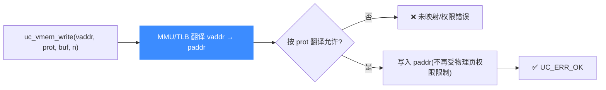

# uc_vmem_write — 经 MMU 翻译后按虚拟地址写

像 CPU 一样，先把虚拟地址走 MMU 翻译成物理地址再写入。读完本页你能掌握它与 `uc_mem_write` 的区别、`prot` 参数的含义，以及一个容易忽略的"权限放行"细节。

## 🧭 原型

```c
uc_err uc_vmem_write(uc_engine *uc, uint64_t address, uc_prot prot,
                     void *bytes, size_t size);
```

> 📄 声明：[`unicorn.h`](https://github.com/android-security-engineer/unicorn-skills/blob/master/include/unicorn/unicorn.h#L1005) · 实现：[`uc.c`](https://github.com/android-security-engineer/unicorn-skills/blob/master/uc.c#L862)

与 [uc_mem_write](/api/mem-write) 的关键区别：`address` 是**虚拟地址**，Unicorn 先用 MMU/页表翻译成物理地址，再写入 `bytes` 的 `size` 字节。

## 🧩 参数

| 参数 | 类型 | 说明 |
|------|------|------|
| `uc` | `uc_engine *` | 引擎句柄 |
| `address` | `uint64_t` | 起始**虚拟地址** |
| `prot` | `uc_prot` | TLB 查找使用的访问类型 |
| `bytes` | `void *` | 源数据缓冲区，≥ `size` 字节 |
| `size` | `size_t` | 写入字节数 |

::: tip 翻译放行后，写不再受物理页权限约束
只要页按 `prot` 要求的权限完成了翻译，实际写入就**独立于物理映射的权限**。也就是说，某页物理上是只读映射，只要你用 `prot == UC_PROT_READ` 让翻译通过，这次 `uc_vmem_write` 依然能把数据写进去。
:::

## 📤 返回值

| 返回值 | 含义 |
|--------|------|
| `UC_ERR_OK` | 翻译并写入成功 |
| `UC_ERR_WRITE_UNMAPPED` | 翻译后的物理地址未映射 |
| `UC_ERR_WRITE_PROT` | 页表/权限不允许该 `prot` 的翻译 |
| `UC_ERR_ARG` | 参数非法 |

## 🔧 翻译再写入



## 💻 完整示例

```c
#include <unicorn/unicorn.h>
#include <stdio.h>

int main(void) {
    uc_engine *uc;
    uc_open(UC_ARCH_ARM64, UC_MODE_ARM, &uc);

    uc_mem_map(uc, 0x1000, 0x1000, UC_PROT_ALL);
    // 假设页表已把虚拟 0x4000 映射到物理 0x1000

    uint32_t data = 0x12345678;
    uc_err err = uc_vmem_write(uc, 0x4000, UC_PROT_WRITE, &data, sizeof(data));
    if (err != UC_ERR_OK) {
        printf("vmem_write: %s\n", uc_strerror(err));
        return 1;
    }

    // 用物理地址读回校验
    uint32_t out = 0;
    uc_mem_read(uc, 0x1000, &out, sizeof(out));
    printf("phys[0x1000] = 0x%08x\n", out); // 12345678

    uc_close(uc);
    return 0;
}
```

::: warning 常见坑
- **页表必须先配好**：翻译失败会返回 `UC_ERR_WRITE_UNMAPPED` / `UC_ERR_WRITE_PROT`。
- 别混淆地址空间：`uc_vmem_write` 用虚拟地址，[uc_mem_write](/api/mem-write) 用物理地址。
- `prot` 只影响**翻译是否放行**，不影响写入本身——放行后连只读物理页也能写。
:::

## 📂 相关源码

| 文件 | 角色 |
|------|------|
| [`unicorn.h`](https://github.com/android-security-engineer/unicorn-skills/blob/master/include/unicorn/unicorn.h#L1005) | `uc_vmem_write` 声明 |
| [`uc.c`](https://github.com/android-security-engineer/unicorn-skills/blob/master/uc.c#L862) | `uc_vmem_write` 实现 |

## 相关页面

- [uc_vmem_read](/api/vmem-read) — 反向：按虚拟地址读
- [uc_vmem_translate](/api/vmem-translate) — 只翻译不读写
- [MMU 与虚拟内存](/features/mmu) — 翻译机制全貌
- [uc_mem_write](/api/mem-write) — 按物理地址写入
