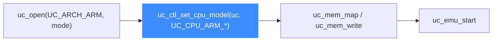

# ARM CPU 型号

本页列出 32 位 ARM 在 Unicorn 中可选的 CPU 型号 `UC_CPU_ARM_*`(真实取自 [`include/unicorn/arm.h`](https://github.com/android-security-engineer/unicorn-skills/blob/master/include/unicorn/arm.h)),说明 `UC_MODE_ARM926/946/1176` 三个模式级别的核选择,以及如何用 `uc_ctl_set_cpu_model` 在打开引擎后精确指定型号。读完你能为不同固件挑到匹配的 CPU 语义。

## 🧠 为什么要选型号

不同 ARM 核在特性寄存器、协处理器、Cortex-M 语义上有差异。选错型号可能导致某些指令(如读 `CONTROL`、特定 VFP 编码)行为不符预期。默认型号未必是你目标固件所用的核,显式设置更稳妥。



::: warning ⚠️ 设置时机
`uc_ctl_set_cpu_model` 必须在开始模拟(`uc_emu_start`)之前调用,通常紧跟 `uc_open` 之后。
:::

## 📋 UC_CPU_ARM_* 型号真实列表

以下枚举完整来自 `arm.h`(`UC_CPU_ARM_926 = 0` 起):

| 分类 | 型号常量 |
| --- | --- |
| 经典 ARM 核 | `UC_CPU_ARM_926`、`UC_CPU_ARM_946`、`UC_CPU_ARM_1026`、`UC_CPU_ARM_1136_R2`、`UC_CPU_ARM_1136`、`UC_CPU_ARM_1176`、`UC_CPU_ARM_11MPCORE` |
| Cortex-M | `UC_CPU_ARM_CORTEX_M0`、`UC_CPU_ARM_CORTEX_M3`、`UC_CPU_ARM_CORTEX_M4`、`UC_CPU_ARM_CORTEX_M7`、`UC_CPU_ARM_CORTEX_M33` |
| Cortex-R | `UC_CPU_ARM_CORTEX_R5`、`UC_CPU_ARM_CORTEX_R5F` |
| Cortex-A | `UC_CPU_ARM_CORTEX_A7`、`UC_CPU_ARM_CORTEX_A8`、`UC_CPU_ARM_CORTEX_A9`、`UC_CPU_ARM_CORTEX_A15` |
| TI / StrongARM | `UC_CPU_ARM_TI925T`、`UC_CPU_ARM_SA1100`、`UC_CPU_ARM_SA1110` |
| PXA 系列 | `UC_CPU_ARM_PXA250`、`PXA255`、`PXA260`、`PXA261`、`PXA262`、`PXA270`、`PXA270A0`、`PXA270A1`、`PXA270B0`、`PXA270B1`、`PXA270C0`、`PXA270C5` |

::: tip 📌 边界常量
`UC_CPU_ARM_MAX` 和 `UC_CPU_ARM_ENDING` 是列表边界标记,不是真实 CPU,不要传给 `uc_ctl_set_cpu_model`。
:::

## 🔧 用 uc_ctl_set_cpu_model 设置

[`samples/sample_arm.c`](https://github.com/android-security-engineer/unicorn-skills/blob/master/samples/sample_arm.c) 的 `test_thumb_mrs` 为了让 `mrs r0, control` 正确工作,显式选了 Cortex-M33:

```c
uc_engine *uc;
uc_open(UC_ARCH_ARM, UC_MODE_THUMB, &uc);

// 关键:设置 CPU 型号为 Cortex-M33
uc_err err = uc_ctl_set_cpu_model(uc, UC_CPU_ARM_CORTEX_M33);
if (err) {
    printf("set_cpu_model failed: %s\n", uc_strerror(err));
    return;
}

uc_mem_map(uc, ADDRESS, 2 * 1024 * 1024, UC_PROT_ALL);
uc_mem_write(uc, ADDRESS, "\xef\xf3\x14\x80", 4); // mrs r0, control
uc_emu_start(uc, ADDRESS | 1, ADDRESS + 4, 0, 1);
```

单元测试 `tests/unit/test_arm.c` 的通用初始化则普遍使用 `UC_CPU_ARM_CORTEX_A15` 作为默认 A 系核。

## 🧩 UC_MODE_ARM926/946/1176 与型号的关系

除了 `uc_ctl_set_cpu_model`,`mode` 里也有几个直接选核的位:

| 模式常量 | 对应核 |
| --- | --- |
| `UC_MODE_ARM926` | ARM926 |
| `UC_MODE_ARM946` | ARM946 |
| `UC_MODE_ARM1176` | ARM1176 |

它们是打开引擎时的快捷选择;若需要 Cortex-M/A 等更多型号,请用 `uc_ctl_set_cpu_model` 传对应 `UC_CPU_ARM_*`。

::: warning ⚠️ 别与指令集位混用冲突
`UC_MODE_ARM926/946/1176`(bit 7/8/9)与指令集 `UC_MODE_THUMB`(bit 4)、`UC_MODE_MCLASS`(bit 5)位不同,可以组合,但要确保所选核与指令集语义相符(例如 Cortex-M 才用 M-Class 语义)。
:::

## 📂 相关源码

| 文件 | 角色 |
|------|------|
| [`include/unicorn/arm.h`](https://github.com/android-security-engineer/unicorn-skills/blob/master/include/unicorn/arm.h#L73) | `UC_ARM_REG_*` 寄存器枚举与 `uc_cpu_*` CPU 型号定义 |
| [`qemu/target/arm/unicorn_arm.c`](https://github.com/android-security-engineer/unicorn-skills/blob/master/qemu/target/arm/unicorn_arm.c) | 后端：`reg_read`/`reg_write`/`uc_init` 等函数指针实现 |
| [`qemu/target/arm/translate.c`](https://github.com/android-security-engineer/unicorn-skills/blob/master/qemu/target/arm/translate.c) | 前端：机器码翻译（TCG） |
| [`samples/sample_arm.c`](https://github.com/android-security-engineer/unicorn-skills/blob/master/samples/sample_arm.c) | 该架构的 C 示例程序 |
| [`include/unicorn/unicorn.h`](https://github.com/android-security-engineer/unicorn-skills/blob/master/include/unicorn/unicorn.h#L99) | `UC_ARCH_ARM` 架构常量与 `UC_MODE_*` 公共模式定义 |

## 相关页面

- [uc_ctl_set_cpu_model](/ctl/set-cpu-model)
- [CPU 型号特性](/features/cpu-models)
- [ARM 模式与字节序](/arch/arm/modes)
