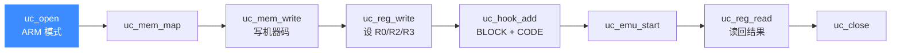

# ARM 实战示例

本页给出一个端到端可运行的 32 位 ARM 仿真示例:打开引擎、映射内存、写入机器码、设初值、注册 Hook、启动执行、读回结果。代码结构参照 [`samples/sample_arm.c`](https://github.com/android-security-engineer/unicorn-skills/blob/master/samples/sample_arm.c) 的 `test_arm`,逐段讲解并给出预期输出。

## 🎯 目标

在 `0x10000` 处执行一条 ARM 机器码,用 `UC_HOOK_BLOCK` 和 `UC_HOOK_CODE` 追踪执行,最后打印寄存器上下文。



## 🧩 完整代码

```c
#include <unicorn/unicorn.h>
#include <string.h>

// 待模拟机器码:一条 ARM 的 nop
#define ARM_CODE "\x00\xf0\x20\xe3"
#define ADDRESS 0x10000

static void hook_block(uc_engine *uc, uint64_t address, uint32_t size,
                       void *user_data)
{
    printf(">>> Tracing basic block at 0x%" PRIx64 ", block size = 0x%x\n",
           address, size);
}

static void hook_code(uc_engine *uc, uint64_t address, uint32_t size,
                      void *user_data)
{
    printf(">>> Tracing instruction at 0x%" PRIx64
           ", instruction size = 0x%x\n", address, size);
}

int main(void)
{
    uc_engine *uc;
    uc_err err;
    uc_hook trace1, trace2;

    int r0 = 0x1234, r2 = 0x6789, r3 = 0x3333, r1;

    // 1) 初始化:32 位 ARM,ARM 指令集,小端
    err = uc_open(UC_ARCH_ARM, UC_MODE_ARM, &uc);
    if (err) {
        printf("uc_open failed: %u (%s)\n", err, uc_strerror(err));
        return 1;
    }

    // 2) 映射 2MB 可读写执行内存
    uc_mem_map(uc, ADDRESS, 2 * 1024 * 1024, UC_PROT_ALL);

    // 3) 写入机器码(注意去掉字符串结尾的 '\0')
    uc_mem_write(uc, ADDRESS, ARM_CODE, sizeof(ARM_CODE) - 1);

    // 4) 设置寄存器初值
    uc_reg_write(uc, UC_ARM_REG_R0, &r0);
    uc_reg_write(uc, UC_ARM_REG_R2, &r2);
    uc_reg_write(uc, UC_ARM_REG_R3, &r3);

    // 5) 注册 Hook:基本块 + 单条指令
    uc_hook_add(uc, &trace1, UC_HOOK_BLOCK, hook_block, NULL, 1, 0);
    uc_hook_add(uc, &trace2, UC_HOOK_CODE, hook_code, NULL, ADDRESS, ADDRESS);

    // 6) 启动模拟:从 ADDRESS 执行到码尾;超时 0=无限,指令数 0=跑完
    err = uc_emu_start(uc, ADDRESS, ADDRESS + sizeof(ARM_CODE) - 1, 0, 0);
    if (err) {
        printf("uc_emu_start failed: %u\n", err);
    }

    // 7) 读回并打印寄存器
    printf(">>> Emulation done. Below is the CPU context\n");
    uc_reg_read(uc, UC_ARM_REG_R0, &r0);
    uc_reg_read(uc, UC_ARM_REG_R1, &r1);
    printf(">>> R0 = 0x%x\n", r0);
    printf(">>> R1 = 0x%x\n", r1);

    uc_close(uc);
    return 0;
}
```

## 🔧 逐段讲解

| 步骤 | API | 要点 |
| --- | --- | --- |
| 1 | `uc_open` | 架构 [`UC_ARCH_ARM`](https://github.com/android-security-engineer/unicorn-skills/blob/master/include/unicorn/unicorn.h#L99)、模式 `UC_MODE_ARM`(小端默认) |
| 2 | `uc_mem_map` | 起始地址与大小需页对齐;`UC_PROT_ALL` 给全部权限 |
| 3 | `uc_mem_write` | 用 `sizeof(x) - 1` 去掉 C 字符串结尾 `\0` |
| 4 | `uc_reg_write` | 传寄存器常量与变量地址 |
| 5 | `uc_hook_add` | BLOCK 用 `(1,0)` 覆盖全部;CODE 限定单地址 |
| 6 | `uc_emu_start` | 参数为 (起始, 结束, 超时, 指令数),0 表示不限 |
| 7 | `uc_reg_read` | 执行后读回观察 CPU 状态 |

::: tip 📌 换成 Thumb 只需两处改动
把 `UC_MODE_ARM` 改为 `UC_MODE_THUMB`,并把 `uc_emu_start` 起始地址改为 `ADDRESS | 1`,即可运行 Thumb 代码,详见 [ARM 模式与字节序](/arch/arm/modes)。
:::

## 📤 预期输出

因为示例机器码是一条 nop,寄存器值不变:

```text
>>> Tracing basic block at 0x10000, block size = 0x4
>>> Tracing instruction at 0x10000, instruction size = 0x4
>>> Emulation done. Below is the CPU context
>>> R0 = 0x1234
>>> R1 = 0x0
```

::: warning ⚠️ R1 未被赋值
本例只写了 R0/R2/R3,R1 保持默认 0。若把机器码换成 `sub r1, r2, r3`(`\x37\x00\xa0\xe3\x03\x10\x42\xe0` 的后半段),R1 才会随运算改变。
:::

## 📂 相关源码

| 文件 | 角色 |
|------|------|
| [`include/unicorn/arm.h`](https://github.com/android-security-engineer/unicorn-skills/blob/master/include/unicorn/arm.h#L73) | `UC_ARM_REG_*` 寄存器枚举与 `uc_cpu_*` CPU 型号定义 |
| [`qemu/target/arm/unicorn_arm.c`](https://github.com/android-security-engineer/unicorn-skills/blob/master/qemu/target/arm/unicorn_arm.c) | 后端：`reg_read`/`reg_write`/`uc_init` 等函数指针实现 |
| [`qemu/target/arm/translate.c`](https://github.com/android-security-engineer/unicorn-skills/blob/master/qemu/target/arm/translate.c) | 前端：机器码翻译（TCG） |
| [`samples/sample_arm.c`](https://github.com/android-security-engineer/unicorn-skills/blob/master/samples/sample_arm.c) | 该架构的 C 示例程序 |
| [`include/unicorn/unicorn.h`](https://github.com/android-security-engineer/unicorn-skills/blob/master/include/unicorn/unicorn.h#L99) | `UC_ARCH_ARM` 架构常量与 `UC_MODE_*` 公共模式定义 |

## 相关页面

- [sample_arm.c 讲解](/samples/sample-arm)
- [ARM 架构概览](/arch/arm/)
- [ARM 指令与特性](/arch/arm/instructions)
