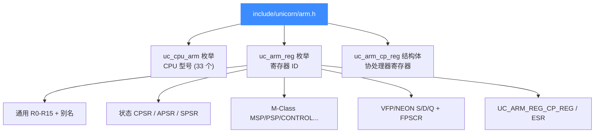
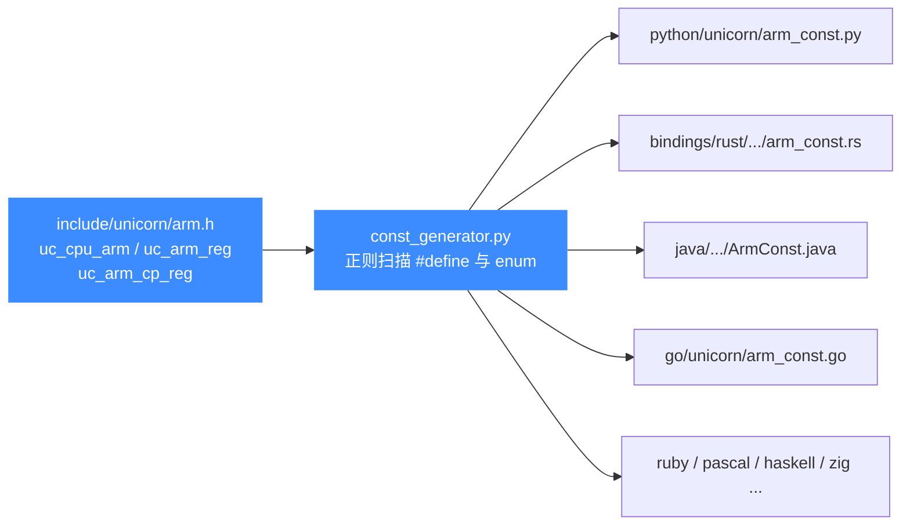

# arm.h — ARM 头文件常量参考

本页讲 [`include/unicorn/arm.h`](https://github.com/android-security-engineer/unicorn-skills/blob/master/include/unicorn/arm.h)：它是 32 位 ARM 架构在 Unicorn 中所有公开常量的**真源（source of truth）**，定义了 CPU 型号枚举、寄存器 ID 枚举与协处理器寄存器结构体。所有语言绑定（Python/Rust/Go/Java/…）的 ARM 常量都由 `const_generator.py` 从这个头文件自动生成，不要手改绑定里的 `*_const.*`。

## 📌 概述

`arm.h` 是被 `unicorn.h` 聚合进来的架构头之一。它本身只声明三类对绑定量化的内容：

1. **CPU 型号枚举 `uc_cpu_arm`** —— 列出全部可模拟的 32 位 ARM 核（Cortex-A/M/R 系列、ARM9/11、PXA、SA1100 等），配合 `uc_ctl_set_cpu_model` 使用。
2. **寄存器 ID 枚举 `uc_arm_reg`** —— 给 `uc_reg_read` / `uc_reg_write` 用的寄存器编号，覆盖通用寄存器、状态寄存器、M-Class 系统寄存器、VFP/NEON 浮点向量寄存器。
3. **协处理器寄存器结构体 `uc_arm_cp_reg`** —— 用于经 `UC_ARM_REG_CP_REG` 读写 CP14/CP15 等系统寄存器。

```c
#include <unicorn/unicorn.h>
/* arm.h 会被 unicorn.h 自动聚合,无需单独 include */
```

::: tip 📌 这就是 source of truth
改了 `arm.h` 里的枚举值或新增常量后,必须跑 `bindings/const_generator.py` 重新生成各绑定常量,否则 Python/Rust/Go 等会与 C 头漂移。详见 [常量生成器](/bindings/const-generator)。
:::

## 🧱 文件结构



## 🔧 CPU 型号枚举 uc_cpu_arm

`arm.h` 用一个连续递增的 `enum` 列出全部 32 位 ARM 核。取值传给 [uc_ctl](/api/ctl) 的 `UC_CTL_CPU_MODEL`（便捷宏 `uc_ctl_set_cpu_model`）。完整型号语义见 [ARM CPU 型号](/arch/arm/cpu-models)。

| 常量 | 值 | 说明 |
|------|----|------|
| `UC_CPU_ARM_926` | 0 | ARM926EJ-S |
| `UC_CPU_ARM_946` | 1 | ARM946E-S |
| `UC_CPU_ARM_1026` | 2 | ARM1026EJ-S |
| `UC_CPU_ARM_1136_R2` | 3 | ARM1136 r2 |
| `UC_CPU_ARM_1136` | 4 | ARM1136 |
| `UC_CPU_ARM_1176` | 5 | ARM1176 |
| `UC_CPU_ARM_11MPCORE` | 6 | ARM11MPCore |
| `UC_CPU_ARM_CORTEX_M0` | 7 | Cortex-M0 |
| `UC_CPU_ARM_CORTEX_M3` | 8 | Cortex-M3 |
| `UC_CPU_ARM_CORTEX_M4` | 9 | Cortex-M4 |
| `UC_CPU_ARM_CORTEX_M7` | 10 | Cortex-M7 |
| `UC_CPU_ARM_CORTEX_M33` | 11 | Cortex-M33 |
| `UC_CPU_ARM_CORTEX_R5` | 12 | Cortex-R5 |
| `UC_CPU_ARM_CORTEX_R5F` | 13 | Cortex-R5F |
| `UC_CPU_ARM_CORTEX_A7` | 14 | Cortex-A7 |
| `UC_CPU_ARM_CORTEX_A8` | 15 | Cortex-A8 |
| `UC_CPU_ARM_CORTEX_A9` | 16 | Cortex-A9 |
| `UC_CPU_ARM_CORTEX_A15` | 17 | Cortex-A15 |
| `UC_CPU_ARM_TI925T` | 18 | TI925T |
| `UC_CPU_ARM_SA1100` | 19 | SA1100 |
| `UC_CPU_ARM_SA1110` | 20 | SA1110 |
| `UC_CPU_ARM_PXA250` … `PXA270C5` | 21–32 | Intel XScale PXA 系列 |
| `UC_CPU_ARM_MAX` | — | 哨兵,非有效型号 |
| `UC_CPU_ARM_ENDING` | — | 枚举上界哨兵 |

## 📖 寄存器 ID 枚举 uc_arm_reg

这是 `arm.h` 的主体。下面列出常用部分（完整列表以源码为准）。配合 `uc_reg_read` / `uc_reg_write` 使用，详见 [ARM 寄存器](/arch/arm/registers)。

### 通用寄存器与别名

| 常量 | 含义 |
|------|------|
| `UC_ARM_REG_INVALID` | 占位,无效值（= 0） |
| `UC_ARM_REG_R0` … `UC_ARM_REG_R12` | 通用寄存器 R0–R12 |
| `UC_ARM_REG_SP` | 栈指针（别名 `UC_ARM_REG_R13`） |
| `UC_ARM_REG_LR` | 链接寄存器 / 返回地址（别名 `UC_ARM_REG_R14`） |
| `UC_ARM_REG_PC` | 程序计数器（别名 `UC_ARM_REG_R15`） |
| `UC_ARM_REG_SB` | 静态基址（= `UC_ARM_REG_R9`） |
| `UC_ARM_REG_SL` | 栈界限（= `UC_ARM_REG_R10`） |
| `UC_ARM_REG_FP` | 帧指针（= `UC_ARM_REG_R11`） |
| `UC_ARM_REG_IP` | 内部过程调用临时寄存器（= `UC_ARM_REG_R12`） |

### 状态寄存器

| 常量 | 含义 |
|------|------|
| `UC_ARM_REG_CPSR` | 当前程序状态寄存器（含 N/Z/C/V、T 位、模式位） |
| `UC_ARM_REG_APSR` | 应用程序状态寄存器 |
| `UC_ARM_REG_APSR_NZCV` | 仅 NZCV 标志视图 |
| `UC_ARM_REG_SPSR` | 保存的程序状态寄存器 |
| `UC_ARM_REG_ITSTATE` | IT 块状态 |

### VFP / NEON 浮点与向量

| 常量 | 含义 |
|------|------|
| `UC_ARM_REG_S0` … `UC_ARM_REG_S31` | 单精度浮点寄存器（32 位） |
| `UC_ARM_REG_D0` … `UC_ARM_REG_D31` | 双精度浮点寄存器（64 位） |
| `UC_ARM_REG_Q0` … `UC_ARM_REG_Q15` | 四字向量寄存器（128 位） |
| `UC_ARM_REG_FPSCR` | 浮点状态与控制寄存器 |
| `UC_ARM_REG_FPSCR_NZCV` | FPSCR 的 NZCV 视图 |
| `UC_ARM_REG_FPEXC` | 浮点异常寄存器 |
| `UC_ARM_REG_FPSID` | 浮点系统 ID 寄存器 |
| `UC_ARM_REG_MVFR0` / `MVFR1` / `MVFR2` | 媒体与 VFP 特性寄存器 |

### M-Class 系统寄存器（Cortex-M）

| 常量 | 含义 |
|------|------|
| `UC_ARM_REG_MSP` | 主栈指针 |
| `UC_ARM_REG_PSP` | 进程栈指针 |
| `UC_ARM_REG_CONTROL` | CONTROL 寄存器 |
| `UC_ARM_REG_PRIMASK` | 中断屏蔽 |
| `UC_ARM_REG_BASEPRI` | 基础优先级屏蔽 |
| `UC_ARM_REG_BASEPRI_MAX` | 基础优先级上限 |
| `UC_ARM_REG_FAULTMASK` | 故障屏蔽 |
| `UC_ARM_REG_IPSR` | 中断程序状态 |
| `UC_ARM_REG_EPSR` | 执行程序状态 |
| `UC_ARM_REG_XPSR` | 组合程序状态 |
| `UC_ARM_REG_IEPSR` | IPSR + EPSR 合并视图 |

### 协处理器与伪寄存器

| 常量 | 含义 |
|------|------|
| `UC_ARM_REG_CP_REG` | 经 `uc_arm_cp_reg` 读写 CP14/CP15 系统寄存器 |
| `UC_ARM_REG_ESR` | 伪寄存器:取异常综合症（非真实寄存器） |
| `UC_ARM_REG_C1_C0_2` | 已弃用,改用 `UC_ARM_REG_CP_REG` |
| `UC_ARM_REG_C13_C0_2` | 已弃用,改用 `UC_ARM_REG_CP_REG` |
| `UC_ARM_REG_C13_C0_3` | 已弃用,改用 `UC_ARM_REG_CP_REG` |
| `UC_ARM_REG_ENDING` | 枚举上界哨兵 |

::: warning ⚠️ 别用已弃用的 Cx 常量
`UC_ARM_REG_C1_C0_2` / `UC_ARM_REG_C13_C0_2` / `UC_ARM_REG_C13_C0_3` 注释里明确标 Depreciated。访问 CP15 等系统寄存器应填充 `uc_arm_cp_reg` 后用 `UC_ARM_REG_CP_REG`,详见 [ARM 寄存器](/arch/arm/registers)。
:::

## 🗂️ 协处理器寄存器结构体 uc_arm_cp_reg

`arm.h` 还定义了一个结构体，用于按协处理器编码寻址系统寄存器（CP14/CP15）。把它传给 `uc_reg_read`/`uc_reg_write`，并把寄存器 ID 设为 `UC_ARM_REG_CP_REG`。

```c
typedef struct uc_arm_cp_reg {
    uint32_t cp;   // 协处理器标识 (如 15 表示 CP15)
    uint32_t is64; // 是否为 64 位控制寄存器
    uint32_t sec;  // 安全状态
    uint32_t crn;  // 主寄存器号
    uint32_t crm;  // 次寄存器号
    uint32_t opc1; // Opcode1
    uint32_t opc2; // Opcode2
    uint64_t val;  // 读/写的值
} uc_arm_cp_reg;
```

```c
/* 读 SCTLR (CP15 c1 c0 0) 的示例骨架 */
uc_arm_cp_reg sctlr = {
    .cp = 15, .is64 = 0, .sec = 0,
    .crn = 1, .crm = 0, .opc1 = 0, .opc2 = 0,
};
uc_reg_read(uc, UC_ARM_REG_CP_REG, &sctlr);
printf("SCTLR = 0x%llx\n", (unsigned long long)sctlr.val);
```

## ⚠️ ARM 特有的 UC_MODE_* 模式位

模式位本身定义在 [`include/unicorn/unicorn.h`](https://github.com/android-security-engineer/unicorn-skills/blob/master/include/unicorn/unicorn.h) 的 `uc_mode` 枚举里，并非 `arm.h`，但它们是 ARM 架构专属、与 `arm.h` 的 CPU 型号枚举配套使用，故一并列出。组合方式见 [ARM 模式与字节序](/arch/arm/modes)。

| 值 | 常量 | 说明 |
|----|------|------|
| `0` | `UC_MODE_ARM` | ARM（A32）指令集,4 字节编码 |
| `1<<4` | `UC_MODE_THUMB` | Thumb / Thumb-2 指令集 |
| `1<<5` | `UC_MODE_MCLASS` | Cortex-M 系列（已弃用,改用 `UC_CPU_ARM_CORTEX_M*` + `uc_ctl`） |
| `1<<6` | `UC_MODE_V8` | ARMv8 A32 编码 |
| `1<<10` | `UC_MODE_ARMBE8` | 大端数据 + 小端代码（BE8） |
| `1<<7` | `UC_MODE_ARM926` | ARM926 CPU 类型（已弃用,改用 CPU 型号枚举） |
| `1<<8` | `UC_MODE_ARM946` | ARM946 CPU 类型（已弃用） |
| `1<<9` | `UC_MODE_ARM1176` | ARM1176 CPU 类型（已弃用） |

::: warning ⚠️ CPU 类型模式位已弃用
`UC_MODE_ARM926/946/1176/MCLASS` 是 Unicorn v1 遗留的 CPU 选择方式,已弃用。现在统一用 `uc_cpu_arm` 枚举里的具体型号 + `uc_ctl_set_cpu_model`,见 [ARM CPU 型号](/arch/arm/cpu-models)。
:::

## 💻 用法：注册并读取一个寄存器

```c
#include <unicorn/unicorn.h>
#include <stdio.h>

int main(void) {
    uc_engine *uc;
    uc_err err = uc_open(UC_ARCH_ARM, UC_MODE_ARM, &uc);
    if (err != UC_ERR_OK) {
        printf("uc_open: %s\n", uc_strerror(err));
        return 1;
    }

    int r0 = 0x1234;
    uc_reg_write(uc, UC_ARM_REG_R0, &r0);   /* 写入通用寄存器 */

    int pc = 0;
    uc_reg_read(uc, UC_ARM_REG_PC, &pc);    /* 读程序计数器 */
    printf("PC = 0x%x\n", pc);

    uc_close(uc);
    return 0;
}
```

## 📖 关于指令 ID

与 x86、arm64 不同，**`arm.h` 不提供 `UC_ARM_INS_*` 指令 ID 枚举**。ARM 的指令识别在 Unicorn 中通过 [UC_HOOK_CODE](/hooks/code) / [UC_HOOK_INSN_INVALID](/hooks/insn-invalid) 等代码 Hook 回调地址与原始字节完成，而非 Capstone 风格的指令枚举。如需指令级反汇编，请配合 Capstone 使用。

## 🔧 头文件如何被绑定生成器消费



::: details 为什么生成器扫到的是 enum 值
`const_generator.py` 实际只读 `#define UC_...` 形式的宏。对 `uc_arm_reg` 这类 `enum`,生成器靠头文件里配套的 `#define UC_ARM_REG_R0 UC_ARM_REG_R0` 风格声明把它们暴露成可被正则捕获的常量。因此新增寄存器时,枚举与对应 `#define` 都要加,否则绑定里取不到名字。详见 [常量生成器](/bindings/const-generator)。
:::

## 📂 相关源码

| 文件 | 角色 |
|------|------|
| [`include/unicorn/arm.h`](https://github.com/android-security-engineer/unicorn-skills/blob/master/include/unicorn/arm.h#L73) | `UC_ARM_REG_*` 寄存器枚举与 `uc_cpu_*` CPU 型号定义 |
| [`qemu/target/arm/unicorn_arm.c`](https://github.com/android-security-engineer/unicorn-skills/blob/master/qemu/target/arm/unicorn_arm.c) | 后端：`reg_read`/`reg_write`/`uc_init` 等函数指针实现 |
| [`qemu/target/arm/translate.c`](https://github.com/android-security-engineer/unicorn-skills/blob/master/qemu/target/arm/translate.c) | 前端：机器码翻译（TCG） |
| [`samples/sample_arm.c`](https://github.com/android-security-engineer/unicorn-skills/blob/master/samples/sample_arm.c) | 该架构的 C 示例程序 |
| [`include/unicorn/unicorn.h`](https://github.com/android-security-engineer/unicorn-skills/blob/master/include/unicorn/unicorn.h#L99) | `UC_ARCH_ARM` 架构常量与 `UC_MODE_*` 公共模式定义 |

## 相关页面

- [ARM 架构概览](/arch/arm/)
- [ARM 寄存器](/arch/arm/registers)
- [ARM CPU 型号](/arch/arm/cpu-models)
- [常量生成器 const_generator.py](/bindings/const-generator)
- [unicorn.h — 公共 C API 头文件](/headers/unicorn-h)
