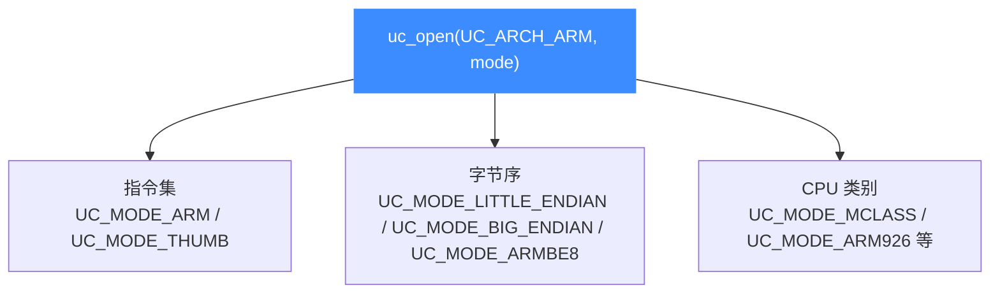

# ARM(32 位)架构概览

本页介绍 Unicorn 中 32 位 ARM 架构([`UC_ARCH_ARM`](https://github.com/android-security-engineer/unicorn-skills/blob/master/include/unicorn/unicorn.h#L99))的整体面貌:ARM 与 Thumb 两套指令集、大小端支持,以及它在固件分析与移动逆向中的典型用途。读完你能建立起后续 5 个子页面的知识地图。

## 🎯 ARM 在 Unicorn 中的定位

ARM 是 Unicorn 支持最早、使用最广的架构之一。在头文件 [`include/unicorn/unicorn.h`](https://github.com/android-security-engineer/unicorn-skills/blob/master/include/unicorn/unicorn.h) 中,架构常量定义为:

```c
UC_ARCH_ARM = 1,   // ARM architecture (including Thumb, Thumb-2)
UC_ARCH_ARM64,     // ARM-64, also called AArch64
```

注意 `UC_ARCH_ARM` **专指 32 位 ARM**(AArch32),其中已经包含 Thumb 与 Thumb-2 编码。64 位的 AArch64 是独立的 `UC_ARCH_ARM64`,请见 [ARM64 架构](/arch/arm64/)。

创建一个最小的 ARM 模拟器只需一行:

```c
uc_engine *uc;
// 32 位 ARM,ARM 指令集,小端(默认)
uc_err err = uc_open(UC_ARCH_ARM, UC_MODE_ARM, &uc);
if (err != UC_ERR_OK) {
    printf("uc_open failed: %s\n", uc_strerror(err));
}
```

## 🧩 三个维度决定一个 ARM 实例

打开 ARM 引擎时,`mode` 参数由三类正交的开关按位组合(部分互斥),它们共同决定 CPU 行为:



- **指令集**:`UC_MODE_ARM`(固定 4 字节编码)或 `UC_MODE_THUMB`(2/4 字节,含 Thumb-2)。
- **字节序**:默认小端;`UC_MODE_BIG_ENDIAN` 为大端,`UC_MODE_ARMBE8` 为「数据大端、代码小端」的 BE8 模式。
- **CPU 类别**:如 `UC_MODE_MCLASS` 选择 Cortex-M 系列,`UC_MODE_ARM926/946/1176` 选择经典核。

::: tip 📌 组合方式
mode 用加法或按位或组合,例如大端 ARM 写作 `UC_MODE_ARM + UC_MODE_BIG_ENDIAN`(见 [`samples/sample_arm.c`](https://github.com/android-security-engineer/unicorn-skills/blob/master/samples/sample_arm.c))。
:::

## 🚀 典型用途

| 场景 | 说明 |
| --- | --- |
| 固件分析 | 模拟路由器/IoT 设备中的 ARM/Thumb 代码片段,观察寄存器与内存变化 |
| 移动逆向 | 运行 Android SO 中的 ARM 函数、还原壳/校验算法 |
| Shellcode 验证 | 隔离执行未知机器码,配合 Hook 追踪行为 |
| 单元测试 | 为反汇编/模拟工具提供确定性的 CPU 参考实现 |

一个完整可运行的示例参见本目录的 [ARM 实战示例](/arch/arm/example),或仓库示例讲解 [sample_arm.c](/samples/sample-arm)。

## 🗺️ 本架构子页面索引

| 页面 | 内容 |
| --- | --- |
| [ARM 寄存器](/arch/arm/registers) | R0–R15、CPSR/APSR、VFP/NEON 及 `UC_ARM_REG_*` 常量 |
| [ARM 模式与字节序](/arch/arm/modes) | ARM/Thumb 切换、M-Class、大小端与 BE8 |
| [ARM 指令与特性](/arch/arm/instructions) | 编码差异、条件执行、单步与 SVC 软中断 |
| [ARM CPU 型号](/arch/arm/cpu-models) | `UC_CPU_ARM_*` 真实型号与 `uc_ctl_set_cpu_model` |
| [ARM 实战示例](/arch/arm/example) | 端到端可运行仿真与预期输出 |

::: warning ⚠️ 别混淆 32 位与 64 位
`UC_ARCH_ARM` 只处理 32 位状态;要模拟 AArch64 指令与 X0–X30 寄存器,必须用 `UC_ARCH_ARM64`。
:::

## 📂 相关源码

| 文件 | 角色 |
|------|------|
| [`include/unicorn/arm.h`](https://github.com/android-security-engineer/unicorn-skills/blob/master/include/unicorn/arm.h#L73) | `UC_ARM_REG_*` 寄存器枚举与 `uc_cpu_*` CPU 型号定义 |
| [`qemu/target/arm/unicorn_arm.c`](https://github.com/android-security-engineer/unicorn-skills/blob/master/qemu/target/arm/unicorn_arm.c) | 后端：`reg_read`/`reg_write`/`uc_init` 等函数指针实现 |
| [`qemu/target/arm/translate.c`](https://github.com/android-security-engineer/unicorn-skills/blob/master/qemu/target/arm/translate.c) | 前端：机器码翻译（TCG） |
| [`samples/sample_arm.c`](https://github.com/android-security-engineer/unicorn-skills/blob/master/samples/sample_arm.c) | 该架构的 C 示例程序 |
| [`include/unicorn/unicorn.h`](https://github.com/android-security-engineer/unicorn-skills/blob/master/include/unicorn/unicorn.h#L99) | `UC_ARCH_ARM` 架构常量与 `UC_MODE_*` 公共模式定义 |

## 相关页面

- [ARM64 架构](/arch/arm64/)
- [ARM 寄存器](/arch/arm/registers)
- [sample_arm.c 讲解](/samples/sample-arm)
