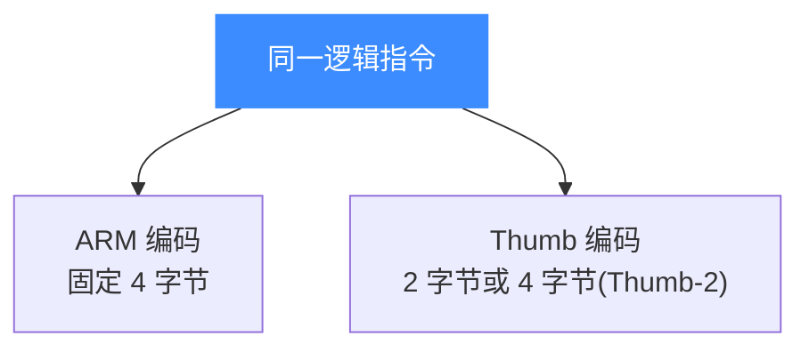
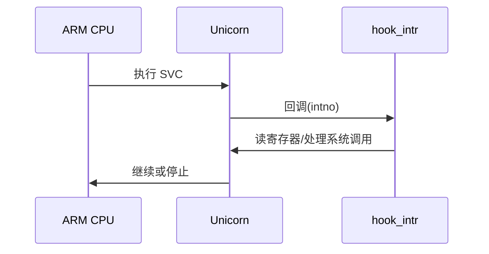

# ARM 指令与特性

本页讲 32 位 ARM 在 Unicorn 中的指令执行特性:ARM 与 Thumb 编码差异、条件执行(IT 块)、用 `UC_HOOK_CODE` 做单步追踪,以及 `SVC` 软中断如何配合 `UC_HOOK_INTR` 捕获。示例代码取自 [`samples/sample_arm.c`](https://github.com/android-security-engineer/unicorn-skills/blob/master/samples/sample_arm.c)。

## 🧩 ARM vs Thumb 编码差异



| 特性 | ARM | Thumb / Thumb-2 |
| --- | --- | --- |
| 指令长度 | 恒为 4 字节 | 2 字节为主,部分 4 字节 |
| 条件执行 | 几乎每条都可带条件后缀 | 靠 `IT`/`ITE` 块提供条件 |
| 代码密度 | 较低 | 较高,适合受限固件 |
| 启动方式 | 起始地址偶数 | 起始地址 `| 1`(见 [模式](/arch/arm/modes)) |

例如 `sub sp, #0xc`,Thumb 版仅 2 字节 `\x83\xb0`,而 ARM 版需 4 字节。

## 🔀 条件执行与 IT 块

Thumb-2 用 `IT`/`ITE`(If-Then / If-Then-Else)让紧随其后的指令带条件。`sample_arm.c` 的 `ARM_THUM_COND_CODE` 演示了 `cmp r2,r3; it ne; mov r2,#0x68; mov r2,#0x4d`,并验证「整体执行」与「逐条单步」结果一致:

```c
#define ARM_THUM_COND_CODE \
    "\x9a\x42\x14\xbf\x68\x22\x4d\x22"
    // cmp r2, r3 ; it ne ; mov r2, #0x68 ; mov r2, #0x4d
```

::: tip 📌 IT 块可安全单步
Unicorn 会正确维护 `ITSTATE`(`UC_ARM_REG_ITSTATE`),所以对 IT 块逐指令 `uc_emu_start(..., count=1)` 也能得到与整体运行相同的寄存器结果。
:::

## 🪝 用 UC_HOOK_CODE 单步追踪

`UC_HOOK_CODE` 在每条指令执行前回调,是实现单步、指令计数、打桩的核心手段:

```c
static void hook_code(uc_engine *uc, uint64_t address, uint32_t size,
                      void *user_data)
{
    printf(">>> Tracing instruction at 0x%" PRIx64
           ", instruction size = 0x%x\n", address, size);
}

uc_hook trace2;
// 仅在 [ADDRESS, ADDRESS] 范围回调
uc_hook_add(uc, &trace2, UC_HOOK_CODE, hook_code, NULL, ADDRESS, ADDRESS);
```

想真正「单步」还可把 `uc_emu_start` 的最后一个参数(执行指令数)设为 1,逐条推进(见 `test_thumb_ite_internal` 的 step 分支)。

## ⚡ SVC 软中断与 UC_HOOK_INTR

ARM 用 `SVC`(旧称 `SWI`)触发软中断,常用于系统调用。要捕获它,注册 `UC_HOOK_INTR` 中断 Hook:

```c
static void hook_intr(uc_engine *uc, uint32_t intno, void *user_data)
{
    // ARM 上 SVC 触发的软件中断会到这里
    printf(">>> Interrupt, intno = %u\n", intno);
    // 可在此读取寄存器模拟系统调用,再决定是否停止
}

uc_hook ih;
uc_hook_add(uc, &ih, UC_HOOK_INTR, hook_intr, NULL, 1, 0);
```



::: warning ⚠️ 中断号不是系统调用号
`UC_HOOK_INTR` 回调拿到的 `intno` 是异常/中断编号,并非 ARM 系统调用号。系统调用号通常在 R7(EABI)里,需要自行从寄存器读取。
:::

## 📂 相关源码

| 文件 | 角色 |
|------|------|
| [`include/unicorn/arm.h`](https://github.com/android-security-engineer/unicorn-skills/blob/master/include/unicorn/arm.h#L73) | `UC_ARM_REG_*` 寄存器枚举与 `uc_cpu_*` CPU 型号定义 |
| [`qemu/target/arm/unicorn_arm.c`](https://github.com/android-security-engineer/unicorn-skills/blob/master/qemu/target/arm/unicorn_arm.c) | 后端：`reg_read`/`reg_write`/`uc_init` 等函数指针实现 |
| [`qemu/target/arm/translate.c`](https://github.com/android-security-engineer/unicorn-skills/blob/master/qemu/target/arm/translate.c) | 前端：机器码翻译（TCG） |
| [`samples/sample_arm.c`](https://github.com/android-security-engineer/unicorn-skills/blob/master/samples/sample_arm.c) | 该架构的 C 示例程序 |
| [`include/unicorn/unicorn.h`](https://github.com/android-security-engineer/unicorn-skills/blob/master/include/unicorn/unicorn.h#L99) | `UC_ARCH_ARM` 架构常量与 `UC_MODE_*` 公共模式定义 |

## 相关页面

- [UC_HOOK_CODE 指令 Hook](/hooks/code)
- [UC_HOOK_INTR 中断 Hook](/hooks/intr)
- [ARM 模式与字节序](/arch/arm/modes)
