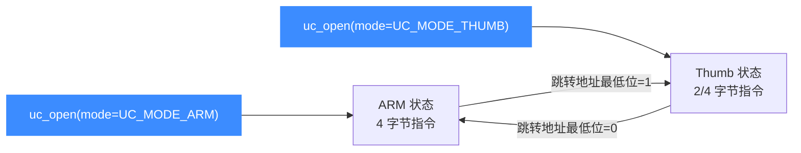

# ARM 模式与字节序

本页讲清 32 位 ARM 打开引擎时 `mode` 参数的取值:ARM 与 Thumb 指令集切换、Cortex-M 的 `UC_MODE_MCLASS`、大端 `UC_MODE_BIG_ENDIAN` 与 BE8 的 `UC_MODE_ARMBE8`,以及在运行中如何通过 PC 最低位 / CPSR 的 T 位在 ARM 与 Thumb 之间切换。所有常量取自 [`include/unicorn/unicorn.h`](https://github.com/android-security-engineer/unicorn-skills/blob/master/include/unicorn/unicorn.h)。

## 🧩 mode 常量一览

来自头文件的真实定义:

```c
UC_MODE_LITTLE_ENDIAN = 0,    // 小端(默认)
UC_MODE_BIG_ENDIAN = 1 << 30, // 大端
UC_MODE_ARM = 0,              // ARM 指令集
UC_MODE_THUMB = 1 << 4,       // Thumb(含 Thumb-2)
UC_MODE_MCLASS = 1 << 5,      // Cortex-M 系列
UC_MODE_V8 = 1 << 6,          // ARMv8 A32 编码
UC_MODE_ARMBE8 = 1 << 10,     // 数据大端、代码小端
UC_MODE_ARM926 = 1 << 7,      // ARM926 核
UC_MODE_ARM946 = 1 << 8,      // ARM946 核
UC_MODE_ARM1176 = 1 << 9,     // ARM1176 核
```

| 常量 | 维度 | 含义 |
| --- | --- | --- |
| `UC_MODE_ARM` | 指令集 | 固定 4 字节 ARM 编码(值为 0,即默认) |
| `UC_MODE_THUMB` | 指令集 | 2/4 字节 Thumb 与 Thumb-2 |
| `UC_MODE_MCLASS` | CPU 类别 | 微控制器 Cortex-M 语义 |
| `UC_MODE_BIG_ENDIAN` | 字节序 | 大端 |
| `UC_MODE_ARMBE8` | 字节序 | BE8:数据大端、代码小端 |
| `UC_MODE_ARM926/946/1176` | CPU 核 | 选择经典 ARM 核 |

## 🔀 ARM 与 Thumb 切换



ARM 用 **PC 的最低位**来指示 Thumb 状态:地址奇数(bit0=1)表示 Thumb,偶数表示 ARM;这一位并不参与实际取指对齐,而是驱动 CPSR 的 **T 位**。

因此,在 Thumb 模式下调用 `uc_emu_start` 时,起始地址必须或上 1:

```c
// 打开 Thumb 模式
uc_open(UC_ARCH_ARM, UC_MODE_THUMB, &uc);
uc_mem_write(uc, ADDRESS, THUMB_CODE, sizeof(THUMB_CODE) - 1);

// 注意:起始地址 ADDRESS | 1 表示以 Thumb 状态执行
uc_emu_start(uc, ADDRESS | 1, ADDRESS + sizeof(THUMB_CODE) - 1, 0, 0);
```

::: warning ⚠️ 忘记 `| 1` 的经典陷阱
若在 `UC_MODE_THUMB` 下把起始地址写成偶数 `ADDRESS`,引擎会按 ARM 解码 Thumb 字节,导致非法指令或错误行为。反过来,ARM 模式下也不要给奇数地址。
:::

## 🌐 字节序:小端 / 大端 / BE8

大端 ARM 通过把字节序位加进 mode 实现(见 [`samples/sample_arm.c`](https://github.com/android-security-engineer/unicorn-skills/blob/master/samples/sample_arm.c) 的 `test_armeb`):

```c
// 大端 ARM
uc_open(UC_ARCH_ARM, UC_MODE_ARM + UC_MODE_BIG_ENDIAN, &uc);

// 大端 Thumb
uc_open(UC_ARCH_ARM, UC_MODE_THUMB + UC_MODE_BIG_ENDIAN, &uc);
```

| 字节序 | 常量组合 | 说明 |
| --- | --- | --- |
| 小端 | `UC_MODE_LITTLE_ENDIAN`(默认) | 最常见,x86/多数 ARM 系统 |
| 大端 | `UC_MODE_BIG_ENDIAN` | 数据与代码均大端(BE32 语义) |
| BE8 | `UC_MODE_ARMBE8` | ARMv6+ 惯用:数据大端、指令仍按小端取 |

::: tip 📌 大端下机器码也要「反」
`test_armeb` 里同一条 `mov r0,#0x37` 的字节序与小端版本正好相反(`\xe3\xa0\x00\x37` vs `\x37\x00\xa0\xe3`)。构造大端测试时别忘了同步调整机器码字节顺序。
:::

## 🔧 M-Class 与经典核

- `UC_MODE_MCLASS` 让引擎按 Cortex-M(如 M3/M33)语义工作,暴露 MSP/PSP/CONTROL 等寄存器。
- `UC_MODE_ARM926/946/1176` 直接选择对应经典核;更细的型号选择建议改用 `uc_ctl_set_cpu_model`,见 [ARM CPU 型号](/arch/arm/cpu-models)。

## 📂 相关源码

| 文件 | 角色 |
|------|------|
| [`include/unicorn/arm.h`](https://github.com/android-security-engineer/unicorn-skills/blob/master/include/unicorn/arm.h#L73) | `UC_ARM_REG_*` 寄存器枚举与 `uc_cpu_*` CPU 型号定义 |
| [`qemu/target/arm/unicorn_arm.c`](https://github.com/android-security-engineer/unicorn-skills/blob/master/qemu/target/arm/unicorn_arm.c) | 后端：`reg_read`/`reg_write`/`uc_init` 等函数指针实现 |
| [`qemu/target/arm/translate.c`](https://github.com/android-security-engineer/unicorn-skills/blob/master/qemu/target/arm/translate.c) | 前端：机器码翻译（TCG） |
| [`samples/sample_arm.c`](https://github.com/android-security-engineer/unicorn-skills/blob/master/samples/sample_arm.c) | 该架构的 C 示例程序 |
| [`include/unicorn/unicorn.h`](https://github.com/android-security-engineer/unicorn-skills/blob/master/include/unicorn/unicorn.h#L99) | `UC_ARCH_ARM` 架构常量与 `UC_MODE_*` 公共模式定义 |

## 相关页面

- [字节序详解](/features/endianness)
- [ARM 指令与特性](/arch/arm/instructions)
- [ARM CPU 型号](/arch/arm/cpu-models)
