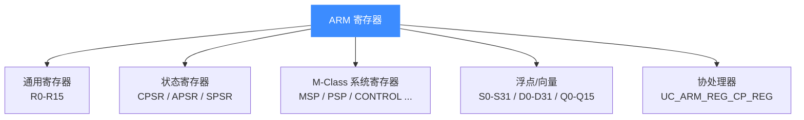

# ARM 寄存器

本页梳理 32 位 ARM 在 Unicorn 中可读写的寄存器:通用寄存器 R0–R15、程序状态寄存器 CPSR/APSR、M-Class 系统寄存器,以及 VFP/NEON 浮点向量寄存器 D/Q/S。所有寄存器都通过 `UC_ARM_REG_*` 常量配合 `uc_reg_read`/`uc_reg_write` 访问。常量列表以 [`include/unicorn/arm.h`](https://github.com/android-security-engineer/unicorn-skills/blob/master/include/unicorn/arm.h) 为准。

## 🧠 寄存器全景



## 📥 通用寄存器 R0–R15

R0–R12 是通用寄存器,R13–R15 具有专门用途。`arm.h` 用别名把编号与角色绑定:

```c
UC_ARM_REG_R13 = UC_ARM_REG_SP,   // 栈指针 SP
UC_ARM_REG_R14 = UC_ARM_REG_LR,   // 链接寄存器 LR
UC_ARM_REG_R15 = UC_ARM_REG_PC,   // 程序计数器 PC
UC_ARM_REG_SB  = UC_ARM_REG_R9,
UC_ARM_REG_SL  = UC_ARM_REG_R10,
UC_ARM_REG_FP  = UC_ARM_REG_R11,
UC_ARM_REG_IP  = UC_ARM_REG_R12,
```

| 寄存器 | 常量 | 角色 |
| --- | --- | --- |
| R0–R12 | `UC_ARM_REG_R0` … `UC_ARM_REG_R12` | 通用/参数/返回值 |
| R13 / SP | `UC_ARM_REG_SP`(= `UC_ARM_REG_R13`) | 栈指针 |
| R14 / LR | `UC_ARM_REG_LR`(= `UC_ARM_REG_R14`) | 返回地址 |
| R15 / PC | `UC_ARM_REG_PC`(= `UC_ARM_REG_R15`) | 程序计数器 |

::: tip 📌 别名可互换
`UC_ARM_REG_SP` 与 `UC_ARM_REG_R13` 指向同一寄存器,读写效果一致,选可读性更好的即可。
:::

## ⚡ 状态寄存器 CPSR / APSR

| 常量 | 说明 |
| --- | --- |
| `UC_ARM_REG_CPSR` | 当前程序状态寄存器(含 N/Z/C/V 标志、T 位、模式位) |
| `UC_ARM_REG_APSR` | 应用程序状态寄存器(CPSR 中的标志子集) |
| `UC_ARM_REG_APSR_NZCV` | 仅 NZCV 标志视图 |
| `UC_ARM_REG_SPSR` | 保存的程序状态寄存器 |

其中 CPSR 的 **T 位**决定当前是 ARM 还是 Thumb 状态,详见 [ARM 模式与字节序](/arch/arm/modes)。

## 🔧 M-Class 系统寄存器

Cortex-M 系列(配合 `UC_MODE_MCLASS` 或对应 CPU 型号)额外暴露一组系统寄存器:

```c
UC_ARM_REG_MSP,       // 主栈指针
UC_ARM_REG_PSP,       // 进程栈指针
UC_ARM_REG_CONTROL,   // CONTROL 寄存器
UC_ARM_REG_PRIMASK,   // 中断屏蔽
UC_ARM_REG_BASEPRI,
UC_ARM_REG_FAULTMASK,
UC_ARM_REG_IPSR,      // 中断程序状态
UC_ARM_REG_XPSR,      // 组合程序状态
```

[`samples/sample_arm.c`](https://github.com/android-security-engineer/unicorn-skills/blob/master/samples/sample_arm.c) 的 `test_thumb_mrs` 就在 Cortex-M33 上执行 `mrs r0, control` 来读取 `CONTROL`。

## 🎨 VFP / NEON 浮点向量寄存器

| 类型 | 常量范围 | 位宽 |
| --- | --- | --- |
| 单精度 S | `UC_ARM_REG_S0` … `UC_ARM_REG_S31` | 32 位 |
| 双精度 D | `UC_ARM_REG_D0` … `UC_ARM_REG_D31` | 64 位 |
| 四字 Q | `UC_ARM_REG_Q0` … `UC_ARM_REG_Q15` | 128 位 |

还有控制寄存器 `UC_ARM_REG_FPSCR`、`UC_ARM_REG_FPEXC`、`UC_ARM_REG_MVFR0/1/2` 等。

## 📤 读写寄存器示例

```c
int r0 = 0x1234, r2 = 0x6789, r3 = 0x3333, r1;

// 写入初值
uc_reg_write(uc, UC_ARM_REG_R0, &r0);
uc_reg_write(uc, UC_ARM_REG_R2, &r2);
uc_reg_write(uc, UC_ARM_REG_R3, &r3);

// ... uc_emu_start(...) ...

// 执行后读回
uc_reg_read(uc, UC_ARM_REG_R0, &r0);
uc_reg_read(uc, UC_ARM_REG_R1, &r1);
printf(">>> R0 = 0x%x\n", r0);
printf(">>> R1 = 0x%x\n", r1);
```

::: warning ⚠️ 协处理器寄存器另有其法
CP15 等协处理器寄存器不用 `UC_ARM_REG_Cx`(已弃用),而是填充 `uc_arm_cp_reg` 结构体后用 `UC_ARM_REG_CP_REG` 读写,详见 [sample_arm.c 讲解](/samples/sample-arm) 的 SCTLR 示例。
:::

## 📂 相关源码

| 文件 | 角色 |
|------|------|
| [`include/unicorn/arm.h`](https://github.com/android-security-engineer/unicorn-skills/blob/master/include/unicorn/arm.h#L73) | `UC_ARM_REG_*` 寄存器枚举与 `uc_cpu_*` CPU 型号定义 |
| [`qemu/target/arm/unicorn_arm.c`](https://github.com/android-security-engineer/unicorn-skills/blob/master/qemu/target/arm/unicorn_arm.c) | 后端：`reg_read`/`reg_write`/`uc_init` 等函数指针实现 |
| [`qemu/target/arm/translate.c`](https://github.com/android-security-engineer/unicorn-skills/blob/master/qemu/target/arm/translate.c) | 前端：机器码翻译（TCG） |
| [`samples/sample_arm.c`](https://github.com/android-security-engineer/unicorn-skills/blob/master/samples/sample_arm.c) | 该架构的 C 示例程序 |
| [`include/unicorn/unicorn.h`](https://github.com/android-security-engineer/unicorn-skills/blob/master/include/unicorn/unicorn.h#L99) | `UC_ARCH_ARM` 架构常量与 `UC_MODE_*` 公共模式定义 |

## 相关页面

- [uc_reg_read](/api/reg-read)
- [ARM 模式与字节序](/arch/arm/modes)
- [ARM 架构概览](/arch/arm/)
