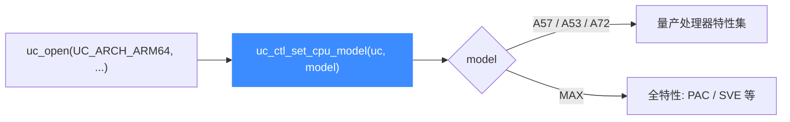

# ARM64 CPU 型号

本页讲清 Unicorn 支持的 ARM64（AArch64）CPU 型号：`UC_CPU_ARM64_*` 的真实取值、用 [uc_ctl_set_cpu_model](/ctl/set-cpu-model) 切换型号，以及不同型号如何影响可用特性（指针认证 PAC、SVE 等）。读完你能为一段 A64 代码选对 CPU，并知道为什么某些高级特性只有选 `MAX` 才能跑通。

## 🧠 型号从哪来

Unicorn 的 ARM64 后端沿用 QEMU 的 CPU 定义，可选型号被枚举在 [`include/unicorn/arm64.h`](https://github.com/android-security-engineer/unicorn-skills/blob/master/include/unicorn/arm64.h) 的 `uc_cpu_arm64` 中。这个列表很短——只有三款真实处理器加一个"全特性"虚拟型号：



## 📋 型号一览

下表常量全部来自 [`include/unicorn/arm64.h`](https://github.com/android-security-engineer/unicorn-skills/blob/master/include/unicorn/arm64.h)（`enum uc_cpu_arm64`）：

| 常量 | 枚举值 | 对应处理器 | 定位 |
| --- | --- | --- | --- |
| `UC_CPU_ARM64_A57` | 0（默认） | Cortex-A57 | ARMv8.0 大核，经典高性能核 |
| `UC_CPU_ARM64_A53` | 1 | Cortex-A53 | ARMv8.0 小核，能效核 |
| `UC_CPU_ARM64_A72` | 2 | Cortex-A72 | ARMv8.0 大核，A57 的迭代 |
| `UC_CPU_ARM64_MAX` | 3 | 虚拟"全特性"型号 | 打开 QEMU 支持的最大特性集 |

::: warning 只有这四个是合法值
`UC_CPU_ARM64_ENDING` 只是列表结束标记，不是可用型号。传入超出范围的值会导致 `uc_ctl_set_cpu_model` 返回错误。不要臆造 `A76`、`Neoverse` 等常量——头文件里没有。
:::

## 🔧 切换型号

型号必须在 `uc_open()` 之后、`uc_emu_start()` 之前设置。底层通过 [uc_ctl](/ctl/) 的 `uc_ctl_set_cpu_model` 宏完成：

```c
#include <unicorn/unicorn.h>

uc_engine *uc;

// 打开 ARM64 引擎
uc_open(UC_ARCH_ARM64, UC_MODE_ARM, &uc);

// 选用全特性型号，才能启用 PAC / SVE 等高级能力
uc_err err = uc_ctl_set_cpu_model(uc, UC_CPU_ARM64_MAX);
if (err != UC_ERR_OK) {
    printf("设置 CPU 型号失败: %s\n", uc_strerror(err));
}
```

不显式设置时，ARM64 默认使用 `UC_CPU_ARM64_A57`（枚举值 0）。对绝大多数 ARMv8.0 用户态代码，默认型号即可正常仿真。

## ⚡ 型号如何影响特性

CPU 型号决定了后端"声明支持哪些 ARMv8.x 扩展"。最典型的例子是**指针认证（PAC）**：`sample_arm64.c` 的 `test_arm64_pac` 在跑 `paciza` 之前，第一步就是把型号切到 `MAX`。

```c
// 摘自 sample_arm64.c: test_arm64_pac
CHECK(uc_open(UC_ARCH_ARM64, UC_MODE_ARM, &uc));
CHECK(uc_ctl_set_cpu_model(uc, UC_CPU_ARM64_MAX)); // PAC 依赖全特性型号
CHECK(uc_mem_map(uc, ADDRESS, 2 * 1024 * 1024, UC_PROT_ALL));
CHECK(uc_mem_write(uc, ADDRESS, ARM64_PAC_CODE, sizeof(ARM64_PAC_CODE) - 1));
```

| 特性 | A57 / A53 / A72 | MAX |
| --- | --- | --- |
| ARMv8.0 基础指令 | ✅ | ✅ |
| 指针认证 PAC（`paci*`/`auti*`） | ❌ | ✅ |
| SVE / 更高版本扩展 | ❌ | ✅ |

::: tip 需要新特性就选 MAX
如果你的目标代码用到了 PAC、SVE 或其他 ARMv8.3+ 指令，直接选 `UC_CPU_ARM64_MAX`。想复现真实某款手机 SoC 的"精确特性边界"时，才需要退回到具体的 A5x/A7x 型号。
:::

::: warning PAC 不止选型号
选了 `MAX` 只是前提。要真正让 PAC 生效，还需按 `test_arm64_pac` 那样配置 `SCR_EL3` / `SCTLR_EL1` / `HCR_EL2` 等系统寄存器（通过 `UC_ARM64_REG_CP_REG` 写入）。完整流程见 [实战示例](/arch/arm64/example)。
:::

## 📂 相关源码

| 文件 | 角色 |
|------|------|
| [`include/unicorn/arm64.h`](https://github.com/android-security-engineer/unicorn-skills/blob/master/include/unicorn/arm64.h#L41) | `UC_ARM64_REG_*` 寄存器枚举与 `uc_cpu_*` CPU 型号定义 |
| [`qemu/target/arm/unicorn_aarch64.c`](https://github.com/android-security-engineer/unicorn-skills/blob/master/qemu/target/arm/unicorn_aarch64.c) | 后端：`reg_read`/`reg_write`/`uc_init` 等函数指针实现 |
| [`qemu/target/arm/translate-a64.c`](https://github.com/android-security-engineer/unicorn-skills/blob/master/qemu/target/arm/translate-a64.c) | 前端：机器码翻译（TCG） |
| [`samples/sample_arm64.c`](https://github.com/android-security-engineer/unicorn-skills/blob/master/samples/sample_arm64.c) | 该架构的 C 示例程序 |
| [`include/unicorn/unicorn.h`](https://github.com/android-security-engineer/unicorn-skills/blob/master/include/unicorn/unicorn.h#L100) | `UC_ARCH_ARM64` 架构常量与 `UC_MODE_*` 公共模式定义 |

## 相关页面

- [uc_ctl_set_cpu_model](/ctl/set-cpu-model) — 设置 CPU 型号的控制接口
- [CPU 型号特性总览](/features/cpu-models) — 跨架构的型号与特性说明
- [ARM64 架构概览](/arch/arm64/) — AArch64 入门
- [ARM64 实战示例](/arch/arm64/example) — 含 PAC 完整走读
