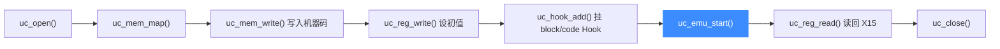

# ARM64 实战示例

本页带你完整跑通一个 AArch64 仿真：映射内存、写入 A64 机器码、初始化寄存器、挂 Hook 跟踪、启动仿真、读回结果。示例改编自官方 `sample_arm64.c` 的 `test_arm64`，逐段讲解并给出预期输出。读完你能独立写出并运行自己的第一段 ARM64 仿真。

## 🎯 我们要模拟什么

目标是两条 A64 指令：`str w11, [x13], #0`（把 W11 存入 [X13]）和 `ldrb w15, [x13], #0`（从 [X13] 读一个字节到 W15）。初始 X11 = `0x12345678`，X13 指向 `0x10008`。执行后，取出的字节应是 `0x12345678` 的最低字节——小端下即 `0x78`。



## 🧩 完整代码

以下代码摘自 [`samples/sample_arm64.c`](https://github.com/android-security-engineer/unicorn-skills/blob/master/samples/sample_arm64.c)，可直接编译运行：

```c
#include <unicorn/unicorn.h>

// str w11, [x13], #0; ldrb w15, [x13], #0
#define ARM64_CODE "\xab\x05\x00\xb8\xaf\x05\x40\x38"
#define ADDRESS 0x10000

static void hook_block(uc_engine *uc, uint64_t address, uint32_t size,
                       void *user_data)
{
    printf(">>> Tracing basic block at 0x%" PRIx64 ", block size = 0x%x\n",
           address, size);
}

static void hook_code(uc_engine *uc, uint64_t address, uint32_t size,
                      void *user_data)
{
    printf(">>> Tracing instruction at 0x%" PRIx64
           ", instruction size = 0x%x\n",
           address, size);
}

static void test_arm64(void)
{
    uc_engine *uc;
    uc_err err;
    uc_hook trace1, trace2;

    int64_t x11 = 0x12345678;    // X11 寄存器
    int64_t x13 = 0x10000 + 0x8; // X13 寄存器
    int64_t x15 = 0x33;          // X15 寄存器

    // 1. 初始化引擎：小端标准 AArch64
    err = uc_open(UC_ARCH_ARM64, UC_MODE_ARM, &uc);
    if (err) {
        printf("uc_open 失败: %u (%s)\n", err, uc_strerror(err));
        return;
    }

    // 2. 映射 2MB 内存
    uc_mem_map(uc, ADDRESS, 2 * 1024 * 1024, UC_PROT_ALL);

    // 3. 写入待仿真机器码
    uc_mem_write(uc, ADDRESS, ARM64_CODE, sizeof(ARM64_CODE) - 1);

    // 4. 初始化寄存器
    uc_reg_write(uc, UC_ARM64_REG_X11, &x11);
    uc_reg_write(uc, UC_ARM64_REG_X13, &x13);
    uc_reg_write(uc, UC_ARM64_REG_X15, &x15);

    // 5. 挂 Hook：跟踪基本块与单条指令
    uc_hook_add(uc, &trace1, UC_HOOK_BLOCK, hook_block, NULL, 1, 0);
    uc_hook_add(uc, &trace2, UC_HOOK_CODE, hook_code, NULL, ADDRESS, ADDRESS);

    // 6. 启动仿真：从 ADDRESS 跑到代码结尾
    err = uc_emu_start(uc, ADDRESS, ADDRESS + sizeof(ARM64_CODE) - 1, 0, 0);
    if (err) {
        printf("uc_emu_start 失败: %u\n", err);
    }

    // 7. 读回结果
    printf(">>> Emulation done. Below is the CPU context\n");
    printf(">>> As little endian, X15 should be 0x78:\n");
    uc_reg_read(uc, UC_ARM64_REG_X15, &x15);
    printf(">>> X15 = 0x%" PRIx64 "\n", x15);

    // 8. 释放引擎
    uc_close(uc);
}
```

## 🔧 逐段讲解

- **① uc_open**：用 [`UC_ARCH_ARM64`](https://github.com/android-security-engineer/unicorn-skills/blob/master/include/unicorn/unicorn.h#L100) + `UC_MODE_ARM` 打开引擎。`UC_MODE_ARM` 在 AArch64 语境下代表"标准 ARM 执行"，默认小端，详见 [模式与字节序](/arch/arm64/modes)。
- **② uc_mem_map**：仿真前必须先映射内存，否则取指/访存会触发 `UC_ERR_*` 异常。这里映射 2MB，权限 `UC_PROT_ALL`（可读可写可执行）。
- **③ uc_mem_write**：把机器码字节写入映射地址。`sizeof(ARM64_CODE) - 1` 去掉字符串结尾的 `\0`。
- **④ uc_reg_write**：设置初值。注意 X13 = `0x10008`，正是访存目标地址。
- **⑤ uc_hook_add**：挂两个 [Hook](/features/hooks)——`UC_HOOK_BLOCK` 跟踪基本块，`UC_HOOK_CODE` 跟踪指令。`begin=1, end=0`（begin>end）表示对全地址范围生效。
- **⑥ uc_emu_start**：核心。第 4 个参数 timeout=0 表示不限时，第 5 个 count=0 表示不限指令数，跑到 end 地址为止。
- **⑦ uc_reg_read**：读回 X15。小端下 `0x12345678` 的最低字节是 `0x78`。

## 📤 预期输出

```text
Emulate ARM64 code
>>> Tracing basic block at 0x10000, block size = 0x8
>>> Tracing instruction at 0x10000, instruction size = 0x4
>>> Emulation done. Below is the CPU context
>>> As little endian, X15 should be 0x78:
>>> X15 = 0x78
```

::: tip 为什么是 0x78
`ldrb`（load byte）只读一个字节。W11=`0x12345678` 存入内存后，最低地址处的字节在小端下是 `0x78`，所以 W15/X15 最终为 `0x78`。若换成大端（`test_arm64eb`），字节序不同但该样例结果仍为 `0x78`，因为读写用的是同一份内存。
:::

::: warning 别忘了 uc_close
每个 `uc_open` 都要对应一个 `uc_close`，否则会泄漏引擎持有的内存与 JIT 缓存。长期运行的批量仿真尤其要注意。
:::

## 📂 相关源码

| 文件 | 角色 |
|------|------|
| [`include/unicorn/arm64.h`](https://github.com/android-security-engineer/unicorn-skills/blob/master/include/unicorn/arm64.h#L41) | `UC_ARM64_REG_*` 寄存器枚举与 `uc_cpu_*` CPU 型号定义 |
| [`qemu/target/arm/unicorn_aarch64.c`](https://github.com/android-security-engineer/unicorn-skills/blob/master/qemu/target/arm/unicorn_aarch64.c) | 后端：`reg_read`/`reg_write`/`uc_init` 等函数指针实现 |
| [`qemu/target/arm/translate-a64.c`](https://github.com/android-security-engineer/unicorn-skills/blob/master/qemu/target/arm/translate-a64.c) | 前端：机器码翻译（TCG） |
| [`samples/sample_arm64.c`](https://github.com/android-security-engineer/unicorn-skills/blob/master/samples/sample_arm64.c) | 该架构的 C 示例程序 |
| [`include/unicorn/unicorn.h`](https://github.com/android-security-engineer/unicorn-skills/blob/master/include/unicorn/unicorn.h#L100) | `UC_ARCH_ARM64` 架构常量与 `UC_MODE_*` 公共模式定义 |

## 相关页面

- [sample_arm64.c 走读](/samples/sample-arm64) — 官方样例全量解析（含 PAC、MRS Hook）
- [ARM64 架构概览](/arch/arm64/) — AArch64 入门与寄存器族
- [Hook 体系](/features/hooks) — UC_HOOK_BLOCK / UC_HOOK_CODE 详解
- [CPU 型号](/arch/arm64/cpu-models) — 高级特性需要的型号选择
