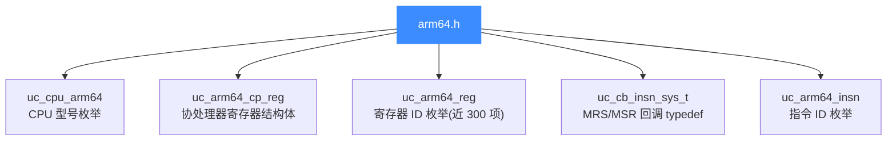
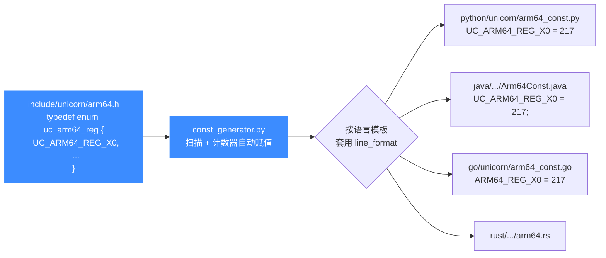

# arm64.h — ARM64 头文件常量参考

本页逐段拆解 [`include/unicorn/arm64.h`](https://github.com/android-security-engineer/unicorn-skills/blob/master/include/unicorn/arm64.h)：它是 AArch64 架构在 Unicorn 中的常量真源（source of truth），定义了 CPU 型号枚举、寄存器 ID 枚举、协处理器寄存器结构体、MRS/MSR 指令回调以及指令 ID 枚举。所有语言绑定（Python / Java / Go / Rust / .NET …）的 ARM64 常量都由 `const_generator.py` 从这个头文件自动生成。读完你能知道这个头里有哪些常量、它们如何被消费，以及改了之后为什么要立刻跑生成器。

## 📌 概述

`arm64.h` 是被 `unicorn.h` 聚合的架构头之一。它**只定义 AArch64 专有的常量与类型**，跨架构通用的东西（`uc_arch`、`uc_mode`、`uc_err`、Hook 类型等）都在 `unicorn.h` 里。文件结构很清晰，分五大块：



五块之外，文件还做了两件小事：用 `extern "C"` 包裹声明以兼容 C++，并在 MSVC 下用 `#pragma warning(disable : 4201)` 关掉无名位段警告。这与其他 `<arch>.h` 的做法一致。

## 🧠 CPU 型号枚举 uc_cpu_arm64

`enum uc_cpu_arm64` 列出 Unicorn 支持的 AArch64 处理器型号，作为 [uc_ctl_set_cpu_model](/ctl/set-cpu-model) 的入参。列表很短——三款真实核加一个"全特性"虚拟型号：

| 常量 | 枚举值 | 说明 |
| --- | --- | --- |
| `UC_CPU_ARM64_A57` | 0（默认） | Cortex-A57，ARMv8.0 大核 |
| `UC_CPU_ARM64_A53` | 1 | Cortex-A53，ARMv8.0 能效核 |
| `UC_CPU_ARM64_A72` | 2 | Cortex-A72，A57 的迭代大核 |
| `UC_CPU_ARM64_MAX` | 3 | 虚拟"全特性"型号，开启 PAC / SVE 等扩展 |
| `UC_CPU_ARM64_ENDING` | 4 | 列表结束哨兵，**非可用型号** |

型号如何影响可用特性（指针认证 PAC、SVE 等）以及为什么跑 `paci*` 前必须选 `MAX`，详见 [ARM64 CPU 型号](/arch/arm64/cpu-models)。

## 🔧 协处理器寄存器结构体 uc_arm64_cp_reg

AArch64 的系统寄存器（SCTLR_EL1、TTBR0_EL1、VBAR_EL3 ……）数量极大，不可能每个都给一个枚举常量。Unicorn 的做法是用一个通用结构体 `uc_arm64_cp_reg` 配合寄存器 ID `UC_ARM64_REG_CP_REG`，通过 `crn/crm/op0/op1/op2` 五元组精确定位任意系统寄存器：

```c
typedef struct uc_arm64_cp_reg {
    uint32_t crn; // Coprocessor register number
    uint32_t crm; // Coprocessor register number
    uint32_t op0; // Opcode0
    uint32_t op1; // Opcode1
    uint32_t op2; // Opcode2
    uint64_t val; // The value to read/write
} uc_arm64_cp_reg;
```

典型用法——读 `SCTLR_EL1`（编码 `op0=0b11, op1=0, crn=1, crm=0, op2=0`）：

```c
uc_arm64_cp_reg reg;
reg.crn = 1; reg.crm = 0; reg.op0 = 0b11; reg.op1 = 0; reg.op2 = 0;
uc_reg_read(uc, UC_ARM64_REG_CP_REG, &reg);
printf("SCTLR_EL1 = 0x%" PRIx64 "\n", reg.val);
```

::: tip 头文件里的 ELx 直达常量已弃用
`arm64.h` 仍保留了 `UC_ARM64_REG_TPIDR_EL0`、`UC_ARM64_REG_ELR_EL1`、`UC_ARM64_REG_SP_EL2`、`UC_ARM64_REG_TTBR0_EL1` 等一批带 `_ELx` 后缀的常量，但注释里都标注了 **depreciated, use UC_ARM64_REG_CP_REG instead**。新代码请统一走 `CP_REG` 编码，可移植性更好。完整寄存器访问机制见 [ARM64 寄存器参考](/arch/arm64/registers)。
:::

## 🧮 寄存器 ID 枚举 uc_arm64_reg

`enum uc_arm64_reg` 是本头文件最长的枚举，近 300 项，覆盖通用寄存器、SIMD/浮点寄存器、系统寄存器与伪寄存器。下表只列**前 25 项与最常用的关键常量**（按头文件出现顺序），完整列表请直接看源码或 [寄存器参考](/arch/arm64/registers)。

| 常量 | 类别 | 含义 |
| --- | --- | --- |
| `UC_ARM64_REG_INVALID` | 哨兵 | 0，非法/未设置标记 |
| `UC_ARM64_REG_X29` | 通用 | X29（帧指针，等同 `UC_ARM64_REG_FP`） |
| `UC_ARM64_REG_X30` | 通用 | X30（链接寄存器，等同 `UC_ARM64_REG_LR`） |
| `UC_ARM64_REG_NZCV` | 标志 | 条件标志 N/Z/C/V |
| `UC_ARM64_REG_SP` | 通用 | 栈指针（64 位） |
| `UC_ARM64_REG_WSP` | 通用 | 栈指针（32 位视图） |
| `UC_ARM64_REG_WZR` | 通用 | 零寄存器（32 位视图） |
| `UC_ARM64_REG_XZR` | 通用 | 零寄存器（64 位） |
| `UC_ARM64_REG_B0` … `B31` | SIMD | 8 位 Byte 视图 |
| `UC_ARM64_REG_D0` … `D31` | SIMD | 64 位 Double / 双精度浮点视图 |
| `UC_ARM64_REG_H0` … `H31` | SIMD | 16 位 Half / 半精度视图 |
| `UC_ARM64_REG_Q0` … `Q31` | SIMD | 128 位 Quad 视图 |
| `UC_ARM64_REG_S0` … `S31` | SIMD | 32 位 Single / 单精度浮点视图 |
| `UC_ARM64_REG_W0` … `W30` | 通用 | X 寄存器的低 32 位视图 |
| `UC_ARM64_REG_X0` … `X28` | 通用 | 通用寄存器（完整 64 位） |
| `UC_ARM64_REG_V0` … `V31` | SIMD | 完整 128 位向量寄存器 |

几个不在上表但很关键的常量：

| 常量 | 含义 |
| --- | --- |
| `UC_ARM64_REG_PC` | 程序计数器（伪寄存器） |
| `UC_ARM64_REG_CPACR_EL1` | 协处理器访问控制寄存器 |
| `UC_ARM64_REG_PSTATE` | 处理器状态（含 NZCV、当前 EL 等） |
| `UC_ARM64_REG_CP_REG` | 通用系统寄存器访问入口（配合 `uc_arm64_cp_reg`） |
| `UC_ARM64_REG_FPCR` / `UC_ARM64_REG_FPSR` | 浮点控制 / 状态寄存器 |
| `UC_ARM64_REG_ENDING` | 列表结束哨兵 |

### 别名寄存器

枚举尾部用 `=` 给几个常用寄存器起了别名，值即对应 X 寄存器（不是新枚举值）：

| 别名 | 等价于 | 用途 |
| --- | --- | --- |
| `UC_ARM64_REG_IP0` | `UC_ARM64_REG_X16` | 过程内调用临时寄存器 0 |
| `UC_ARM64_REG_IP1` | `UC_ARM64_REG_X17` | 过程内调用临时寄存器 1 |
| `UC_ARM64_REG_FP` | `UC_ARM64_REG_X29` | 帧指针 |
| `UC_ARM64_REG_LR` | `UC_ARM64_REG_X30` | 链接寄存器（返回地址） |

::: warning 别名是同一枚举值
`IP0` 与 `X16` 在枚举里是**同一个值**，传给 [uc_reg_read](/api/reg-read) / [uc_reg_write](/api/reg-write) 效果完全相同。生成器会把两者都输出到绑定常量文件里。
:::

## 🎛️ 模式位 UC_MODE_*

`arm64.h` 本身**不定义任何 `UC_MODE_*` 宏**——模式枚举 `uc_mode` 是跨架构通用的，定义在 `unicorn.h` 里。AArch64 实际可用的模式位只有这几个：

| 值 | 名称 | 适用 | 说明 |
|----|------|------|------|
| `0` | `UC_MODE_LITTLE_ENDIAN` | 全部 | 小端（默认） |
| `1<<30` | `UC_MODE_BIG_ENDIAN` | 全部 | 大端 |
| `0` | `UC_MODE_ARM` | ARM/ARM64 | ARM 执行状态（AArch64 下即 A64） |

::: details 为什么 arm64.h 里没有 UC_MODE_ARM
`UC_MODE_ARM` 的值是 `0`，与 `UC_MODE_LITTLE_ENDIAN` 同值。AArch64 只有定长 4 字节的 A64 一种指令编码，不存在 Thumb 切换，因此初始化 ARM64 引擎时 mode 实质只有"字节序"一个自由度。完整模式选择与 EL0-EL3 异常级别说明见 [ARM64 模式与字节序](/arch/arm64/modes)。
:::

初始化示例：

```c
// 小端 AArch64（最常用，三种写法等价）
uc_open(UC_ARCH_ARM64, UC_MODE_ARM, &uc);
uc_open(UC_ARCH_ARM64, UC_MODE_LITTLE_ENDIAN | UC_MODE_ARM, &uc);

// 大端 AArch64
uc_open(UC_ARCH_ARM64, UC_MODE_ARM + UC_MODE_BIG_ENDIAN, &uc);
```

## ⚡ 指令 ID 枚举 uc_arm64_insn

与 x86 / arm 的 `UC_<arch>_INS_*` 拥有庞大指令表不同，ARM64 的指令 ID 枚举极小——**只枚举 Unicorn 需要专门 Hook 的系统寄存器访问指令**：

| 常量 | 枚举值 | 指令 | 说明 |
| --- | --- | --- | --- |
| `UC_ARM64_INS_INVALID` | 0 | — | 非法/未设置 |
| `UC_ARM64_INS_MRS` | 1 | `MRS` | 读系统寄存器到通用寄存器 |
| `UC_ARM64_INS_MSR` | 2 | `MSR` | 写通用寄存器到系统寄存器 |
| `UC_ARM64_INS_SYS` | 3 | `SYS` | 系统指令（如缓存/屏障操作） |
| `UC_ARM64_INS_SYSL` | 4 | `SYSL` | 系统指令（带结果返回） |
| `UC_ARM64_INS_ENDING` | 5 | — | 列表结束哨兵 |

这四条指令对应 [UC_HOOK_INSN](/features/hooks) 在 ARM64 下的全部可选值。配合下面的回调类型，可以在 MRS/MSR 真正执行前拦截并决定是否放行。

## 🪝 MRS/MSR 回调 typedef uc_cb_insn_sys_t

头文件定义了一个专用于系统寄存器访问的回调类型，配合 `UC_HOOK_INSN` + `UC_ARM64_INS_MRS`/`MSR`/`SYS`/`SYSL` 使用：

```c
typedef uint32_t (*uc_cb_insn_sys_t)(uc_engine *uc, uc_arm64_reg reg,
                                     const uc_arm64_cp_reg *cp_reg,
                                     void *user_data);
```

- `reg`：源/目的通用寄存器（如 `MRS x0, SCTLR_EL1` 里的 `X0`）。
- `cp_reg`：被访问的系统寄存器，含 `crn/crm/op0/op1/op2` 编码与 `val`。
- 返回值：**返回非零（true）则跳过这次读写**（即便会引发异常）；返回 0 则正常执行。

::: warning 回调跳过的副作用
返回 true 会让 Unicorn **不执行**该 MRS/MSR 的真实读写。若你的目的是改写访问值，需要在回调里手动填 `cp_reg->val`；若只是观察，务必返回 0。每条指令只允许注册一个此类回调。
:::

## 💻 在 C 中使用

一个最小例子，演示如何 include 头文件、用常量读写寄存器、用 `CP_REG` 访问系统寄存器：

```c
#include <unicorn/unicorn.h>
#include <stdio.h>
#include <inttypes.h>

int main(void) {
    uc_engine *uc;
    uc_open(UC_ARCH_ARM64, UC_MODE_ARM, &uc);

    // 用头文件常量读写通用寄存器
    uint64_t x0 = 0xdeadbeefULL;
    uc_reg_write(uc, UC_ARM64_REG_X0, &x0);

    // 用别名常量读链接寄存器（等同 X30）
    uint64_t lr = 0;
    uc_reg_read(uc, UC_ARM64_REG_LR, &lr);

    // 用 CP_REG 编码读系统寄存器 SCTLR_EL1
    uc_arm64_cp_reg reg;
    reg.crn = 1; reg.crm = 0;
    reg.op0 = 0b11; reg.op1 = 0; reg.op2 = 0;
    uc_reg_read(uc, UC_ARM64_REG_CP_REG, &reg);
    printf("SCTLR_EL1 = 0x%" PRIx64 "\n", reg.val);

    uc_close(uc);
    return 0;
}
```

实际工程中你不会直接 `#include <unicorn/arm64.h>`——`unicorn.h` 已经聚合了它。只需 `#include <unicorn/unicorn.h>` 即可使用上述全部常量与类型。

## 🔧 实现：头文件如何被绑定消费

`arm64.h` 是各语言绑定的常量来源。`bindings/const_generator.py` 逐行扫描该头文件，对 `#define UC_...` 宏和 `typedef enum` 中的枚举成员统一提取，按语言模板输出到 `*_const.*` 文件。



生成器对枚举的处理很巧妙：它按逗号拆分行，遇到没有显式 `=` 的枚举成员（如 `UC_ARM64_REG_X0,`）就用一个递增计数器自动赋值，因此 `arm64.h` 里的 `typedef enum` 无需手写数值也能被正确导出。

::: tip 改了头文件就要跑生成器
这些常量是**绑定生成的来源**。修改 `arm64.h`（新增寄存器、调整枚举顺序、改别名映射）后，必须运行 `python3 const_generator.py all` 重新生成各绑定常量，否则会出现"C 头文件与某语言常量取值不一致"的隐患。生成流程、幂等写回与命名前缀映射详见 [常量生成器](/bindings/const-generator)。
:::

::: warning 枚举顺序即契约
因为生成器靠计数器按出现顺序赋值，**调整枚举成员顺序会改变所有后续常量的数值**，属于破坏性改动（绑定常量值会变）。新增寄存器请插在 `UC_ARM64_REG_ENDING` 之前，不要随意重排。
:::

## 📖 参考

- 头文件源码：[`include/unicorn/arm64.h`](https://github.com/android-security-engineer/unicorn-skills/blob/master/include/unicorn/arm64.h)
- 跨架构公共头：[`include/unicorn/unicorn.h`](https://github.com/android-security-engineer/unicorn-skills/blob/master/include/unicorn/unicorn.h)（见 [unicorn.h](/headers/unicorn-h)）
- 常量生成器：`bindings/const_generator.py`（见 [常量生成器](/bindings/const-generator)）

## 📂 相关源码

| 文件 | 角色 |
|------|------|
| [`include/unicorn/arm64.h`](https://github.com/android-security-engineer/unicorn-skills/blob/master/include/unicorn/arm64.h#L41) | `UC_ARM64_REG_*` 寄存器枚举与 `uc_cpu_*` CPU 型号定义 |
| [`qemu/target/arm/unicorn_aarch64.c`](https://github.com/android-security-engineer/unicorn-skills/blob/master/qemu/target/arm/unicorn_aarch64.c) | 后端：`reg_read`/`reg_write`/`uc_init` 等函数指针实现 |
| [`qemu/target/arm/translate-a64.c`](https://github.com/android-security-engineer/unicorn-skills/blob/master/qemu/target/arm/translate-a64.c) | 前端：机器码翻译（TCG） |
| [`samples/sample_arm64.c`](https://github.com/android-security-engineer/unicorn-skills/blob/master/samples/sample_arm64.c) | 该架构的 C 示例程序 |
| [`include/unicorn/unicorn.h`](https://github.com/android-security-engineer/unicorn-skills/blob/master/include/unicorn/unicorn.h#L100) | `UC_ARCH_ARM64` 架构常量与 `UC_MODE_*` 公共模式定义 |

## 相关页面

- [ARM64 架构概览](/arch/arm64/)
- [ARM64 寄存器参考](/arch/arm64/registers)
- [ARM64 CPU 型号](/arch/arm64/cpu-models)
- [常量生成器 const_generator.py](/bindings/const-generator)
- [unicorn.h — 公共 C API 头文件](/headers/unicorn-h)
